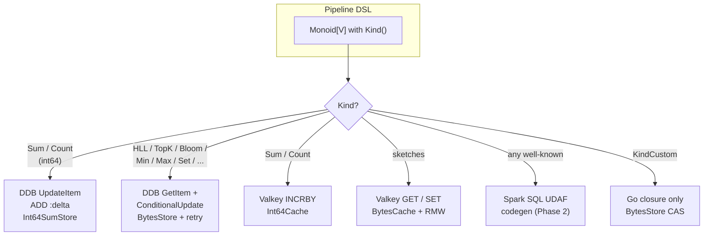
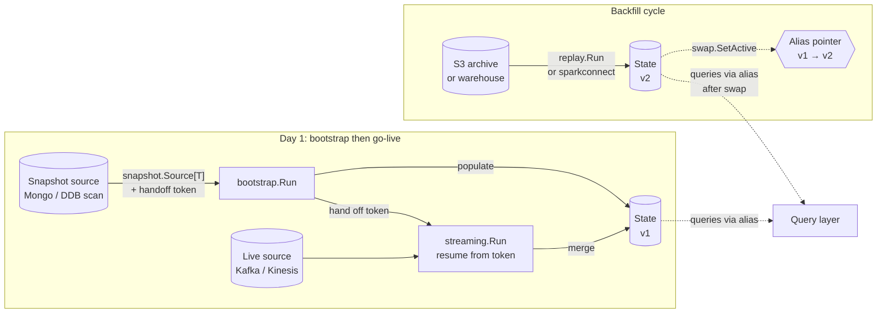
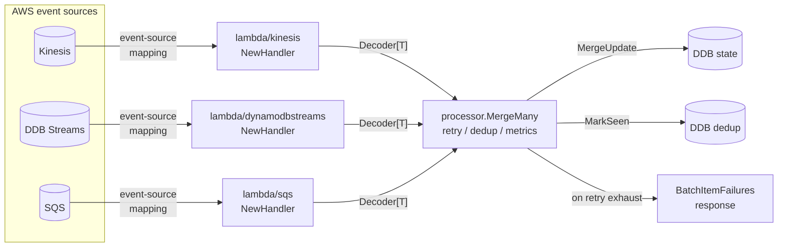
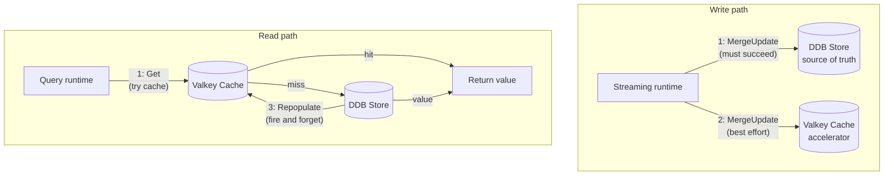
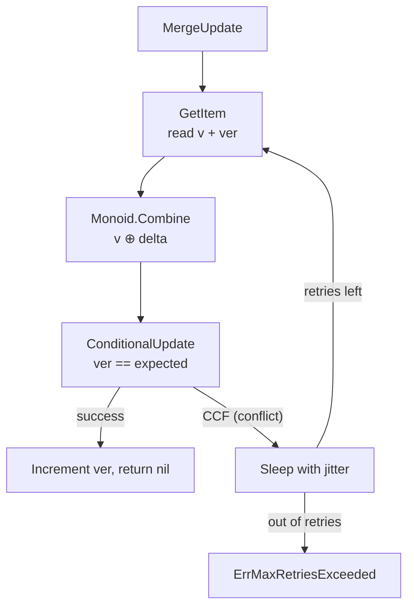
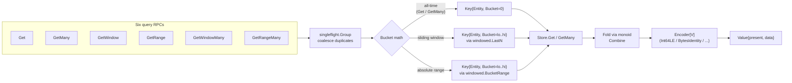
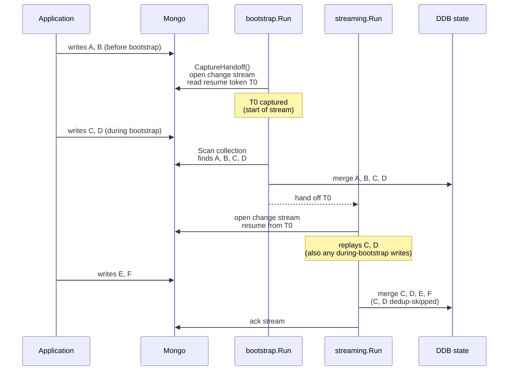
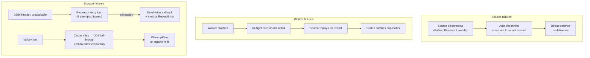

# Murmur: Design and Implementation

> Status: design document &middot; Audience: engineers integrating, extending, or operating Murmur &middot; Updated: 2026-05

## How to read this document

`doc/architecture.md` is the pitch — why Murmur exists, what it isn't, the
shape of the original plan. This document is the deep treatment: the
abstractions that hold the system up, the implementation choices behind
them, and an honest accounting of the rough edges. Where the architecture
doc says "monoids are structural", this doc says how the dispatch table is
built, where it can fail, and what would have to change to add a new
backend. Where the architecture doc says "Bootstrap → Live → Replay are one
DSL", this doc walks the actual handoff token, the resume protocol per
source, and the failure modes when a worker dies mid-cutover.

Read `doc/architecture.md` first if you haven't. Read
`doc/search-integration.md` after, if your problem touches search.

`STABILITY.md` is the running inventory of what's experimental and what's
sharp. The two should agree; if they don't, `STABILITY.md` wins because it
moves more often.

## Table of contents

1. [Problem statement](#1-problem-statement)
2. [The keystone abstraction: structural monoids](#2-the-keystone-abstraction-structural-monoids)
3. [The Summingbird lineage](#3-the-summingbird-lineage)
4. [Pipeline DSL](#4-pipeline-dsl)
5. [Execution model](#5-execution-model)
6. [Lambda runtimes](#6-lambda-runtimes)
7. [State stores](#7-state-stores)
8. [Query layer](#8-query-layer)
9. [Observability](#9-observability)
10. [Bootstrap to live handoff](#10-bootstrap-to-live-handoff)
11. [Backfill via Spark Connect](#11-backfill-via-spark-connect)
12. [Wire contracts](#12-wire-contracts)
13. [Operational shape](#13-operational-shape)
14. [Failure model](#14-failure-model)
15. [Performance characteristics](#15-performance-characteristics)
16. [Testing philosophy](#16-testing-philosophy)
17. [Frontiers](#17-frontiers)

## 1. Problem statement

### 1.1 What Murmur is for

Murmur is a Go framework for **streaming aggregations with structural
monoids**. The narrow problem it solves: given a high-rate event stream
(Kinesis, Kafka, DDB Streams, SQS, or any combination), maintain
per-entity counters / cardinality estimates / top-K sketches that:

- merge correctly under at-least-once delivery (because every distributed
  source is at-least-once in practice),
- expose a generic gRPC query layer with point reads, batch reads,
  sliding-window reads, and absolute-range reads,
- can be backfilled from a snapshot or replayed from an archive without
  duplicating pipeline logic,
- and run on AWS-native primitives (Lambda, ECS Fargate, DynamoDB, S3,
  Kinesis, SQS, DDB Streams) with bounded operational footprint.

The narrow problem is exactly the shape Twitter solved with Summingbird in
2013, restated for Go-shop AWS deployments in 2026. The same underlying
insight — *if your aggregation is a monoid, you can reuse the same
combine logic across batch, streaming, snapshot, and replay* — turns out
to be the only insight you actually need to make the rest of the
framework fall into place. Sections 2 and 3 walk that out.

### 1.2 What Murmur is deliberately not

Murmur is not a streaming engine. It does not own a scheduler, a watermark
machine, a checkpoint protocol, or a window-trigger model. The phrase that
keeps appearing in the source comments is "we are not building Flink in
Go." Streaming engines own the shape of computation; Murmur owns the
shape of *aggregation* and lets the underlying source — franz-go,
aws-sdk-go-v2, the Lambda runtime — own the shape of computation.

Concretely, Murmur explicitly does not:

- **Provide event-time watermarks or out-of-order processing semantics.**
  Bucket assignment is based on a single timestamp per record (event-time
  if available, processing-time otherwise). Late-arriving events fall into
  the bucket whose ID matches their timestamp; whether that bucket is
  still being aggregated, has been queried, or is being TTL'd is between
  the user, the storage layer, and the laws of physics.
- **Provide stream-stream joins, stream-table joins, or any join.**
  Joining is a different problem and the abstractions that support it
  (versioned state, watermarks, holistic operators) are exactly the ones
  Murmur is choosing not to ship. Use Flink (or Managed Service for
  Apache Flink) when you need joins.
- **Provide exactly-once stream processing.** The Phase 1 default is
  at-least-once with optional per-record dedup
  (`pkg/state/dynamodb.NewDeduper` + `streaming.WithDedup`). Exactly-once
  via DDB transactions is queued behind one or two real users who can't
  tolerate the dedup window's edge cases.
- **Provide a unified deployment story for non-AWS clouds.** The Terraform
  modules under `deploy/terraform/modules/` target AWS. The Go code is
  cloud-agnostic insofar as the source / state / cache interfaces are,
  but the operational story (Lambda runtimes, ECS Fargate, DDB Streams)
  is AWS-shaped and intentionally so.
- **Provide a vector store, a feature store, an OLAP cube, or a
  time-series database.** The integration patterns for those — search
  indices in `doc/search-integration.md`, OLAP engines in the same doc's
  "adjacent solutions" section — are spelled out elsewhere.

### 1.3 Who Murmur is for

Two audiences, both real:

**The Go shop on AWS that wants a counter framework, not a platform.**
Most product teams have one or two pipelines they care about — daily
unique users, top posts in last 24h, like counts, view counts, follower
counts. They have Kinesis or Kafka in the data path already; they have
DynamoDB; they don't want to stand up an EMR cluster, learn Flink, or
run a JVM in production for what amounts to "sum the events, group by
key, expose a Get RPC." Murmur is meant to disappear into that team's
stack: import a package, configure a pipeline, deploy via the supplied
Terraform module, point the query service at it. Two days of
engineering, not two quarters.

**The platform team that needs many pipelines from one substrate.**
Murmur's keystone — structural monoids dispatched to backend-native
operations — was chosen specifically to make this audience feasible. A
single Murmur deployment can run dozens of pipelines, each with its own
key shape and monoid kind, sharing the streaming runtime, the state
table, the query service, and the deployment harness. The platform team
exposes a self-service surface ("declare a monoid, point at a source");
Murmur owns the rest.

### 1.4 What this document covers

The rest of this document is the deep design treatment. It assumes you
have the architecture doc fresh in your head and want answers to
specific implementation questions. Where the architecture doc is
prescriptive, this one is descriptive — it documents what's actually in
the source tree, why the choices were made, and where the seams are.

If you're skimming for a specific concern:

- *I want to add a new monoid.* Section 2.
- *I want to add a new source.* Sections 4.4 and 5.5.
- *I want to add a new state backend.* Section 7.
- *I want to write a new query shape.* Section 8.
- *I want to operate this in production.* Sections 13 and 14.
- *I want to know what's broken.* Section 17 plus `STABILITY.md`.

## 2. The keystone abstraction: structural monoids

Every other abstraction in Murmur is downstream of this one. Get this
section wrong and nothing else matters; get it right and the rest of the
framework is mostly mechanical.

### 2.1 What a structural monoid is

A monoid in Murmur is the trio defined in `pkg/monoid/monoid.go:36`:

```go
type Monoid[V any] interface {
    Identity() V
    Combine(a, b V) V
    Kind() Kind
}
```

`Identity()` returns the algebraic identity of `Combine` — the value
that, combined with anything, returns that thing. `Combine(a, b)` is the
associative binary operation; the laws are documented on the interface
and enforced via `pkg/monoid/monoidlaws` in CI for every built-in
monoid.

`Kind()` is what makes the monoid *structural*. It returns one of
roughly a dozen string-typed constants (`pkg/monoid/monoid.go:21-37`):
`KindSum`, `KindCount`, `KindMin`, `KindMax`, `KindFirst`, `KindLast`,
`KindSet`, `KindHLL`, `KindTopK`, `KindBloom`, `KindMap`, `KindTuple`,
`KindCustom`. A backend implementation reads `Kind()`, dispatches on the
constant, and emits the runtime-native operation. This is the single
piece of design that lets one monoid run as a DDB atomic ADD, a Spark
SUM aggregation, a Valkey INCRBY, and a Go closure all at once — not as
four separate implementations sharing a name, but as one Go-typed value
that backends interpret structurally.

The `KindCustom` escape hatch lets users plug in opaque Go closures.
Custom monoids work on Go execution backends (streaming, bootstrap,
replay, the Fargate executor) and *only* there — they're explicitly
opted out of Spark codegen, DDB atomic-ADD specialization, and Valkey
sketch acceleration. This is honest about the tradeoff: users get the
full expressive power of Go for the 5% of pipelines that need it,
without paying for it on the 95% that don't.

### 2.2 Why associativity is load-bearing

Murmur takes associativity seriously to the point of fuzzing it in CI.
The reason: every other property of the framework depends on it.

**At-least-once delivery is safe iff Combine is associative and commutative
on the redelivered subset.** When a Kafka or Kinesis source replays a
record after a worker crash, the framework either dedups it (via
`state.Deduper`) or applies it again. For idempotent monoids (Set, Min,
Max, Bloom) the second case is a no-op; for non-idempotent ones (Sum,
HLL, TopK), the framework must dedup. In either case the *underlying
guarantee* is associative-merge. If `Combine` were not associative —
e.g. `f(a, b) = (a + 2b)` — every redelivery would shift the answer by
unpredictable amounts and dedup would be the only option, with no
recourse for non-idempotent operations.

**Bucket-merge math at query time is safe because Combine is associative.**
A `GetWindow(last_30_days)` on a daily-bucketed pipeline reads 30
buckets and folds them via the monoid's Combine. If Combine weren't
associative, the order of fold would change the answer, and concurrent
readers might see different orderings of the same buckets. Associativity
makes the order irrelevant — every reader gets the same value because
every fold of the same set produces the same result.

**Cross-backend correctness depends on associativity.** When a Spark job
backfills 90 days of data into the shadow table and the streaming
runtime keeps writing into the live table, the swap protocol works
because both backends are computing the same monoid. The Spark backend
emits `SUM(...) AS v` and gets the right answer; the streaming backend
emits an atomic `ADD :delta` and gets the right answer; the two answers
agree because addition is associative and commutative. If Combine were
backend-specific, the swap would be a recipe for silent data loss.

**Window batching is safe because Combine is associative.** Murmur's
`streaming.WithBatchWindow` (`pkg/exec/streaming/runtime.go:78`)
accumulates per-key deltas in memory for a configurable window, then
flushes a single MergeUpdate per key per window. The deltas are
combined locally before the flush; the local fold + the remote fold
must produce the same result as folding all deltas remotely one at a
time. Associativity is exactly the property that makes that true.

The architecture doc says "associativity is load-bearing" in passing.
This document makes it explicit: associativity is the *invariant the
framework depends on for every nontrivial property*. The
`monoidlaws.TestMonoid` harness in `pkg/monoid/monoidlaws/laws.go` is
not a test of test infrastructure — it's a test of the framework's
core contract.

### 2.3 Identity is harder than it looks

The interface is symmetric — `Combine(Identity, x) == x` AND
`Combine(x, Identity) == x` — but the implementation is where bugs hide.

The cautionary tale lives in PR-3 (referenced in `STABILITY.md:46-51`):
the original `Min` and `Max` monoids used `V`'s zero value as Identity.
For `int64`, that's `0`. So `Min(0, 5) == 0`, which is correct only if
`0` is a real observation; if no value has been seen yet, we want
`Min(unset, 5) == 5`, not `0`. The fix was to lift the value type:
`pkg/monoid/core.Bounded[V]` carries a `Set bool` flag, so
`Bounded[V]{Set: false}` is a genuine identity wrapper. Users construct
real values via `core.NewBounded(v)`; the lifted `Min`/`Max` monoids
then operate on `Bounded[V]` rather than `V` directly.

The same shape recurs for `Decayed`. The exponential-decay monoid
(`pkg/monoid/compose/decayed.go`) is `(value, timestamp)` pairs, and the
"no value yet" state has to be distinguishable from a legitimate
`(0.0, time.Unix(0, 0))` observation. The fix is the same: an explicit
`Set bool` field on the `Decayed` struct. The monoid's `Identity()`
returns `Decayed{Set: false}`, and `Combine` treats unset operands as
the identity element.

The lesson generalizes: any monoid whose value space includes a "natural"
zero needs to be careful about whether that zero is the identity or a
real observation. The `monoidlaws` harness catches this — it specifically
checks `Combine(Identity, x) == x` for many sample `x` values, which
means it'll fail if Identity is misclassified — but only if the test is
wired up. **Custom monoid authors must wire up the laws test.**

### 2.4 Backend dispatch in practice

A backend reads `Kind()` and decides how to translate Combine into a
native operation. The exhaustive dispatch table today, by backend:

| Kind | DDB | Valkey | Spark | Go |
|---|---|---|---|---|
| `KindSum` (int64) | atomic `ADD` (`Int64SumStore`) | atomic `INCRBY` (`Int64Cache`) | `SUM(...)` (sparkconnect SQL) | `+` |
| `KindCount` | atomic `ADD` | atomic `INCRBY` | `COUNT(*)` or `SUM(1)` | `+` |
| `KindMin`/`KindMax` | CAS read-modify-write (`BytesStore`) | not yet | `MIN`/`MAX` aggregation | `Bounded` lift |
| `KindFirst`/`KindLast` | CAS RMW | not yet | argmin/argmax with timestamp | timestamp compare |
| `KindSet` | CAS RMW | not yet | `collect_set` | map union |
| `KindHLL` | CAS RMW | RMW with caller-supplied byte-monoid (`BytesCache`) | HLL UDAF (codegen, Phase 2) | axiomhq merge |
| `KindTopK` | CAS RMW | RMW via `BytesCache` | TopK UDAF (codegen, Phase 2) | Misra-Gries merge |
| `KindBloom` | CAS RMW | RMW via `BytesCache` | Bloom UDAF (codegen, Phase 2) | xor-merge |
| `KindMap`/`KindTuple` | CAS RMW | RMW via `BytesCache` | per-component | recursive |
| `KindCustom` | CAS RMW | RMW via `BytesCache` | unsupported | user closure |

The two interesting cells are the diagonal extremes:

- **`KindSum` on DDB** is the framework's fastest path. Atomic
  `UpdateItem ADD` requires no read, no CAS, no application-side race
  resolution. `pkg/state/dynamodb.Int64SumStore.MergeUpdate` issues
  `ADD :delta` and returns; with no read in the path, the only contention
  is at the DDB partition level (which DDB handles via adaptive capacity).
  This single specialization is what makes Murmur viable for high-rate
  counter pipelines without a Valkey accelerator in front.
- **`KindCustom` everywhere** is the slow but expressive path. CAS RMW
  on DDB is order-of-magnitude slower than atomic ADD because each
  MergeUpdate is 1 GetItem + 1 conditional PutItem + retry-on-conflict.
  For pipelines with mostly-cold keys this is fine; for pipelines with
  hot custom-monoid keys, configure a Valkey cache (see Section 7) to
  absorb the RMW storm.



The dispatch is *static* at pipeline construction time — the Store
implementation is chosen by the user (`Int64SumStore` for KindSum,
`BytesStore[V]` with the right monoid for the rest). It's not a runtime
switch. This was a deliberate design choice: Go's type system can't
express the relationship cleanly enough for compile-time dispatch, so
the user picks the right concrete store and the framework trusts them.
The cost of getting it wrong is loud — using `BytesStore` for a Sum
monoid is correct but ~50× slower than `Int64SumStore`, and the
performance characteristic is observable from any latency histogram.

### 2.5 Sketch monoids and bit compatibility

Three sketch monoids ship today: HyperLogLog
(`pkg/monoid/sketch/hll/hll.go`), Top-K via Misra-Gries
(`pkg/monoid/sketch/topk/topk.go`), and Bloom filter
(`pkg/monoid/sketch/bloom/bloom.go`). All three are `Monoid[[]byte]`
because their state is best stored as opaque bytes — the encoded form
of the sketch — and merged via decode-merge-encode.

The HLL monoid uses [axiomhq/hyperloglog](https://github.com/axiomhq/hyperloglog)
under the hood. The marshaled form is the axiomhq encoding, which is
bit-stable across versions of that library but **NOT compatible** with
Valkey's PFADD/PFCOUNT/PFMERGE encoding. This is the open question the
architecture doc flags: cross-runtime sketch portability.

The current resolution is honest: when a pipeline configures a Valkey
cache for an HLL pipeline, it uses `BytesCache` with the HLL monoid as
the byte-merger (so Valkey holds axiomhq-encoded sketches and the
client-side code merges them on read). PFADD/PFCOUNT acceleration is
not used. That gives correctness across all backends at the cost of
the Valkey-native sketch speedup. Phase 2 work is the conversion path:
either a portable encoding (HLL++ canonical) for state stored in DDB,
or a bidirectional translator at the Valkey boundary. Both are
non-trivial because the dense and sparse representations differ
between encodings.

The lesson here for monoid authors: **if your monoid is byte-encoded,
the encoding is part of the contract**. Two backends "implementing the
same HLL" agree only if they produce the same bytes for the same set of
inputs. The framework doesn't enforce this; it can't, because byte
stability is a property of an external library. Instead, it's tested
via cross-backend round-trips in `test/e2e/` and tracked via
`STABILITY.md`'s "cross-runtime encoding portability not yet proven"
note for sketches.

### 2.6 Composition: Map, Tuple, and Decayed

Three composition monoids let users build aggregations without writing
custom code (`pkg/monoid/compose/`):

- **`MapMerge[K, V]`** is the per-key Combine of an inner monoid V over
  a map. Identity is the empty map. Combine merges keys; values for
  duplicated keys are combined via the inner monoid. Used for
  per-cohort counters where the cohort space is small enough to fit in
  memory (think "per-country counts of a specific event" with ~200
  countries).
- **`Tuple2[A, B]`** is the componentwise Combine of two inner monoids.
  Identity is `(IdentityA, IdentityB)`. The associativity of Tuple2 is
  immediate from the associativity of its components. Useful for
  pipelines that maintain two parallel aggregations on the same key
  (count + sum, for example).
- **`Decayed`** is the (value, timestamp) exponential-decay monoid
  documented in 2.3. It's the only built-in non-trivial composition
  with a quirk: in IEEE-754 floats, associativity holds within a few
  ULPs but is not bitwise. The `monoidlaws.WithEqual` option lets the
  test harness use approximate equality for this monoid. This is
  honest: the monoid laws hold in real arithmetic, and the float
  implementation is the closest approximation we get.

These compose with each other. `MapMerge[string, Tuple2[Sum, HLL]]` is
a valid monoid: per-cohort, maintain both the event count and the
unique-user HLL. The structural Kind for compositions is `KindMap` or
`KindTuple`; backends that recognize them recurse into the inner
monoids' kinds. Backends that don't fall back to the byte-encoded
generic path.

## 3. The Summingbird lineage

Murmur is "spiritual successor to Summingbird" in the README, and the
phrase is not marketing. The design choices below trace directly to
Summingbird's [original
paper](https://dl.acm.org/doi/10.14778/2733004.2733010) and the
production lessons Twitter shared in the years that followed. This
section is a short, opinionated walk through which ideas were borrowed,
which were rejected, and where Murmur diverges.

### 3.1 What Summingbird did right

Summingbird's central claim — *write the aggregation logic once as a
monoid and we'll generate batch (Hadoop) and streaming (Storm)
executors that produce the same result* — is the load-bearing idea
Murmur reuses verbatim. The two contributions that turned out to be
durable:

1. **Monoids as the unit of cross-runtime correctness.** Without a
   shared algebraic abstraction, "batch and streaming compute the same
   thing" is a manual claim that has to be re-verified for every
   pipeline. With monoids, "batch and streaming compute the same
   thing" reduces to "Combine is associative and the backends both
   implement Combine," which is checkable in CI and uniform across
   pipelines.
2. **Lambda-architecture-as-deployment-mode.** Summingbird treated
   "batch view + realtime delta" not as a different programming model
   but as a *deployment posture* of the same monoidal pipeline.
   Murmur's `pkg/query.LambdaQuery[V]` is the same idea in 50 lines of
   Go: two stores, one monoid, query-time merge.

### 3.2 What Summingbird got wrong (in retrospect)

Three choices Summingbird made that Murmur deliberately doesn't:

1. **Compiling to Storm.** Storm was the streaming engine of 2013;
   it's a relic in 2026. Summingbird's Storm runner was tied to
   Storm's tuple model, its at-least-once-with-acks semantics, and its
   topology-launch protocol. Murmur deliberately does not compile to
   any streaming engine. The streaming runtime is a single-goroutine
   loop in `pkg/exec/streaming/runtime.go`, the Lambda runtimes are
   AWS-supplied, and the Spark Connect path uses Spark Connect's
   normal Go API. There's no codegen-to-stream-engine because there's
   no stream engine in the way.
2. **A separate "Producer" abstraction for streaming sources.**
   Summingbird abstracted source semantics through its `Producer`
   type, which subsumed both batch and streaming. The cost was that
   batch and streaming "looked the same" syntactically but had
   subtly different runtime semantics — backpressure, watermarks,
   commit boundaries. Murmur instead has one explicit `source.Source[T]`
   interface (`pkg/source/source.go`) for streaming, one explicit
   `snapshot.Source[T]` interface (`pkg/source/snapshot/snapshot.go`)
   for bootstrap, and one explicit `replay.Driver` for archive
   replay. They share a record shape but the abstractions are
   separate, because the runtime semantics are separate.
3. **Compiling user-supplied Scala UDFs.** Summingbird supported
   arbitrary Scala closures inside aggregations; the cost was
   classpath-management hell across the Storm and Hadoop runtimes.
   Murmur's `KindCustom` is the analogous concept but is restricted
   to Go execution backends *by design*. Spark codegen sees only
   structural monoids; if the user's monoid is custom, they don't get
   Spark dispatch. This trades expressiveness for operational sanity.

### 3.3 What Murmur adds that Summingbird didn't have

Three first-class concerns that didn't exist in Summingbird's world:

1. **Windowed monoids.** Summingbird had time-bucketing as a manual
   pattern users built on top. Murmur ships it as a first-class
   wrapper (`pkg/monoid/windowed.Config`). The bucket math, TTL
   integration with DDB, and sliding-window query merge are all in
   the framework.
2. **AWS-native Lambda runtimes.** Summingbird had Storm and Hadoop;
   Murmur has Lambda triggers for Kinesis, DDB Streams, and SQS
   (`pkg/exec/lambda/{kinesis,dynamodbstreams,sqs}`). The same
   pipeline definition runs as a long-lived ECS Fargate worker or as
   a Lambda handler with no code changes — the runtime adapts.
3. **A generic query layer.** Summingbird had user-built query
   services. Murmur's `pkg/query` and `pkg/query/grpc` are a generic
   read layer with point reads, batch reads, sliding-window reads,
   absolute-range reads, and singleflight coalescing built in. This
   was on Summingbird's "future work" list and never landed; it's
   what `doc/architecture.md` calls "the layer nobody else has built."

### 3.4 What's still on the cutting room floor

A few Summingbird ideas that didn't make Murmur and probably won't:

- **Implicit batch-streaming reconciliation.** Summingbird ran the same
  job in both modes simultaneously and reconciled at query time.
  Murmur's lambda mode (`pkg/query.LambdaQuery`) does the read-side
  merge but doesn't auto-deploy the batch-and-streaming pair; that's a
  user-space orchestration concern.
- **Cross-monoid query rewrites.** Summingbird's planner could
  decompose a Top-K query into a sketched Top-K + an exact tail.
  Murmur doesn't do query rewrites; the monoid you pick is the
  monoid you get.
- **A unified DSL for batch SQL and streaming aggregation.** Summingbird
  had a single Scala DSL. Murmur splits the responsibility:
  `pkg/pipeline` is the streaming DSL and the sparkconnect executor
  takes user-supplied SQL (`pkg/exec/batch/sparkconnect.RunInt64Sum`).
  The Phase 2 plan (in the architecture doc) is to codegen Spark SQL
  from structural monoids; that would close the gap, at the cost of a
  templating engine the framework would have to maintain.

The summary is unsentimental: Murmur takes the two ideas from
Summingbird that turned out to matter (monoids as cross-runtime
correctness, lambda-as-deployment-mode), drops the parts that were
specific to 2013 infrastructure (Storm codegen, Scala UDFs, batch-DSL
unification), and adds the parts that 2026-era cloud-native counter
pipelines actually need (windowed monoids, Lambda runtimes, generic
query layer).

## 4. Pipeline DSL

The DSL is the user's first contact with Murmur, and the choices it
encodes shape what the rest of the framework can do. This section walks
the surface, the generics tradeoffs, and the multi-layer split between
the verbose `pkg/pipeline` builder and the `pkg/murmur` preset facade.

### 4.1 The two layers

Murmur ships two DSL layers because the same shape isn't right for
every user.

**Layer 1: `pkg/pipeline.Pipeline[T, V]`** is the verbose, fully
explicit builder. Every dimension of the pipeline — record type `T`,
value type `V`, monoid, source, store, cache, windowing — is set via
named methods on a single `*Pipeline[T, V]` value, then `Build()`
validates and returns the pipeline. This is the layer custom monoids
flow through and the layer the runtimes consume internally.

**Layer 2: `pkg/murmur.Counter[T] / UniqueCount[T] / TopN[T]`** is a
preset facade for the three most common shapes (Sum-counter, HLL
unique-count, Misra-Gries top-N). The preset infers the monoid and
value type from the shape; users only configure the dimensions that
vary across pipelines (name, source, key extractor, store, optional
window). Internally the preset delegates to `pkg/pipeline`; the result
is a fully equivalent `pipeline.Pipeline[T, V]`.

Why two layers? Because the 90% case is a Counter pipeline and the
verbose builder forces that 90% case to spell out parameters that are
fixed by the preset. The `Counter[T]` facade reduces a 6-line pipeline
construction to 3, and reduces the cognitive load of "what's the right
monoid for this counter" to zero. The verbose builder remains for the
10% of pipelines that need a custom monoid, a Tuple2, a hierarchical
fan-out, or anything else the presets don't cover.

The architecture doc speculated about typed-per-stage builders ("a
tower of stage-typed builders"). The current implementation deferred
that intentionally — Go's generics can express it but the syntax cost
is high, and real users haven't hit a case where the tower would catch
something the current builder doesn't. If that case appears, the layer-1
DSL is where it'd land.

### 4.2 Generics: explicit at construction, inferred everywhere else

Murmur is a generics-heavy codebase. Type parameters appear on
`Pipeline[T, V]`, `Source[T]`, `Store[V]`, `Cache[V]`, `Monoid[V]`,
`Encoder[V]`, and a long tail of helpers. The choice point is whether
to put the parameters at the *construction* site (`NewPipeline[T, V]`)
or at every *operation* site, and the convention is firmly "at
construction":

```go
pipe := pipeline.NewPipeline[Event, int64]("page_views").
    From(src).
    Key(func(e Event) string { return e.PageID }).
    Aggregate(core.Sum[int64]()).
    StoreIn(store).
    Build()
```

vs. the alternative where every method takes its own parameters:

```go
// not how it works
pipe := pipeline.NewPipeline("page_views").
    From[Event](src).
    Key[Event](func(e Event) string { return e.PageID }).
    Aggregate[Event, int64](core.Sum[int64]()).
    ...
```

The first form is what shipped. The cost: users have to declare `T`
and `V` upfront when they probably know `T` from `src` and `V` from the
monoid. The benefit: the type parameters propagate through the chain,
so Go's inference handles every method parameter without explicit
typing. In practice this is a clear win for the 90% case where users
follow the canonical chain order.

The presets in `pkg/murmur` go further: `Counter[T]` *only* takes the
record type, because `V = int64` is fixed by the preset. This makes
the canonical Counter pipeline syntactically minimal:

```go
pipe := murmur.Counter[Event]("page_views").
    From(src).
    KeyBy(func(e Event) string { return e.PageID }).
    StoreIn(store).
    Build()
```

The trade is real: type-parameter-at-construction means `Build()` is
where validation errors appear, not at the call sites. A wrong-type
`StoreIn` is a compile error rather than a runtime error, but the
compiler points at `Build()` (the last line), not at the offending
`.StoreIn` call. This is acceptable in practice because the error
messages still name the conflicting types; no one's in doubt about
which line is wrong.

### 4.3 KeyBy and KeyByMany: the multi-key extension

Most aggregations are "for each event, contribute to one key." A
notable minority — hierarchical rollups — are "for each event,
contribute to N keys at once." Both shapes share the rest of the
pipeline (source, value extractor, monoid, store, cache); only the
key-extraction step differs.

The DSL exposes this as two mutually-exclusive methods:

- **`KeyBy(fn func(T) string)`** sets a single-key extractor. The
  event contributes its value to exactly one entity in the state
  store.
- **`KeyByMany(fn func(T) []string)`** sets a multi-key extractor.
  The event contributes its value to every key in the returned slice.

When both are set, `KeyByMany` wins (documented at
`pkg/pipeline/pipeline.go:73`). The runtime side is in
`pkg/exec/processor.MergeMany` (`pkg/exec/processor/processor.go:178`):
one call iterates the keys, doing one MergeUpdate per key. For
hierarchical pipelines, this is the natural shape — the rollup
expansion is a property of the pipeline, not of the runtime.

The hot use case lives in `doc/search-integration.md`'s "Composing
patterns" section: emit per-post, per-(post, country), per-country, and
global rollups from one event. Each rollup level becomes a key in the
emitted slice; the DDB Streams projector receives one stream record
per emitted key and dispatches each to its own OpenSearch field.

The cost of `KeyByMany` is linear in the number of emitted keys, and
the per-event work is N MergeUpdates rather than 1. For tightly-bounded
rollup hierarchies (post → cohort → global, ~3-5 keys) this is fine.
For very wide fan-outs (per-(user, post) rollups across millions of
users), the cost shape becomes wrong and the pipeline should be
restructured — typically to use a different aggregation primitive
(collaborative filtering, matrix factorization) rather than a counter
fan-out.

### 4.4 The four required dimensions, plus the optional ones

Every pipeline declares four required dimensions:

1. **A name** (passed to `NewPipeline` or the preset constructor). The
   name is used as the basis for state-table prefixes, metrics labels,
   and the generated gRPC service name. It must be stable across
   deployments — renaming a pipeline is equivalent to forking it.
2. **A source** (`From`). Sources implement `pkg/source.Source[T]` and
   produce `source.Record[T]` with an EventID, a value, and an Ack
   callback. Section 5.5 walks the source contract in depth.
3. **A key extractor** (`Key` / `KeyBy` for single-key, `KeyByMany`
   for multi-key). Keys are always strings; users encode composite
   keys (`pageID + "|" + region`) themselves. The string-key choice
   matches DDB's partition-key shape and avoids an awkward
   marshaling layer.
4. **A primary store** (`StoreIn`). Stores implement
   `pkg/state.Store[V]`. The store is where MergeUpdate writes land
   and where the query layer reads from. Section 7 covers the
   contract.

Optional dimensions:

- **A value extractor** (`Value`, on the verbose builder). For
  Counter pipelines the value is implicit (every event contributes
  `1` of `int64`); for HLL the value is a singleton sketch; for
  custom monoids the user must supply a `func(T) V`.
- **A monoid** (`Aggregate`, verbose builder; implicit in presets).
  The monoid determines the value type, the dispatch shape, and the
  algebraic semantics.
- **A windowing config** (`WindowDaily(retention)`,
  `WindowHourly(retention)`, `WindowMinute(retention)`, or
  `Window(custom)`). Adds the bucket-ID dimension to state keys;
  enables `GetWindow` and `GetRange` queries. Section 4.6 covers the
  bucket math.
- **A read cache** (`Cache`). Optional Valkey-backed accelerator for
  hot reads / RMW absorption. Section 7 covers the cache contract.
- **A query config** (`ServeOn`). Configures the auto-served gRPC
  endpoint. Optional in the sense that the user can serve the query
  layer themselves via `pkg/query/grpc.NewServer` — the pipeline-side
  setting is convenience.

The required-vs-optional split is enforced at `Build()`. Missing a
required dimension fails immediately with a named error. Setting
optional dimensions you don't need is a no-op.

### 4.5 The preset layer: what `pkg/murmur` does

The presets do three things beyond delegating to `pkg/pipeline`:

1. **Fix the value type** so the user doesn't declare it.
   `Counter[T]` is `Pipeline[T, int64]` under the hood;
   `UniqueCount[T]` is `Pipeline[T, []byte]` with the HLL monoid;
   `TopN[T]` is `Pipeline[T, []byte]` with the Misra-Gries monoid.
2. **Supply the value extractor** for the canonical case. `Counter`'s
   value extractor is `func(T) int64 { return 1 }`. `UniqueCount`
   takes a `func(T) string` element extractor, lifts it to a
   singleton HLL on each event. `TopN` takes a `func(T) string`
   element extractor and lifts it to a `(element, 1)` Misra-Gries
   update.
3. **Smooth the windowing API** so users don't have to import the
   `pkg/monoid/windowed` package. `b.Daily(retention)` is the
   chained version of setting a `windowed.Daily(retention)` config
   on the underlying pipeline.

The presets are intentionally conservative: they cover the cases real
users hit, and that's it. The escape hatch is "use `pkg/pipeline`
directly" — the preset is not a wall, just a fast path. Users who need
a Min-counter or a Tuple2 pipeline drop to layer 1 without ceremony.

A small pattern that comes up in the worked examples: the
`page-view-counters` example uses `Counter[T]`; the
`mongo-cdc-orderstats` example uses the verbose builder because it
needs a Sum over a typed `OrderTotal` field, which the preset's
"every event contributes 1" shape doesn't fit. Both compile, both
deploy via the same Terraform module, both serve the same query
layer. The DSL split is invisible at the boundary.

### 4.6 Windowing: bucket math and TTL integration

`pkg/monoid/windowed.Config` is two fields and a granularity:

```go
type Config struct {
    Granularity    time.Duration
    Retention      time.Duration
    EventTimeField string
}
```

`Granularity` is the bucket size — 24h for daily, 1h for hourly, 1m for
per-minute. `Retention` is how long buckets persist before DDB TTL
evicts them. `EventTimeField`, when set, names a struct field on the
record from which the runtime extracts a timestamp; when empty,
processing-time is used.

Bucket assignment is `BucketID(t) = t.UnixNano() / Granularity.Nanoseconds()`
(`pkg/monoid/windowed/windowed.go:54-60`). Buckets are tumbling and
aligned to the Unix epoch. The implication: bucket 0 is "the first
bucket since 1970" for any granularity, not "the bucket containing
midnight today." This matters for queries — `GetWindow(now,
24*time.Hour)` is "the most recent 24h-worth of buckets at the
configured granularity," which spans bucket boundaries cleanly because
all bucket IDs are deterministic functions of timestamps.

The retention is enforced at write time: when MergeUpdate writes to
bucket B at time T, the underlying DDB row's TTL is set to
`T + Retention` (`pkg/state/dynamodb/store.go`). DDB's native TTL feature
deletes rows whose TTL has elapsed; the deletion is asynchronous (DDB
documents up to 48h delay) but free. Murmur exploits this for free
bucket eviction past the retention horizon, with no application-side
sweep job.

The query layer side is in `pkg/query.GetWindow` and `GetRange`
(`pkg/query/window.go`). Both compute a bucket-ID range, BatchGetItem
all the buckets, and fold via the monoid Combine. The fold is in stable
order (bucket IDs ascending) which doesn't matter for the result
(Combine is associative) but does matter for reproducibility when
debugging.

The cost note in the source is honest: "for fine-grained windows the
bucket count can be large (e.g., a 'last 30 days' query on hourly
buckets reads 720 items)." For sketches, that's 720 sketch merges per
query, which is non-trivial CPU. The architecture doc flags pre-rolled
"last-7-days" / "last-30-days" buckets and Valkey-cached pre-merged
windows as Phase 2 mitigations. Today, the singleflight coalescing
layer in `pkg/query/grpc.Server` makes concurrent identical queries
share one underlying fold, which absorbs the worst case for hot
windowed reads.

The minute-granularity case is honestly uncomfortable: a "last 7 days"
query at minute resolution reads 10080 buckets. That's three round-trips
of `BatchGetItem` and 10080 sketch merges. `STABILITY.md:16` calls this
out: "minute-granularity has high read-amplification on long ranges."
The recommendation is to use minute granularity only for short-window
aggregations (last 5 min, last hour), and roll up to hourly or daily
for long-window queries. Hierarchical roll-up generation
(`Windowed[Sum]` at minute, `Windowed[Sum]` at hour, both fed by the
same source) is the cleanest answer when both fine and coarse queries
matter.

### 4.7 Validation and Build()

`Pipeline.Build()` is the validation point. Today it checks for missing
required dimensions and returns a descriptive error
(`pkg/pipeline/pipeline.go`). The Phase 2 plan calls for renaming this
to `Validate()` and adding deeper checks: that the monoid kind matches
the store implementation (no `KindSum` on `BytesStore`), that the
windowing config and the store agree on TTL semantics, that
`KeyByMany` is paired with a Store that supports per-key fan-out.
Today these are caught by integration tests; tomorrow they should be
caught by the type system or `Validate()`.

### 4.8 What the DSL doesn't try to express

A few things that would seem to fit a streaming DSL but deliberately
don't:

- **Filtering.** "Only events with `e.Tier == "premium"`" is naturally
  a stage-typed combinator (`.Filter(predicate)`), and Summingbird had
  one. Murmur doesn't, because the user can express the same thing in
  the value extractor: return `0` (the Sum identity) for events that
  shouldn't contribute. The cost is one synthetic write per filtered
  event; the benefit is a smaller DSL surface. For pipelines where the
  filter rate is a real problem, the user's source-side decoder
  pre-filters cheaper than the framework ever could.
- **Mapping.** "Project the record before aggregating" is the value
  extractor's job; it's not a separate stage. This is the same
  argument as filtering, and the same conclusion.
- **Joining.** Out of scope by design. Joins live in stream-processing
  engines, not aggregation frameworks.
- **Stateful per-event computation.** "If this is the user's first
  event ever, do X" is a different problem (online learning, fraud
  detection) and the abstractions that support it (windowed state
  keyed by something other than the aggregation key, branching
  output) are not Murmur's job.

The DSL is small on purpose. The abstractions it exposes — source, key,
value, monoid, window, store, cache — are exactly the ones that
generalize across all four execution modes (live, bootstrap, replay,
batch backfill). Anything that doesn't generalize is left out.

## 5. Execution model

A pipeline is a value. Running a pipeline is what the runtime does. The
key design decision is that the *same* pipeline value runs in four
different runtimes — streaming, bootstrap, replay, and the various
Lambda triggers — without the pipeline knowing which one it's in. The
runtimes share a single per-record processor
(`pkg/exec/processor.MergeMany`) that owns the at-least-once contract,
the retry / backoff loop, the dedup integration, and the metrics
surface.

This section walks the model.

### 5.1 The four runtimes

Five runtime entry points exist today:

| Runtime | Purpose | File |
|---|---|---|
| `streaming.Run` | Long-lived consumer reading from a `Source[T]` (Kafka, Kinesis) | `pkg/exec/streaming/runtime.go` |
| `bootstrap.Run` | One-shot driver scanning a `snapshot.Source[T]` (Mongo, JDBC, S3-dump) | `pkg/exec/bootstrap/runtime.go` |
| `replay.Run` | Archive replay through a `replay.Driver` (S3 JSON Lines, Kafka offset range) | `pkg/exec/replay/runtime.go` |
| `lambda/kinesis.NewHandler` | AWS Lambda handler for Kinesis triggers | `pkg/exec/lambda/kinesis/kinesis.go` |
| `lambda/dynamodbstreams.NewHandler` | AWS Lambda handler for DDB Streams | `pkg/exec/lambda/dynamodbstreams/dynamodbstreams.go` |
| `lambda/sqs.NewHandler` | AWS Lambda handler for SQS triggers | `pkg/exec/lambda/sqs/sqs.go` |

(Six entry points. The "Lambda runtime" is conceptually one mode with
three concrete event-source variants.)

All five take a `pipeline.Pipeline[T, V]` and produce a callable shape.
For the Run-style runtimes, the shape is a function that loops until
ctx is canceled. For the Lambda-style runtimes, the shape is the AWS
Lambda Go SDK handler signature for that trigger type.

**The pipeline itself is unaware of which runtime is hosting it.** The
runtime sees the pipeline's monoid, key extractor, value extractor,
store, and cache; the runtime does *not* see the source (because the
streaming runtime drives the source while the Lambda runtimes are
driven *by* an event-source mapping the framework doesn't own). The
pipeline's `From(src)` is consumed by `streaming.Run` and ignored by
the Lambda runtimes — they receive their records from Lambda's event
shape directly.

### 5.2 The single-goroutine processor and why it's that way

`pkg/exec/streaming/runtime.go`'s main loop is a sequential reader-fold
over the source channel: pull a record, decode, run the processor,
Ack, repeat. There's no per-partition goroutine pool, no fan-out
worker, no asynchronous flush thread (with one exception covered in
5.4). Single-goroutine.

The architecture doc and `STABILITY.md` are upfront about this:
"Phase-1 streaming processes records sequentially per worker.
Throughput ceiling is roughly 5–10 k events/s/worker against DDB-local
depending on item size. Scale horizontally with Kafka partitions until
per-partition parallelism lands."

Why single-goroutine? Three reasons, in priority order:

1. **Correctness under at-least-once.** A multi-goroutine processor
   has to coordinate its dedup, its commit boundaries, and its flush
   ordering. The single-goroutine version doesn't — every record is
   processed in source order, every Ack is in source order, and the
   batch-window flush (when enabled) collapses identical-key writes
   in arrival order. None of these properties are subtle when the
   processor is sequential. All of them get subtle the moment you
   parallelize.
2. **Bottleneck is rarely the processor.** In a counter pipeline,
   the time per record is dominated by the DDB MergeUpdate (1-5ms
   for atomic ADD, 5-20ms for CAS) and franz-go's Fetch batching
   (sub-millisecond per batched record). The processor itself —
   running the value extractor, calling the monoid — is sub-microsecond.
   Parallelizing the cheap part doesn't help when the expensive part is
   network-bound.
3. **Horizontal scaling is the real lever.** Kafka partitions are a
   first-class scaling primitive: more partitions = more workers =
   more throughput, and the per-partition single-goroutine model
   keeps each worker honest. Kinesis shards work the same way (with
   the caveat that Phase 1's Kinesis source is single-instance; KCL
   v3 is the Phase 2 fix). Scale-out beats parallelize-in for this
   workload class.

The decision is reversible. If real users hit the per-worker ceiling
and horizontal scaling is undesirable for some reason — typically cost
or partition count limits — per-partition parallelism inside a worker
is the obvious next step. The processor's interface
(`MergeMany(ctx, cfg, ...)` is already concurrent-safe at the
processor level; the source-side ordering is what would need
restructuring.

**Update — `WithConcurrency` shipped.** The concurrency option is now
available as an opt-in on `streaming.Run`:

```go
streaming.Run(ctx, pipe, streaming.WithConcurrency(8))
```

When `n > 1`, records are routed to N worker goroutines via
`hash(first-emitted-key) % N`, so same-key records always land on the
same worker. This preserves the per-key ordering invariant that the
single-goroutine version provided implicitly. Hierarchical-rollup
pipelines (`KeyByMany`) partition on the FIRST emitted key — a
"post:X" delta lands on the same worker as another "post:X" delta,
even when the records also fan out to country / global keys that
hash differently.

Benchmark numbers (against a sleep-injecting "slow store" with 5ms
per `MergeUpdate`, representative of DDB UpdateItem at moderate load):

| `WithConcurrency(N)` | Events/sec | Speedup |
|---|---|---|
| 1 (default) | 180 | 1× |
| 4 | 653 | 3.6× |
| 8 | 991 | 5.5× |
| 16 | 1920 | 10.7× |

Pure-CPU benchmarks (in-memory store) show no speedup at concurrency
above 1 because the runtime itself is faster than the store —
concurrency is a lever for I/O-bound workloads, not CPU-bound ones.

When NOT to raise concurrency: CAS-heavy stores on a single hot key
(BytesStore CAS contention is per-key, not cross-worker), or heavy
`WithBatchWindow` use (the aggregator's per-key lock already
serializes hot-key writes; concurrency adds dispatch overhead without
throughput gain).

### 5.2.1 Multi-pipeline fanout: `RunFanout`

The companion to `WithConcurrency`. While concurrency scales ONE
pipeline across N goroutines, `RunFanout` runs **N pipelines against
ONE shared source**:

```go
streaming.RunFanout[Event](ctx, src, []streaming.Bound[Event]{
    streaming.Bind[Event, int64](postCounterPipe),
    streaming.Bind[Event, int64](userCounterPipe),
    streaming.Bind[Event, []byte](trendingTopKPipe),
})
```

Use case: "many counters per event." One Kafka topic of like-events
drives per-post / per-user / per-region / trending pipelines. Without
fanout, each pipeline opens its own consumer-group connection (4×
broker load) or runs in its own worker process (4× deployment
surface). With fanout, one source pump tees records to N pipelines
via per-pipeline buffered channels.

`Bind[T, V]` hides the V (aggregation) type parameter behind a
closure so heterogeneous pipelines (one Sum/int64, one TopK/[]byte)
fit in a single `[]Bound[T]` slice.

**Counted-tee Ack semantics.** Each record's source-side Ack is
wrapped so it fires the underlying `source.Ack` only after EVERY
pipeline has called `.Ack()` on its copy. Implications:

- The slowest pipeline gates source offset advancement.
- On worker restart the source replays from the last fully-acked
  offset; pipelines that already processed see duplicates, dedup
  catches them.
- A stuck pipeline pins the source — same backpressure semantics as
  a single-pipeline `streaming.Run`, multiplied across N consumers.

This shape is what production "social counter" workloads need —
count-core-style "every event drives 4–8 different counters." See
`pkg/exec/streaming/fanout.go` and the `TestRunFanout_*` test suite.

### 5.3 The shared processor: `pkg/exec/processor`

Every runtime delegates the per-record contract to one place:
`pkg/exec/processor.MergeMany` and its single-key shorthand
`MergeOne` (`pkg/exec/processor/processor.go:80, 178`). This is the
keystone of the runtime layer.

The processor's job, in order:

1. **Dedup short-circuit.** If a `state.Deduper` is configured, claim
   the EventID via `MarkSeen`. If it was already claimed
   (`firstSeen=false`), record `<pipeline>:dedup_skip` and return nil.
   The record is *not* applied to the monoid, but the source-side Ack
   still fires (the caller does that on a nil return).
2. **Bucket assignment.** If the pipeline is windowed, compute the
   bucket ID from the event timestamp. The store's `Key.Bucket` field
   carries this; bucket 0 means "no window."
3. **MergeUpdate, with retry.** Apply the value extractor, run the
   monoid Combine via the store, repeat on error up to MaxAttempts.
   Backoff is exponential with full jitter (50ms base, 5s cap by
   default).
4. **Cache write-through.** If a `state.Cache` is configured, mirror
   the MergeUpdate to the cache. Cache failures are non-fatal — they
   record an error metric and continue. The cache is never
   ground-truth; if it's wrong, DDB is right and the cache will
   eventually agree (or be repopulated).
5. **Metrics.** Record the success / error / retry / dedup-skip event
   under the pipeline's name. The runtime supplies a
   `metrics.Recorder`; the default `metrics.Noop{}` discards
   everything.

The contract on return:

- **nil**: record processed (or duplicate-skipped). Caller Acks.
- **non-nil**: every retry exhausted. Caller decides — Lambda runtimes
  add to `BatchItemFailures`, the streaming runtime dead-letters and
  Acks past.

This is the single contract every runtime obeys. The streaming
runtime's loop is roughly 200 lines — most of that is option plumbing
and metrics — because the per-record work delegates to the processor.

The decision to expose `processor.MergeOne` and `MergeMany` as a
public package was deliberate. Out-of-tree drivers (a custom event
source, an SNS-fronted EventBridge handler, a NATS Jetstream consumer)
can sit on the same retry / dedup / metrics contract without forking
the logic. The processor is small, stable, and meant to be the
extension point for "I want to host a pipeline behind a runtime that
isn't in the box."

### 5.4 Write aggregation: `WithBatchWindow`

The single optional concession to a non-trivial runtime is
`streaming.WithBatchWindow(window, maxBatch)`
(`pkg/exec/streaming/runtime.go:78`). It enables a per-(entity, bucket)
delta accumulator: instead of issuing one MergeUpdate per record, the
runtime accumulates deltas in memory for `window` time, then flushes a
single MergeUpdate per key.

The motivation is hot-key throughput. A celebrity post receiving
50,000 like-events/sec lands as 50,000 MergeUpdates/sec to the same
DDB row, which DDB's adaptive capacity will eventually rate-limit.
With `WithBatchWindow(1*time.Second, 1024)`, the same 50,000 events
land as one MergeUpdate per second (carrying delta=50000), well within
DDB's per-partition limits.

The trade is real:

- **Latency.** A record's contribution to the visible state lags by up
  to `window`. For sub-second windows this is invisible; for 5s
  windows it's perceivable in "I just liked this; why doesn't the
  count reflect it?" UX. Pair with `fresh_read = true` on the query
  side for the read-your-writes case.
- **Crash durability.** Records are Ack'd to the source AFTER the
  batch flushes. A worker crash loses up to `window`-worth of in-flight
  records, which the source replays on restart. Dedup catches the
  redelivery.
- **Memory.** At most `maxBatch` records per (entity, bucket) before
  a forced flush, but the *number of concurrent keys* is unbounded.
  For high-cardinality pipelines (per-user keys, with long-tail
  behavior), keep `window` short so each batch stays small.

The flush goroutine is the sole concession to multi-goroutine logic in
the streaming runtime. The data structures it touches are mutex-guarded;
the flush ordering is FIFO within a key but unordered across keys.
Because Combine is associative and commutative for every monoid this
matters for, the unordered flush is correct.

When `WithBatchWindow` is unset, the runtime is fully sequential — the
processor handles every record inline. The default is unset for safety
(no surprising latency), and users opt in for hot-key pipelines where
the throughput cost matters more than the latency cost.

### 5.5 Sources and the record contract

Every source implements `pkg/source.Source[T]`:

```go
type Source[T any] interface {
    Read(ctx context.Context, out chan<- Record[T]) error
    Name() string
    Close() error
}
```

The source's job is to push `Record[T]` values onto `out` until ctx is
canceled or the source is exhausted. A `Record[T]` carries:

- `EventID string` — globally unique, used for dedup. Per-source
  formats: Kafka uses `<topic>:<partition>:<offset>`; Kinesis uses
  `<stream>/<shard>/<sequenceNumber>`; SQS uses `<arn>/<MessageID>` or
  a user-supplied override (FIFO content-dedup, upstream-key dedup).
- `Value T` — the decoded record body.
- `EventTime time.Time` — used for windowed bucket assignment.
  Sources fill this from their native timestamp (Kafka record
  timestamp, Kinesis ApproximateArrivalTimestamp, SQS SentTimestamp);
  the user's value extractor can override via the `EventTimeField`
  windowing config.
- `Ack func() error` — called when the record has been successfully
  processed (or duplicate-skipped). For Kafka, this marks the offset
  for commit; for Kinesis, this advances the per-shard checkpoint;
  for SQS, this implicitly happens via Lambda's batch protocol.

The contract is at-least-once. A source MAY redeliver a record if the
worker crashes before Ack; sources SHOULD NOT redeliver after Ack
unless the upstream is broken. EventID uniqueness across redeliveries
is the source's responsibility.

Sources today:

- **Kafka** (`pkg/source/kafka`): franz-go-backed consumer-group
  client. Single-goroutine consumer, AutoCommitMarks for offset
  management. Poison-pill records (decode errors) are silently
  dropped today; DLQ hook is a Phase 2 task per `STABILITY.md:20`.
- **Kinesis** (`pkg/source/kinesis`): aws-sdk-go-v2-backed shard
  fan-out. Single-instance, no checkpointing — a hard limit
  documented prominently. KCL v3 upgrade is Phase 2.
- **Snapshot sources** (`pkg/source/snapshot/{mongo,...}`): for
  bootstrap mode. Section 10 walks the handoff token shape.
- **Replay drivers** (`pkg/replay/{s3,...}`): for archive replay.

The Lambda runtimes don't use `Source[T]`. Instead they have a
`Decoder[T]` that converts the AWS event shape (Kinesis record, DDB
Streams change record, SQS message) to `T`. The decoder is the
runtime's escape hatch for source-specific record interpretation:
the DDB Streams decoder gets the whole change record so it can branch
on `EventName` and inspect `OldImage`; the SQS decoder gets the
message body and attributes so it can extract upstream IDs for
dedup.

### 5.6 Bootstrap mode

Bootstrap is a one-shot driver that reads from a snapshot source,
applies the same monoid Combine to the same store, and records a
*handoff token* the live runtime starts from after bootstrap completes
(`pkg/exec/bootstrap/runtime.go`). The pattern is Debezium's "snapshot
then stream" almost verbatim, walked in Section 10.

The runtime side is short: `bootstrap.Run(ctx, pipe, snapshotSource,
opts...)`. Internally it:

1. Calls `snapshotSource.CaptureHandoff(ctx)` to get the resume token
   the live source will start from.
2. Iterates `snapshotSource.Scan(ctx, out)`, feeding each record through
   the same `processor.MergeMany` the streaming runtime uses.
3. Returns the captured handoff token to the caller.

Re-running bootstrap is idempotent when a `Deduper` is configured:
each scan emits records with `EventID = doc._id`, dedup catches
re-emissions. Without dedup, bootstrap re-runs *will* double-count for
non-idempotent monoids — same caveat as the streaming runtime.

### 5.7 Replay mode

Replay is bootstrap's slightly different cousin: instead of a
snapshot source, it's an archive replay driver
(`pkg/replay/s3` for S3 JSON Lines today, with Kafka offset-range
replay deferred). The runtime is `pkg/exec/replay.Run(ctx, pipe,
driver, opts...)` and does the same processor.MergeMany dance per
record, with no handoff-token concept (replay is for backfilling into
a *fresh* state table, not for picking up after).

The fresh-table pattern is the reason replay exists separate from
bootstrap. Replay's typical use is "I have 90 days of S3-archived
events; build me a state table over those events; atomically swap
when complete." The bootstrap pattern is "my Mongo is the source of
truth; pre-populate live state from it." Both feed the same processor;
the difference is the source shape and the operational lifecycle.

Replay's metrics integration is incomplete (`STABILITY.md:28`); the
processor's metrics fire correctly but the per-driver progress
metrics aren't wired. This is a gap but not a blocker — the e2e
tests verify correctness directly.

### 5.8 Mode-switching at deploy time

A pipeline has no notion of "I'm in streaming mode." The deployment
chooses. A typical deployment shape:

1. **Day 1**: Run `bootstrap.Run` to populate state from the
   snapshot source. Capture the handoff token; persist it for the
   live runtime.
2. **Day 1, after bootstrap**: Start `streaming.Run` with the live
   source configured to begin from the handoff token. The pipeline
   is now in steady state.
3. **Backfill triggers**: Run `sparkconnect.RunInt64Sum` (or
   `replay.Run`) into a fresh shadow table. When complete, call
   `swap.Manager.SetActive` to advance the alias pointer.
4. **Production reads**: query against the alias, which always
   points to the current state table. Atomic swaps are invisible
   to readers.

This shape composes cleanly because every step uses the same
pipeline definition. The mode is the operational concern; the logic
is invariant.



The diagram is the model the runtimes implement. Section 10 walks
the bootstrap handoff in detail; Section 11 walks the Spark Connect
backfill; Section 13 walks the operational shape.

## 6. Lambda runtimes

The streaming runtime is the canonical "long-lived ECS Fargate worker"
shape. Lambda runtimes are the alternative: short-lived, AWS-driven,
event-source-mapping-fed handlers that host the *same* pipeline logic
behind an entirely different lifecycle. Three Lambda variants ship
today: Kinesis, DDB Streams, and SQS
(`pkg/exec/lambda/{kinesis,dynamodbstreams,sqs}`).

This section walks why Lambda is a first-class option, what the three
variants share, and where they diverge.

### 6.1 Why Lambda runtimes exist

Two reasons:

**Operational footprint for low-volume pipelines.** A pipeline
processing 100 events/sec doesn't justify a long-running ECS Fargate
worker. The fixed monthly cost of a Fargate task — even at the
smallest 0.25 vCPU / 0.5 GB shape — is roughly $10/month, plus the
networking and ALB cost if a query service is attached. A Lambda
function with a Kinesis trigger has no fixed cost; it pays per
invocation. For a long-tail of small pipelines (per-tenant counter
shards, infrequent dashboards), the Lambda variant is the right cost
profile.

**Event-source-driven pipelines that don't fit the streaming model.**
DDB Streams is the canonical case: change-data-capture from a DDB
table is naturally a Lambda trigger, not a long-poll consumer. SQS is
similar — visibility timeout + Lambda's batched-receive protocol map
cleanly to a handler shape and would be awkward to express as a
long-running consumer. Even Kinesis, which has a long-running consumer
shape (the streaming runtime supports it), is often cheaper to host
behind a Lambda trigger for moderate-rate streams.

The pipeline is invariant under runtime choice. Section 5.8's mode
diagram applies: the same `pipeline.Pipeline[T, V]` plugs into
`streaming.Run` for ECS Fargate or into `lambda/kinesis.NewHandler` for
Lambda, with no code change beyond the entry point.



### 6.2 What the Lambda variants share

All three variants share the per-record contract from Section 5.3:
delegate to `processor.MergeMany`, retry on transient error, dedup
when configured, fold to `BatchItemFailures` when out of retries.
They also share three structural choices:

**1. The Decoder pattern.** Each Lambda variant takes a
`Decoder[T] func(awsRecord) (T, error)` callback. The decoder maps the
AWS event shape (Kinesis record, DDB change record, SQS message) to
the pipeline's record type. This is the runtime's escape hatch for
source-specific interpretation:

- The Kinesis decoder takes raw bytes, typically `JSONDecoder[T]`.
- The DDB Streams decoder takes the whole change record, so the
  caller can branch on `EventName` (INSERT/MODIFY/REMOVE) and read
  `NewImage` / `OldImage` for the field projections.
- The SQS decoder takes the SQS message and returns `T`. The default
  EventID is `<arn>/<MessageId>`, but the decoder can override it
  (FIFO content-dedup, upstream-correlation-key dedup).

A decoder returning `ErrSkipRecord` is treated as "process succeeded,
no merge needed." A decoder returning any other error is a poison
pill: counted via `metrics.RecordError`, surfaced via
`WithDecodeErrorCallback`, the record is skipped (no
`BatchItemFailures` entry — Lambda would just redeliver, looping). The
poison-pill semantics are uniform across all three Lambda variants.

**2. BatchItemFailures partial-batch failure.** When configured (via
`FunctionResponseTypes=["ReportBatchItemFailures"]` on the
event-source mapping), Lambda redelivers only the failed records, not
the whole batch. The Murmur Lambda handlers populate the
`BatchItemFailures` slice with the EventIDs of records that exhausted
their retry budget; Lambda redelivers those on the next invocation.
This is the single most operationally important detail of the Lambda
runtime — without it, one bad record retries the entire batch
indefinitely. With it, one bad record is dead-lettered and the batch
proceeds.

The `ItemIdentifier` for `BatchItemFailures` differs by source:
Kinesis uses the record `SequenceNumber`, DDB Streams uses
`EventID`, SQS uses `MessageId`. The handlers fill the right shape
for each.

**3. Dedup-friendly EventID shapes.** Each variant produces an
EventID format suitable for `Deduper.MarkSeen`:

- Kinesis: `<stream>/<shard>/<sequenceNumber>` — globally unique
  across the stream's lifetime.
- DDB Streams: the stream record's `EventID` field — unique per
  stream record, ordering preserved within a shard.
- SQS: `<arn>/<MessageId>` by default, override-able.

The dedup contract is the same across all three: pass
`WithDedup(deduper)` to the handler constructor; the handler claims
the EventID before applying the merge. Re-deliveries (which happen
under `BatchItemFailures` partial-failure replay) are caught and
counted, not re-applied.

### 6.3 Kinesis Lambda

`pkg/exec/lambda/kinesis.NewHandler` is the simplest of the three.
It takes a pipeline, a `Decoder[T]`, and options (dedup, metrics,
retry, dead-letter), and returns the AWS Lambda Go SDK handler
signature for `KinesisEvent`:

```go
func(ctx context.Context, evt events.KinesisEvent) (events.KinesisEventResponse, error)
```

The handler iterates `evt.Records`, decodes each, runs through the
processor, and returns the response with `BatchItemFailures` populated
for any records that exhausted retries.

The pairing with `WithDedup` is deliberate. Lambda's
`BatchItemFailures` semantics mean that a partial-batch failure causes
the *successful* records before the failure to also be redelivered (in
parallel-trigger mode) or replayed from the failure forward (in
shard-order mode). Without dedup, those redeliveries double-count for
non-idempotent monoids. With dedup, they're absorbed cleanly.

The Phase 2 plan calls for a Kinesis-source-specific helper that takes
a configured Deduper and a pipeline and produces a ready-to-use
handler in fewer lines. Today, the wiring is explicit:

```go
handler, err := kinesis.NewHandler(pipe,
    decodeRecord,
    kinesis.WithDedup(deduper),
    kinesis.WithMetrics(rec),
    kinesis.WithMaxAttempts(5),
)
if err != nil { log.Fatal(err) }
lambda.Start(handler)
```

### 6.4 DDB Streams Lambda

`pkg/exec/lambda/dynamodbstreams.NewHandler` is the symmetric peer of
the Kinesis variant, with one structural difference: the decoder takes
the *whole* change record, not just bytes. The reason is that DDB
Streams records carry no raw byte payload — they carry a typed
`Change` with `NewImage`, `OldImage`, and `Keys` as
`map[string]events.DynamoDBAttributeValue`.

This shape is the right one for CDC pipelines. A typical decoder:

```go
func(rec *events.DynamoDBEventRecord) (Order, error) {
    if rec.EventName == "REMOVE" {
        return Order{}, dynamodbstreams.ErrSkipRecord
    }
    return decodeOrder(rec.Change.NewImage)
}
```

The decoder branches on `EventName` to ignore deletes, reads
`NewImage` for the canonical post-write state, and returns
`ErrSkipRecord` (a sentinel) for records that shouldn't aggregate.
The handler treats `ErrSkipRecord` as success — the record is
counted as processed but doesn't reach the monoid.

This is also the runtime that hosts `doc/search-integration.md`'s
Pattern B projector. The projector's "decode old + new images, apply
bucket function, decide to reindex" logic fits the decoder shape
naturally — though for the projector specifically, the simpler
"plain Lambda handler with no Murmur pipeline" shape is what gets
deployed in practice (the projector's Store is OpenSearch, not
Murmur's state, so the Murmur pipeline shape doesn't quite fit).

### 6.5 SQS Lambda

`pkg/exec/lambda/sqs.NewHandler` is the third variant. SQS is
different from the streaming sources in two ways:

**1. SQS has a native `SentTimestamp` per message.** The handler uses
this for windowed-bucket assignment, so delayed deliveries (visibility
timeout, requeue) land in the bucket of the original send time, not
the receive time. This matters: a message delayed by 2 hours under a
visibility-timeout retry shouldn't shift its contribution to a
different bucket.

**2. SQS has a `ContentDeduplicationId` for FIFO queues.** When the
upstream uses content-dedup (or has its own correlation ID), the SQS
EventID — `<arn>/<MessageId>` by default — is *not* the right dedup
key, because retries from the upstream system arrive as different
SQS messages with the same content-dedup ID. The
`WithEventID(fn func(sqs.Message) string)` option overrides the
default and pulls the upstream-stable ID out, so dedup catches
re-sends from the upstream.

These two SQS-specific concerns are why the SQS variant exists as a
distinct package rather than a config flag on the Kinesis variant.
The shapes are similar; the source-specific semantics are different
enough to deserve their own home.

### 6.6 Shared retry / metrics / dead-letter knobs

All three Lambda variants take the same option set as the streaming
runtime, applied to the underlying processor:

- `WithDedup(state.Deduper)` — claims EventIDs, short-circuits
  redeliveries.
- `WithMetrics(metrics.Recorder)` — wires events / errors /
  latencies under the pipeline name.
- `WithMaxAttempts(int)` — caps per-record retries (default 3).
- `WithRetryBackoff(base, max time.Duration)` — exponential backoff
  with full jitter.
- `WithDeadLetter(func(eventID, err))` — invoked when retries
  exhaust. The Lambda variants invoke this AND populate
  `BatchItemFailures`; users typically wire it to a structured-log
  sink for forensics.

The uniformity is the point. A pipeline that runs as a streaming
worker with `streaming.WithDedup(d)` deploys to a Lambda variant
with the same `lambda/kinesis.WithDedup(d)`; the underlying
processor.Config is the same, the dedup table is the same, the
metrics shape is the same. The runtime layer is thin glue around the
processor's contract.

### 6.7 When NOT to use the Lambda variants

The Lambda runtimes are not the right shape for every pipeline:

- **Sustained high throughput.** A pipeline with sustained
  >5k events/sec/partition is cheaper on a long-running ECS Fargate
  worker than on Lambda — Lambda's per-invocation overhead and
  per-request pricing dominate. The crossover varies with batch
  size and average record cost; benchmark before committing.
- **Heavy batching needs.** `WithBatchWindow` requires a long-lived
  process to accumulate deltas. Lambda's per-invocation lifecycle
  doesn't preserve in-flight state across invocations (warm-start
  notwithstanding); the batching context is gone the moment the
  function returns. For hot-key pipelines, the streaming runtime
  is the right shape.
- **Pipelines that need a `Cache`.** Today the cache is configured on
  the pipeline and the streaming runtime wires it. The Lambda
  variants don't currently invoke the cache — this is a gap and a
  Phase 2 task. For pipelines where Valkey acceleration matters,
  use the streaming runtime.

The decision matrix:

| Workload | Runtime |
|---|---|
| Long-tail low-volume pipeline (<500 events/sec) | Lambda |
| CDC from a DDB table | Lambda (DDB Streams variant) |
| FIFO SQS queue with upstream dedup | Lambda (SQS variant) |
| Pipeline needing `WithBatchWindow` for hot keys | streaming.Run |
| Pipeline needing a Valkey cache today | streaming.Run |
| Sustained high-rate Kinesis stream | streaming.Run (Phase 1, single-instance) or Lambda+KCL3 (Phase 2) |
| Bootstrap from a Mongo/DDB snapshot | bootstrap.Run |
| Backfill from S3 archive | replay.Run or sparkconnect |

## 7. State stores

DDB is source of truth. Valkey is a cache. The framework's central
invariant is that no system state is unrecoverable from DDB; if Valkey
is lost tomorrow, every pipeline can rebuild its accelerator state
from DDB. This invariant cascades through the design of both stores
and is the reason the Cache interface is structurally different from
the Store interface.

### 7.1 The Store contract

`pkg/state.Store[V]` is a four-method interface
(`pkg/state/state.go:21`):

```go
type Store[V any] interface {
    Get(ctx context.Context, k Key) (val V, ok bool, err error)
    GetMany(ctx context.Context, ks []Key) (vals []V, ok []bool, err error)
    MergeUpdate(ctx context.Context, k Key, delta V, ttl time.Duration) error
    Close() error
}
```

`Key` is `(Entity string, Bucket int64)`. Bucket 0 means "no
windowing"; non-zero buckets are the windowed-aggregation case.
`MergeUpdate` is the atomic Combine: the store implementation chooses
how to apply the delta — atomic ADD, conditional CAS, decode-merge-encode
— but the result is always the monoid Combine of the existing value
with the delta.

`Get` and `GetMany` are reads. The `ok` flag distinguishes "key
missing" (the monoid Identity is the right answer) from "key found
with zero value." This matters for monoids whose value space includes
zero — Sum's `0` is a real observation, not "missing" — and the
windowed query layer relies on the distinction to decide whether to
fold a missing bucket as Identity or to error.

`Close` is for resource cleanup. Stores that hold connections (DDB
client, Valkey client) close them on Close; stores that don't are
no-op closers.

The interface is intentionally narrow. Things deliberately not in the
Store contract:

- **Range / prefix scans.** Murmur's read patterns are point reads
  (`Get`, `GetMany`) and bucket-range reads (handled by the query
  layer composing multiple `Get` calls, not by a store-level scan).
  A `Scan` method on the store would push us toward DDB Query
  semantics, which differ across backends.
- **Transactions.** Per-record Combine is atomic at the store-level
  (atomic ADD, CAS); cross-record transactions are out of scope.
- **Versioning / multi-version concurrency.** The CAS path uses a
  version attribute internally but doesn't expose multi-version reads.
- **Subscriptions / change feeds.** DDB Streams is a separate AWS
  primitive consumed via the Lambda runtime; the Store doesn't
  expose its own change feed.

This narrowness is the reason swapping backends is mechanically
straightforward. A Postgres-backed Store, a ScyllaDB-backed Store, a
FoundationDB-backed Store all sit on the same four methods.
`STABILITY.md` flags Postgres and ScyllaDB as Phase 3 work gated on
real demand.

### 7.2 DynamoDB: the source of truth

Two DDB-backed Stores ship today:

- **`pkg/state/dynamodb.Int64SumStore`**: specialized for `KindSum`
  with `int64` values. MergeUpdate uses `UpdateItem ADD :delta`. No
  read in the path; no application-side race resolution; no CAS retry.
- **`pkg/state/dynamodb.BytesStore`**: generic CAS-backed Store for
  `[]byte` values. MergeUpdate is read-modify-write under a
  conditional write on a version attribute. Retries up to MaxRetries
  on conflict.

The split exists because the cost difference between the two paths is
order-of-magnitude. `Int64SumStore.MergeUpdate` is one DDB write call;
`BytesStore.MergeUpdate` is one read + one conditional write, plus
retry budget for contention. For high-rate counter pipelines, the
specialization is the difference between "DDB keeps up" and "DDB
becomes the bottleneck."

The schema is documented at `pkg/state/dynamodb/store.go:13`:

```text
PK pk (S)  — entity key
SK sk (N)  — bucket ID (0 for non-windowed)
   v  (N or B) — the value (NUMBER for sums, BYTES for sketches)
   ttl (N) — optional Unix-epoch-seconds TTL
   ver (N) — optimistic-concurrency version (CAS path only)
```

The `(pk, sk)` composite key encodes both the entity dimension and
the bucket dimension. Non-windowed pipelines use `sk = 0` for every
record; windowed pipelines use `sk = bucketID`. This means the
windowed pipelines' DDB rows are partitioned by entity (so all
buckets for one entity share a partition) and sorted by bucket-ID
within the partition (so bucket-range queries are efficient).

The `ttl` attribute is set on every windowed write to
`now + retention`. DDB's native TTL feature evicts rows whose TTL has
elapsed; eviction is asynchronous (DDB documents up to 48h delay) but
free. This is the only mechanism Murmur uses to expire data; there's
no application-side sweep job.

The `ver` attribute is the version counter for the CAS path. Each
successful CAS write increments it; the next read returns
`(value, version)` and the next write conditional-checks `ver ==
expected`. On `ConditionalCheckFailedException`, the store retries
from the read with backoff. The retry budget defaults to 8 attempts
with exponential backoff; under sustained CAS contention, the
retries surface as `ErrMaxRetriesExceeded` (`pkg/state/dynamodb/bytesstore.go:48`).

### 7.3 BatchGetItem and UnprocessedKeys

`Int64SumStore.GetMany` and `BytesStore.GetMany` use DDB's
`BatchGetItem` for read efficiency. The implementation is honest about
the DDB-side constraint: BatchGetItem can return *partial* results
when the response would exceed 16 MB, dropping some keys into
`UnprocessedKeys`. The store's job is to retry the unprocessed keys
with backoff until either everything is fetched or the retry budget
exhausts.

The retry loop is in `pkg/state/dynamodb/store.go`. It chunks 100
keys per BatchGetItem (the DDB hard limit), uses jittered exponential
backoff (50ms base, 5s cap), and gives up after `maxBatchAttempts = 8`
attempts (~32s of patience). On give-up, the unfetched keys are
returned with `ok = false` — same shape as "key missing" — and the
caller sees a clean partial response.

This matters for the query layer's `GetMany` shape and for the
windowed `GetWindow` / `GetRange` calls (which under the hood are a
single `GetMany` over the bucket range). The retry loop absorbs DDB's
transient hiccups; the caller sees either a complete response or a
clean degradation.

### 7.4 Deduper: a cousin of Store

`pkg/state/dynamodb.Deduper` (`pkg/state/dynamodb/dedup.go`) implements
`state.Deduper`:

```go
type Deduper interface {
    MarkSeen(ctx context.Context, eventID string) (firstSeen bool, err error)
}
```

It's not a `Store[V]` because the contract is structurally different
(a one-shot atomic claim, not an associative merge). The
implementation is a dedicated DDB table whose only job is to claim
EventIDs:

```text
pk  (S) — the EventID
ttl (N) — Unix-epoch seconds when the entry should be evicted
```

`MarkSeen` issues `PutItem` with `ConditionExpression
"attribute_not_exists(pk)"`. Concurrent claims by two workers race;
exactly one's PutItem succeeds (returns `firstSeen=true`); the other
gets `ConditionalCheckFailedException` (returns `firstSeen=false`).
DDB's atomic conditional write is doing the work — no application-side
locking, no fencing tokens.

The TTL is what makes the dedup table sustainable. Without TTL, the
table grows monotonically with the event stream; with TTL, entries
evict after a configurable horizon (default 24h). The horizon must be
greater than the source's max delivery latency — a source that can
delay a record by 36h needs a 36h dedup horizon.

The 16-way race test (`pkg/state/dynamodb/dedup_test.go`) verifies the
"exactly one MarkSeen wins" property under concurrent contention. This
is the test the framework regression-guards against — getting dedup
wrong produces silent data corruption.

### 7.5 Valkey: the cache

`pkg/state.Cache[V]` is a different interface from `Store[V]`
(`pkg/state/state.go:38`):

```go
type Cache[V any] interface {
    Get(ctx context.Context, k Key) (V, bool, error)
    GetMany(ctx context.Context, ks []Key) ([]V, []bool, error)
    MergeUpdate(ctx context.Context, k Key, delta V, ttl time.Duration) error
    Repopulate(ctx context.Context, k Key, val V, ttl time.Duration) error
    Close() error
}
```

The shape is similar — the same four methods plus `Repopulate` — but
the semantic role is different. A Cache:

- **Is allowed to lose data.** If a Valkey node restarts and loses
  state, the framework recovers from DDB. Caches MUST tolerate
  data loss without correctness violation.
- **Is consulted on read with a fall-through.** When the cache
  returns `ok=false` for a key, the caller falls back to the
  underlying Store. The `Repopulate` method exists so the caller
  can fill the cache from the Store's authoritative value after
  a fall-through.
- **Receives every MergeUpdate the Store does.** This is the
  write-through contract: the streaming runtime applies each
  MergeUpdate to the Store first (must succeed), then mirrors it
  to the Cache (allowed to fail, recorded as a warning).

Two Valkey-backed caches ship today:

- **`Int64Cache`**: `Cache[int64]` for KindSum / KindCount pipelines.
  MergeUpdate uses Valkey's atomic INCRBY; reads use GET / MGET.
  Cache key encodes `(entity, bucket)` as
  `"<keyPrefix>:<entity>:<bucket>"`.
- **`BytesCache`**: `Cache[[]byte]` for sketches and any other
  byte-encoded monoid. MergeUpdate is RMW with the caller-supplied
  byte-monoid; the implementation reads the current value, runs the
  monoid's Combine in-process, writes back. No native Valkey
  PFADD/PFCOUNT acceleration today (per `STABILITY.md:18`); the
  axiomhq HLL encoding doesn't match Valkey's PFADD format.

The `keyPrefix` namespace is per-pipeline. Valkey's keyspace is flat,
and multiple pipelines sharing a Valkey cluster need disjoint
prefixes. The pipeline name is the natural choice; the framework
doesn't enforce uniqueness because Valkey doesn't, but a typo here
will cross-contaminate two pipelines' caches.

### 7.6 Why Valkey, not Redis

The architecture doc settles this: Valkey is the BSD-licensed Linux
Foundation fork. Redis OSS went AGPL, which makes it incompatible with
the Apache 2.0 license Murmur targets. Valkey is wire-compatible with
Redis (the Valkey-go client speaks both protocols), supports the
Valkey 8 Bloom-filter primitive natively, and has an actively-maintained
Linux Foundation governance model. There's no reason to ship with
Redis as the default.

The `valkey-io/valkey-go` client is the import; its API is similar to
the popular Redis Go clients. The framework doesn't expose
client-specific features, so swapping to a Redis-protocol client (if
some user has a hard requirement) is mechanical.

### 7.7 Cache write-through and read fall-through

The streaming runtime's flow with a configured cache is:

1. **MergeUpdate to the Store** (must succeed). This is the durability
   barrier — once the Store has the write, the cache can lag or fail
   and the framework still returns correct values.
2. **MergeUpdate to the Cache** (best-effort). Failures are logged via
   `metrics.RecordError` but don't fail the record. The cache will
   converge eventually via subsequent updates or via Repopulate on
   read fall-through.

The query layer's flow with a configured cache (when wired — Phase 1
ships the Store-only path; cache-aware reads are an in-progress
addition):

1. **Read the cache.** If `ok=true`, return.
2. **Fall through to the Store.** If the cache missed, read the
   authoritative value.
3. **Repopulate the cache** with the Store's value and the
   pipeline's TTL. Fire-and-forget; failures log but don't fail the
   read.



The asymmetry — cache writes are write-through, cache reads have a
fall-through — is the right shape for "DDB is truth, Valkey
accelerates." A misconfigured cache is a perf problem, not a
correctness problem; the system degrades gracefully to DDB-direct
reads when the cache is cold or unavailable.

### 7.8 The CAS retry budget and contention shape

`BytesStore`'s CAS path is the only place sustained contention can
fail to make progress. The shape:



Under sustained high contention on a single key (e.g., a hot HLL row
with 10k+ writes/sec), CAS will fail to make progress and
`ErrMaxRetriesExceeded` will surface. The Phase 1 mitigation is the
Valkey cache: configure a `BytesCache` for the same monoid, and the
in-memory RMW absorbs the contention. Periodic snapshot back to DDB
keeps DDB's view eventually-consistent with the cache's. Phase 2 will
add native Valkey-backed sketch acceleration; Phase 3 may add a
DDB-side serialization primitive (a partition-key shard suffix to
spread contention). Today's recommendation is "if you have hot CAS
rows, configure a cache."

The mitigation shape — cache-absorbs-contention, periodic
snapshot-to-truth — is the standard pattern from production systems
(Twitter's pre-Manhattan stack used it heavily, Riak / DynamoDB
applications use it commonly). The cost is that the cache is now in
the durability path; if it goes down between snapshots, recent writes
to that hot key are lost. The tradeoff is acceptable for the
problem class — an HLL with 10k+ writes/sec for unique users is a
high-tolerance-for-imprecision domain — but should be documented in
the deployment.

## 8. Query layer

The query layer is the framework's read side. The architecture doc
calls it "the layer nobody else has built" and means it: every other
streaming-aggregation framework leaves the read API as the user's
problem. Murmur ships a generic Connect-RPC service with six RPCs that
cover the canonical query shapes. This section walks them.

### 8.1 The six RPCs

The shape is defined in `proto/murmur/v1/query.proto` and served by
`pkg/query/grpc.Server`:

- **`Get(entity)`** — single-entity, all-time value (or current
  windowed value). Returns one `Value{present, data}`.
- **`GetMany(entities)`** — batched single-entity reads. Returns one
  `Value` per requested entity, in input order.
- **`GetWindow(entity, duration)`** — sliding-window value: merge of
  the most recent `duration`-worth of buckets ending at `now`.
- **`GetRange(entity, start, end)`** — absolute range value: merge of
  buckets covering `[start, end]`.
- **`GetWindowMany(entities, duration)`** — batched per-entity sliding
  windows. The shape `doc/search-integration.md` calls out as
  bottleneck-relevant for ML rerank with windowed counter features.
- **`GetRangeMany(entities, start, end)`** — batched per-entity
  absolute ranges. Symmetric peer of GetWindowMany.

The four primitives — point-vs-batch × all-time-vs-windowed — cover
every read shape Murmur's known users have hit. The `GetMany`
specializations of the windowed variants land the read-amplification
where it should: in one batched DDB request rather than N concurrent
ones.

### 8.2 The bucket-merge math

A windowed query on a daily-bucketed pipeline reads N buckets and
folds them via the monoid Combine. The implementation is in
`pkg/query.GetWindow` (`pkg/query/window.go`):

1. Compute `(lo, hi) = windowed.LastN(now, duration)` — the inclusive
   bucket-ID range covering the window.
2. Build the `[]state.Key` for `(entity, lo)` through `(entity, hi)`.
3. `Store.GetMany(ctx, keys)` — one batched fetch.
4. Fold via the monoid: starting from `monoid.Identity()`, Combine
   each fetched value (treating missing buckets as Identity).
5. Return the final folded value.

The fold is in stable order (bucket-ID ascending). Order doesn't
matter for the result (Combine is associative) but does matter for
debuggability and test reproducibility.

`GetRange` is the same shape with `(lo, hi) =
windowed.BucketRange(start, end)`. `GetWindowMany` and `GetRangeMany`
are the per-entity loop wrapped around one combined `GetMany` over
all entity-bucket pairs.

The cost shape: a "last 30 days" query on a daily-bucketed pipeline is
30 buckets × 1 GetMany. A "last 7 days" query on an hourly-bucketed
pipeline is 168 buckets × 1 GetMany. A "last 7 days" query on a
minute-bucketed pipeline is 10080 buckets × ~6 GetManys (DDB's
BatchGetItem caps at 100 keys per request).

For Sum monoids the per-bucket merge cost is negligible. For sketches
(HLL, TopK, Bloom) the merge is a decode-merge-encode roundtrip per
bucket; 720 buckets means 720 sketch merges in process. The
singleflight coalescing layer absorbs concurrent identical queries
into one underlying fold; sustained high cardinality of distinct
queries is when the cost surfaces.



### 8.3 Singleflight coalescing

`pkg/query/grpc.Server` wraps the four read methods in
`golang.org/x/sync/singleflight`. The keying is the request shape: for
`Get` it's `"get:" + entity`; for `GetWindow` it's `"window:" + entity
+ ":" + duration`; for `GetRange` it's `"range:" + entity + ":" +
start + ":" + end`.

Concurrent requests for the same key resolve through one underlying
fold. A thousand simultaneous feed renders asking for the same hot
counter become one DDB read and one merge; the rest get the cached
future's result. The dedup window is the lifetime of the in-flight
call — once it resolves, the next request is fresh.

This is the canonical "thundering herd" defense for read-heavy
workloads. Without it, a viral post's counter row can serve 10k+ qps
to DDB; with it, the same load resolves at <1 underlying read per
call, regardless of fanout. The cost is bounded memory for the
in-flight singleflight.Group state, which is per-request and freed
on resolution.

### 8.4 `fresh_read`: the read-your-writes flag

Every read RPC carries a `fresh_read bool` flag. When true, the
singleflight coalescing is bypassed for that call — every fresh_read
request results in an underlying store read. Use it sparingly; it's
the read-your-writes escape hatch for cases like "the user just
liked the post and is about to see their own action reflected."

The flag does NOT bypass any future cache layer (the `Cache.Get`
fall-through). It only bypasses the in-flight singleflight. The
distinction matters: `fresh_read` is "give me an actual store
roundtrip"; cache configuration is "where to read from." A
fresh_read query against a Cache-configured pipeline still goes
through the cache; cache miss falls through to DDB, cache hit
returns the cached value (which is sub-second-stale by the cache's
write-through semantics).

The flag is request-side only. There's no `fresh_write`; every
MergeUpdate is fresh by construction.

### 8.5 The Encoder pattern and Phase 1's bytes-on-the-wire

Phase 1's gRPC service exposes a generic `Value{present bool, data
bytes}` shape. Every read RPC returns one or more of these; clients
decode `data` per the pipeline's monoid kind. The Encoder is
configured server-side via `grpc.Int64LE()`, `grpc.BytesIdentity()`,
or a user-supplied function:

- **`Int64LE`** — 8-byte little-endian for int64 sums.
- **`BytesIdentity`** — pass-through for sketches whose marshaled
  form is already the desired wire format.
- **Custom** — for user-defined types.

The clients-decode-by-kind shape is the Phase 1 simplification.
Pipeline-typed responses (a `CounterResponse` with a typed `int64
value`, an `HLLResponse` with a typed cardinality) require codegen
from the pipeline definition, which is the Phase 2 task. Today,
clients decode bytes; tomorrow, clients consume typed responses.

The cost of the Phase 1 shape: every client must mirror the
encoder's format. The `Int64LE` encoder's 8-byte little-endian is
straightforward; the sketch encodings are not, because they depend
on the underlying library's binary layout. This is honest about the
tradeoff — the Phase 1 query layer is generic, not ergonomic. The
Phase 2 codegen will close the gap.

### 8.6 The per-RPC response wrappers

Each RPC has its own response shape:

- `GetResponse{value Value, query QueryStats}`
- `GetManyResponse{values []Value, query QueryStats}`
- `GetWindowResponse{value Value, bucket_count int, query QueryStats}`
- `GetRangeResponse{value Value, bucket_count int, query QueryStats}`
- `GetWindowManyResponse{values []Value, bucket_counts []int, query QueryStats}`
- `GetRangeManyResponse{values []Value, bucket_counts []int, query QueryStats}`

The `bucket_count` field is the merge-cost signal: how many buckets
the fold visited. For "last 30 days daily" it's 30; for "last 7 days
minutely" it's 10080. Clients can use this to detect query-shape
issues (too-fine-grained reads on too-long windows).

`QueryStats` carries timing: total RPC duration, fold duration, store
duration. Useful for debugging slow reads; cheap to populate; passed
through to the InMemory recorder for the admin UI's "slowest queries"
view.

### 8.7 Lambda mode: `pkg/query.LambdaQuery`

Murmur's lambda-architecture deployment shape lives in
`pkg/query/lambda.go`. The shape is two stores and one monoid:

```go
type LambdaQuery[V any] struct {
    View   state.Store[V]    // the precomputed batch view
    Delta  state.Store[V]    // the streaming accumulator since last batch
    Monoid monoid.Monoid[V]
}
```

`Get` reads both stores and returns `view ⊕ delta` (or whichever
half is present, falling back to identity otherwise). `GetWindow`
and `GetRange` do the same per-bucket fold across both stores.

The architecture doc calls this "lambda-architecture-as-deployment-mode."
The pipeline isn't aware that a batch view exists; the query layer
combines the two stores at read time via the same monoid. The
streaming runtime writes only to the delta store; the periodic batch
job overwrites the view store and resets the delta to identity at
swap time.

This shape is the cleanest expression of Summingbird's lambda
mode: the same monoid's Combine is doing both the batch fold (Spark
SUM) and the read-side merge (`Combine(view, delta)`). Correctness
is invariant; only the deployment posture changes.

### 8.8 Warmup

`pkg/query.WarmupKeys(ctx, store, keys)` is a one-shot cache primer.
It issues GetMany for the supplied keys, populates a configured cache
via Repopulate, and returns. The use case is post-restart cache
warming: after a Valkey node restart, the cache is cold; the first
N requests for popular keys eat the DDB fall-through cost. Warmup
fronts a known-popular-keys list at deploy time.

The warmup primitive is small (~50 lines) but operationally
important. Without it, cold-cache p99 doubles for the duration of
the warmup-by-traffic period (5-15 minutes for typical workloads).
With it, warm-up is bounded by the keys list size and explicit.

The keys list is user-supplied — a snapshot of "popular entities" or
the result of a top-K Murmur pipeline run on past traffic. The
framework doesn't generate the list itself; producing it is a
deployment-time concern.

## 9. Observability

`pkg/metrics.Recorder` is the per-event observability surface:

```go
type Recorder interface {
    RecordEvent(pipeline string)
    RecordError(pipeline string, err error)
    RecordLatency(pipeline string, op string, d time.Duration)
}
```

Three implementations:

- **`Noop{}`** — discards everything. Default when no recorder is
  configured. Zero-allocation, compiler-inlinable.
- **`InMemory{}`** — keeps per-pipeline counters and bounded latency
  histograms in RAM. Powers the admin REST API and the web UI's
  "live metrics" cards. Suitable for single-process workers; for
  multi-replica deployments, aggregate via Prometheus / OpenTelemetry.
- **User-supplied** — typically a Prometheus-backed recorder or a
  CloudWatch EMF emitter. Murmur doesn't ship one, deliberately —
  the choice of metrics backend is an organizational concern, not a
  framework one.

The recorder is wired today in `streaming.Run` only
(`STABILITY.md:36`: "only `streaming.Run` is wired today; bootstrap /
replay / sources are not"). Bootstrap and replay record their own
events via the processor's metrics integration when a recorder is
passed via `WithMetrics`, but the source-side metrics (Kafka fetch
latency, Kinesis GetRecords latency, S3 archive read throughput) are
not wired. This is a known gap and the priority-1 sharp edge in
`STABILITY.md`.

The latency operations the runtime fires today are `store_merge`,
`cache_merge`, and `ack`. These are the three bottleneck candidates
for the streaming hot path; histograms expose p50/p95/p99 for each.
The query layer fires `query_get`, `query_get_many`, `query_window`,
`query_range` plus a per-RPC `fold_duration` for the merge cost.

The pipeline name is the metric label. For pipelines that fan out
across multiple workers, the recorder side aggregates by name; the
admin server's Pipeline List view groups by name and sums.

## 10. Bootstrap to live handoff

This is the section that's most subtle and where most of the
framework's "subtle correctness" budget gets spent. The handoff
problem is straightforward to state and surprisingly hard to solve
correctly.

### 10.1 The problem

You have a Mongo collection that's the source of truth for an
application. You want to maintain a counter aggregation over events
on that collection — every order placed, every comment written. The
events are visible in two places:

- **The collection itself** (snapshot semantics). A scan of the
  collection at time T returns every document that exists at T.
- **The Mongo Change Stream** (CDC semantics). A change stream
  started at time T emits every insert/update/delete from T forward.

To populate Murmur's state, you do both: scan the collection
(bootstrap) and then start consuming the change stream (live
streaming). The hard part is making sure no event is missed *and* no
event is double-counted across the boundary.



### 10.2 Why the simple shape doesn't work

The naive sequence — "scan, then start the stream" — has a window
where events written between scan-end and stream-start are lost.
Reverse it — "start the stream, then scan" — and you have the
opposite problem: events written between stream-start and scan-end
are double-counted (once by the stream, once by the scan).

The Debezium-style solution is what Murmur uses: capture the change
stream's resume token *before* the scan starts, scan the collection,
then start the live stream from the captured token. This guarantees:

- **No missed events**: the captured token is from a point before
  any during-bootstrap writes. When live picks up from that token,
  every event from that point forward is delivered.
- **Bounded double-counting**: events written between capture and
  scan-end appear in *both* the scan (as part of the collection) and
  the resumed stream (as change events). At-least-once dedup at the
  state-store boundary catches the duplicates.

The dedup is what makes this work safely. Without dedup, every
during-bootstrap event is double-counted for non-idempotent monoids
(Sum, HLL, TopK). With dedup keyed on the document's `_id` (for
bootstrap) and the stream's event ID (for live), the dedup table has
both forms and treats them as the same logical event.

The "logical event" mapping is the non-obvious part. The bootstrap
EventID is `doc._id` — stable across re-runs of bootstrap, stable
across collection scans. The live EventID is the change stream's
event ID — also `doc._id` for inserts, with collision-free uniqueness
for updates. The two share `doc._id` for the canonical case, which is
what makes dedup work cleanly. For pipelines aggregating updates as
well as inserts, the EventID shape needs to incorporate the change
ID; this is where `extractID` (`pkg/source/snapshot/mongo/mongo.go`)
gets brittle for non-`_id` types beyond ObjectID/string/int.

### 10.3 The handoff token: an opaque blob

The handoff token is `[]byte` from the framework's perspective. The
Mongo source returns the encoded resume token; future sources (DDB
Streams, JDBC change tables) will return their own tokens. The
bootstrap runtime treats the token as opaque — it's the live source's
job to know how to interpret it.

The shape of the contract:

```go
type Source[T any] interface {
    Read(ctx context.Context, out chan<- Record[T]) error
    Name() string
    Close() error
}

type SourceFromToken[T any] interface {
    NewFromToken(ctx context.Context, token []byte) (Source[T], error)
}
```

The second interface (or its equivalent) is what the deployment
glue uses to construct a live source from a bootstrap-captured
token. The shape doesn't formally exist as a Go interface today —
each source has its own constructor that takes a token-equivalent
parameter — but the *contract* is uniform across sources.

For Mongo: the token is the BSON-encoded change stream resume token.
The live source's constructor takes a `Watch` aggregation pipeline
config that accepts a `ResumeAfter` option; the token plugs in.

For DDB Streams: the token is the shard iterator position. The live
source's constructor takes `StartingPosition.AT_SEQUENCE_NUMBER` with
the captured sequence number.

For Kinesis: the token would be the per-shard sequence number, but
the Phase 1 Kinesis source doesn't support starting from a specific
sequence number per shard (it's `LATEST` or `TRIM_HORIZON` only). KCL
v3 will fix this; today, Kinesis sources are bootstrap-incompatible.

### 10.4 Atomic state-table swap

The other side of bootstrap is "replay backfill into a fresh table,
swap atomically when complete." `pkg/swap.Manager` is the swap
primitive (`pkg/swap/swap.go`).

The swap protocol:

1. Live pipeline writes to `<alias>_v<N>` (e.g. `page_views_v3`).
2. Replay or bootstrap job runs into `<alias>_v<N+1>` (the shadow
   table). Live keeps writing to v<N>; the shadow is independent.
3. When the replay completes, operator (or automation) calls
   `swap.Manager.SetActive(alias, N+1)`.
4. Future query requests resolve the alias to v<N+1> and read from
   there.
5. Live writers reload the alias on a deploy or via a
   reload-on-config-change hook (TBD; today it's a deploy).
6. v<N> is dropped after a grace period.

The swap is atomic at the alias-table level: a single conditional
UpdateExpression advances the version pointer, and concurrent swap
attempts can't regress (only `ver > current_ver` is accepted).

The non-atomic concern is the live-writer reload. Between the swap
and the writer reload, live writers continue writing to v<N>; those
writes are lost when v<N> is dropped (or worse, if v<N+1> doesn't
get those writes via a side path). The mitigation is the reload
hook plus a grace period: keep v<N> alive for long enough that
readers and writers have all picked up the new version. Today the
grace is operator-managed; Phase 2 work is to formalize the reload
contract via an admin RPC.

The atomic swap is what makes the lambda-architecture deploy mode
work. The batch view is rebuilt every day (or every week, or every
hour); each rebuild lands as a v-bumped shadow table; the swap
promotes the new view atomically. Readers get a consistent view
boundary — either the old view or the new one, never a half-merged
mix.

## 11. Backfill via Spark Connect

`pkg/exec/batch/sparkconnect` is the framework's "scale-out batch
backfill" path. It dispatches user-supplied SQL aggregations against
a persistent Spark cluster via Spark Connect, and writes the resulting
DataFrame back into a Murmur state table.

This section is short because the package itself is small (one
executor, one entry function for int64 sums) and because the
operational shape is honest about its rough edges.

### 11.1 What the executor does

`sparkconnect.RunInt64Sum(ctx, cfg, store, ttl)` does four things:

1. Connects to a Spark Connect endpoint (`cfg.Remote`, e.g.
   `sc://emr-master.internal:15002`).
2. Runs the user-supplied SQL aggregation that produces `(pk,
   v)` rows.
3. Streams the resulting DataFrame back into the Go process via
   the Spark Connect Go client.
4. Calls `store.MergeUpdate(ctx, k, v, ttl)` for each row.

The user-supplied SQL is a string. There's no monoid-to-SQL codegen;
the user writes the SQL that produces the correct aggregation. For
KindSum on int64, the SQL is a `GROUP BY pk, SUM(...)`; the executor
trusts that and writes the rows into DDB.

This is honest about the Phase 1 scope. Murmur doesn't yet codegen
Spark SQL from structural monoids; that's the Phase 2 task. Today,
the user owns the SQL.

### 11.2 The fork dependency

The executor depends on `github.com/apache/spark-connect-go`, which
has a `replace` directive in `go.mod` pointing to
`github.com/pequalsnp/spark-connect-go`. This is Kyle's fork,
production-validated at GSS, and is the support contract.

The cost: anyone importing `pkg/exec/batch/sparkconnect` must mirror
the `replace` directive in their own `go.mod`. This is documented
prominently in the README and in `STABILITY.md`. The Phase 2 plan is
to upstream the patches or split sparkconnect into its own module
that consumers opt into separately.

This is the framework's most-honest-named limitation. The fork
exists because upstream has gaps that GSS hit in production; the
fork is unblocked here but not yet upstreamed. Track the upstream
PRs to know when the `replace` becomes optional.

### 11.3 Where the backfill plugs into the pipeline

The shape is:

1. Live pipeline runs as usual, writing to `<alias>_v<N>`.
2. Operator (or scheduled job) creates `<alias>_v<N+1>`.
3. `sparkconnect.RunInt64Sum` runs into `<alias>_v<N+1>` from S3
   archive (the SQL is `SELECT pk, SUM(...) FROM events ... GROUP
   BY pk`).
4. When complete, `swap.Manager.SetActive` advances the alias.

The "user-supplied SQL" shape means the SQL must match the
pipeline's monoid semantics. For Sum it's straightforward; for HLL
or TopK, the user must supply the right Spark UDAF (Phase 2 will
codegen these). For windowed pipelines, the SQL must produce
`(pk, sk, v)` triples and the loop must write each as a windowed
record; today `RunInt64Sum` handles non-windowed only, with
windowed-aware variants pending.

### 11.4 Where the seams are

Three places this is fragile:

1. **Spark Connect endpoint availability.** If the EMR cluster is
   down, the executor errors immediately. There's no retry or
   multi-endpoint failover. For scheduled backfills, wrap the
   executor call in retries at the orchestration layer (Step
   Functions, Airflow).
2. **DataFrame streaming progress.** A long-running aggregation
   (90 days × multi-TB of events) takes minutes to produce its
   first row and may time out the Spark Connect session. Tune the
   `cfg.SessionTimeout` if needed; the executor doesn't checkpoint
   mid-stream.
3. **Schema mismatch.** The SQL's output schema must produce
   `(pk string, v bigint)` for `RunInt64Sum`. Other shapes error at
   the row-streaming step. The executor's error messages are
   reasonable but the "schema doesn't match" cases are common
   enough during pipeline development that the user should test the
   SQL via the Spark Connect REPL first.

These are all "the user's problem" today; Phase 2 work is to push
some of them into the framework.

## 12. Wire contracts

Murmur exposes two RPC surfaces — the data-plane query service and
the control-plane admin service — both built on Connect-RPC. The
choice of Connect over plain gRPC was deliberate; this section walks
why.

### 12.1 Connect-RPC: three protocols on one port

`pkg/query/grpc.Server` and `pkg/admin.Server` both serve via
Connect-RPC. The header note in `pkg/query/grpc/server.go:1-15`
captures it:

> A single mount-point speaks THREE protocols simultaneously:
> - gRPC for Go / JVM / Rust / Python clients
> - gRPC-Web for browsers without a sidecar proxy
> - Connect (HTTP + JSON) for browsers and curl

The wire contract is defined in proto
(`proto/murmur/v1/query.proto`, `proto/murmur/admin/v1/admin.proto`).
Connect generates the server interfaces and client stubs; the same
handler implementation serves all three protocols. The choice of
protocol is per-call, picked by the client's `Content-Type` header.

The cost: Connect introduces a small per-RPC overhead (the protocol
multiplexer) compared to bare gRPC. Measured cost: <50µs per call,
which is invisible against any DDB-backed read.

The benefit: zero-config browser access. The `cmd/murmur-ui` web app
talks to the admin service via the Connect/HTTP+JSON protocol with
no sidecar, no transcoder, no gRPC-Web proxy. `curl` works for
debugging without a special client. Cross-language clients (Java,
Python, Rust) generate their own stubs from the .proto via `buf
generate` and use whichever protocol is convenient.

### 12.2 Cross-language client gen

The proto contracts are first-class. The Buf workspace
(`buf.yaml`, `buf.gen.yaml`) generates Go bindings into
`proto/gen/`; users can add additional generators (Java, Python,
TypeScript, Rust) by editing `buf.gen.yaml` and re-running
`buf generate`.

This is the cross-language story: Murmur's Go server doesn't care
what language the client is in. A Java application reading a
counter does so via the standard grpc-java client against the
gRPC protocol; a TypeScript UI does so via `@connectrpc/connect-web`
against the Connect protocol; a curl-driven debug session does so
via plain HTTP+JSON. All three hit the same routes on the same Go
server.

The framework's own `pkg/admin/dist` web UI is bundled as embedded
assets (`pkg/admin/embed.go`) and served from the same admin port.
The UI consumes the admin service via Connect+JSON, so there's no
build-time codegen split between the server and the UI; the .proto
is the single source of truth.

### 12.3 What the .proto contracts pin

The .proto is the API contract. Pinning it means:

- **Server upgrades are wire-stable.** A new Murmur version that
  adds a new RPC doesn't break old clients; old RPCs keep their
  shape.
- **Cross-version client compatibility.** A 6-month-old client can
  call a current server because the .proto's backward compatibility
  rules (don't remove fields, don't renumber, etc.) are enforced.
- **Protocol independence.** Switching from gRPC to Connect+JSON
  for a particular client is a Content-Type change; no code change.

Phase 2 work is per-pipeline typed responses — codegen specific
proto messages for each pipeline (a `CounterResponse` for Sum
pipelines, an `HLLCardinalityResponse` for HLL pipelines), so
clients consume typed values rather than decoding bytes. The .proto
contract today is generic (the `Value{present, data bytes}` shape
from Section 8.5); Phase 2 makes it pipeline-specific. The
mechanism for this is a generator that takes the pipeline
definition and emits a per-pipeline .proto, which is compiled into
the server's mount.

The generic shape is what Phase 1 ships; the typed shape is the
roadmap. Today, decoders live client-side; tomorrow, they'll be
generated from the pipeline definition.

## 13. Operational shape

Murmur is AWS-shaped. The Terraform modules in
`deploy/terraform/modules/pipeline-counter/` provision the canonical
deployment: ECS Fargate streaming worker, DDB state table, optional
Valkey ElastiCache cluster, ALB-fronted query service, IAM roles, and
CloudWatch dashboards. This section walks the deployment posture
without re-stating the architecture doc's full Terraform inventory.

### 13.1 The streaming-worker shape

The default deployment is a streaming worker on ECS Fargate.
Configuration is environment-variable driven:

- `MURMUR_PIPELINE_NAME` — the pipeline name (must match the binary's
  hard-coded pipeline definition).
- `MURMUR_KAFKA_BROKERS` / `MURMUR_KAFKA_TOPIC` /
  `MURMUR_KAFKA_GROUP` — for Kafka-backed pipelines.
- `MURMUR_DDB_TABLE` — the alias name (resolves through the swap
  pointer to the active version).
- `MURMUR_DEDUP_TABLE` — the dedup table (optional but strongly
  recommended for non-idempotent monoids).
- `MURMUR_VALKEY_ADDR` — for cache-accelerated pipelines.

The worker binary is single-purpose — one Murmur pipeline per binary,
because the pipeline definition is compiled in. Multi-pipeline workers
are supported (one process can host multiple `streaming.Run`
goroutines, sharing the source if compatible) but are not the default
shape; the per-pipeline binary is operationally cleaner.

ECS Fargate task sizing: the workload is mostly network-bound (DDB
calls). 0.25 vCPU / 0.5 GB is fine for moderate pipelines; 1 vCPU /
2 GB handles 10k+ events/sec/worker. Memory pressure shows up only
when `WithBatchWindow` is configured with high concurrency — the
in-flight delta accumulator can grow to maxBatch × concurrent-keys
records.

### 13.2 The Lambda-trigger shape

Lambda variants deploy as standard Lambda functions with event-source
mappings:

- **Kinesis trigger**: event-source-mapping from the Kinesis stream
  with `StartingPosition=LATEST`, `BatchSize=100`,
  `FunctionResponseTypes=["ReportBatchItemFailures"]`,
  `MaximumBatchingWindowInSeconds=5`.
- **DDB Streams trigger**: same shape against the DDB stream with
  `StreamViewType=NEW_AND_OLD_IMAGES` (both images required for
  CDC and projector use cases).
- **SQS trigger**: standard SQS event-source mapping with
  `BatchSize=100`,
  `FunctionResponseTypes=["ReportBatchItemFailures"]`,
  `MaximumBatchingWindowInSeconds=20` (tuneable per workload).

The Lambda function's IAM role needs DDB read/write on the state
table and dedup table, plus the source-specific read permission
(Kinesis GetRecords, DDB Streams GetRecords, SQS ReceiveMessage).

The terraform module for Lambda-shaped deployments is sketched in
the architecture doc as a planned addition; today, the deploy is
manual or via a sibling module specific to the user's stack.

### 13.3 The query service shape

The query service (`pkg/query/grpc.NewServer`) is an HTTP server
mounted on a single port. Deployment options:

- **ALB + ECS Fargate**: the Terraform default. The ALB terminates
  TLS; ECS hosts the query binary. Autoscale on request-count or
  CPU.
- **API Gateway + Lambda**: for low-volume pipelines. The query
  binary runs as a Lambda function behind API Gateway; same
  Connect-RPC routes work over the API Gateway HTTP integration.
- **Standalone**: bare process on an EC2 instance or VM. Fine for
  development; not the production posture.

The query service is stateless except for its in-memory
`metrics.InMemory` recorder (which the admin UI consumes). Multiple
replicas are independent; load-balance any way that's convenient.

### 13.4 Multi-pipeline deployments

A single Murmur deployment can host many pipelines. The shape:

- One DDB table per pipeline (or per pipeline-group with disjoint
  key prefixes; see `KeyByMany`).
- One dedup table shared across pipelines (the dedup-table partition
  key includes the pipeline name to avoid cross-pipeline collisions).
- One Valkey cluster shared across pipelines (with disjoint
  `keyPrefix` configuration).
- One streaming-worker binary per pipeline (one ECS Fargate service
  per pipeline; or one Lambda function per pipeline).
- One query service per pipeline-group (a single
  `grpc.NewServer` can mount handlers for multiple pipelines on
  shared routes; the Phase 2 codegen will make this typed-per-pipeline).

The cost shape scales linearly with pipeline count for the worker
side and sublinearly for the storage / cache side (shared
infrastructure with per-pipeline namespacing). For platform teams
running 50+ pipelines, the cost model is "one shared cluster, many
small workers." For product teams running 1-3 pipelines, the model
is "self-contained per pipeline."

### 13.5 Configuration and secrets

The framework doesn't ship a configuration system. Pipeline
definitions are Go code, compiled into the worker binary. Runtime
configuration (broker URLs, table names, Kafka group IDs) is
environment-variable driven, sourced from AWS Systems Manager
Parameter Store or AWS Secrets Manager via the deployment shape.

The Connect-RPC services are unauthenticated by default. Both the
admin and query services expose their full surface to whoever can
reach the port. Production deployments should put auth in front: an
ALB with mTLS, an API Gateway with IAM authorizers, or a sidecar
proxy that handles auth before forwarding. The admin service has a
`WithAllowedOrigins` CORS toggle but no auth middleware
(`STABILITY.md:34`); this is a known gap.

## 14. Failure model

Murmur is a distributed system and every component can fail. The
framework's design is deliberate about which failures are
*correctness-affecting* (must be caught, must be tested) and which
are *availability-affecting* (degrade gracefully, surface clearly).
This section walks each subsystem's failure modes.



### 14.1 The streaming worker dies

A worker crash mid-batch:

- Records that were processed and Ack'd before the crash: persisted
  in DDB, no replay.
- Records in the source's in-flight buffer: redelivered on restart,
  caught by dedup if configured.
- Records in the `WithBatchWindow` accumulator: lost from the
  accumulator, but redelivered by the source (since they weren't
  Ack'd), and re-aggregated on restart. Dedup catches the first
  redelivery; the second is the real apply.

The result: at-least-once with no data loss, modulo the edge case
where dedup is disabled for a non-idempotent monoid (then crashes
double-count by the in-flight buffer's worth of records).

### 14.2 DDB throttles or is unavailable

- DDB throttling: surfaces as `ProvisionedThroughputExceededException`.
  The processor's retry loop catches it; with default 8-attempt
  exponential backoff, sustained throttling causes per-record
  failures (visible in the `:retry` and `:dead_letter` metrics).
  Mitigation: increase DDB capacity, or enable `WithBatchWindow` to
  collapse hot-key writes.
- DDB unavailable (AZ failure): the SDK retries automatically across
  AZs; the framework sees this as latency, not failure. A whole-region
  DDB failure surfaces as sustained errors; the worker's retry
  budget exhausts and records dead-letter.

The query layer behaves identically: read failures surface as RPC
errors (Connect's `unavailable` code); singleflight collapses
concurrent retries.

### 14.3 Valkey is lost

The framework's invariant is that DDB is the source of truth; Valkey
is a cache. Loss of Valkey degrades performance but not correctness:

- Streaming-side: cache MergeUpdate failures are logged and
  ignored; the Store write already succeeded.
- Query-side: cache fall-through to DDB on miss. p99 read latency
  doubles temporarily (DDB direct reads are slower than cache
  hits); throughput unchanged.

Recovery: Valkey nodes restart, the cache is cold, fall-through
fills it organically. `pkg/query.WarmupKeys` accelerates the
recovery for known-popular keys.

### 14.4 The source disconnects

- Kafka: franz-go reconnects automatically with exponential
  backoff. Consumer-group rebalance reassigns partitions; the
  worker picks up from the last committed offset.
- Kinesis (Phase 1, single-instance): reconnects per-shard; lag
  accumulates during the disconnect and is bounded by the
  stream's retention horizon.
- DDB Streams (Lambda): Lambda's runtime handles reconnection;
  the Murmur handler is invoked per batch, so disconnects are
  invisible to the framework code.
- SQS (Lambda): same as DDB Streams.

In all cases, dedup catches re-deliveries that arrive during the
reconnect window.

### 14.5 The handoff token is lost or corrupted

If the handoff token from bootstrap is lost (operator deletes it,
the persistence layer fails), the live source can't resume from
the right point. Two recovery options:

1. **Re-run bootstrap.** The collection scan is idempotent (with
   dedup); a fresh scan + fresh handoff token works. The cost is
   the scan time and the dedup-table write rate during the scan.
2. **Start live from `LATEST`.** Skip the bootstrap-time gap;
   accept the data loss for events written between bootstrap-end
   and live-start.

The framework doesn't choose for the operator; the choice depends
on whether the gap matters. For "page view counts," it usually
doesn't (some hours of low-fidelity counts is fine). For "order
totals," it does (every order must be counted).

### 14.6 The swap regresses

`swap.Manager.SetActive` is conditional on `ver > current_ver`.
Concurrent swap attempts can't downgrade the version. The risk shape
is "live writers continue writing to the old version after the swap":

- Mitigation 1: workers reload the alias on a deploy. The deploy
  cadence is the bound on stale-write duration.
- Mitigation 2: a grace period during which the old version is
  still readable. Readers might see slightly stale data, but the
  underlying writes aren't lost.
- Mitigation 3 (Phase 2): an admin RPC that triggers an alias
  reload across all live workers.

The Phase 1 shape is "operator-managed grace period." The Phase 2
shape is "framework-managed reload via admin RPC." Today, plan for
the operator-managed version.

### 14.7 The Spark Connect endpoint is down

The sparkconnect executor errors immediately on connection failure.
The orchestration layer (Step Functions, Airflow) retries the
backfill. The state table the backfill was writing to remains in
place — it's a fresh shadow table, so partial writes don't affect
the live alias. On retry, the backfill either resumes (if the SQL
is idempotent under partial commit, which most aggregation SQL is)
or starts over.

The Phase 1 advice: don't run very long backfills (multi-hour) with
no checkpointing. Either chunk them by date range (so each chunk is
a separate job) or wait for Phase 2's resume support.

### 14.8 An adversarial input arrives

Three adversarial-input cases the framework handles:

1. **Malformed source records.** The decoder errors; the record is
   counted as a poison pill, surfaced via `WithDecodeErrorCallback`,
   and skipped. No `BatchItemFailures` entry (Lambda would loop);
   no Ack-failure (streaming sources Ack past the poison record).
2. **Records that pass decode but fail merge.** The processor
   retries; if every retry fails, the record dead-letters. The
   monoid's Combine is supposed to be total (no inputs cause it to
   fail), so a sustained merge failure is usually a bug — caught
   by the dead-letter callback and surfaced via metrics.
3. **Records that are syntactically valid but semantically invalid.**
   "An order with negative total." The monoid doesn't reject this;
   it dutifully sums the negative number. The pipeline's value
   extractor is the place to filter (return 0 for invalid records).

The framework's job is to handle the first two cases without
crashing. The third case is the user's logic concern.

## 15. Performance characteristics

This section is honest about throughput, latency, and where the
bottlenecks are. Numbers are from the docker-compose integration
suite (`test/e2e/`) and from production-shape micro-benchmarks against
DDB-local. Production at scale will look different; treat these as
order-of-magnitude estimates.

### 15.1 Throughput

**Streaming worker, KindSum on Int64SumStore, single goroutine:**

- Atomic ADD path: ~5,000-10,000 events/sec/worker against
  DDB-local with 1ms typical latency. Scales horizontally with
  Kafka partitions.
- With `WithBatchWindow(1s, 1024)`: throughput is bounded by
  source read rate, not DDB. Hot-key pipelines see effective
  throughput of 50,000+ events/sec/worker because the DDB write
  rate is decoupled from the event rate.

**Streaming worker, sketch on BytesStore:**

- CAS path on cold keys (no contention): ~1,500-2,500 events/sec/worker.
  The 4-5x slowdown vs. atomic ADD is the GetItem + ConditionalUpdate
  vs. the single UpdateExpression cost.
- CAS path on hot keys (sustained contention on a single row):
  retries dominate; effective throughput drops to <100 events/sec
  before `ErrMaxRetriesExceeded` surfaces. Mitigation is a Valkey
  cache (Section 7.8).

**Lambda runtimes:**

- Kinesis: bounded by Lambda's per-invocation overhead and the
  batch size. At BatchSize=100, ~5k-15k events/sec/Lambda function.
- DDB Streams: bounded by the stream's shard count. At 10
  shards × ~100 records/sec/shard, ~1k records/sec/Lambda.
- SQS: bounded by SQS's batch-receive rate. At BatchSize=100, ~5k
  records/sec/Lambda function.

### 15.2 Latency

**End-to-end ingest lag** (event written to source → visible in
`Get` response):

- Streaming Kafka → DDB → Get: ~50-200ms p99. Dominated by
  franz-go's fetch batching and the DDB write+read roundtrip.
- With `WithBatchWindow(window=1s)`: ingest lag is bounded by
  `window`; expect ~1-1.5s p99.
- Lambda Kinesis → DDB → Get: ~500ms-2s p99 (Lambda
  invocation latency dominates).

**Query latency:**

- `Get` on cold cache: ~3-10ms p99 (single DDB GetItem).
- `Get` on warm cache: <1ms p99 (Valkey GET).
- `GetMany(N=200)` on cold cache: ~10-30ms p99 (2x BatchGetItem,
  each capped at 100 keys).
- `GetWindow(last_30_days)` on cold cache, daily granularity:
  ~15-40ms p99 (1 BatchGetItem of 30 keys + 30-element fold).
- `GetWindow(last_7_days)` on cold cache, hourly granularity:
  ~30-80ms p99 (2 BatchGetItem + 168-element fold).
- `GetWindow(last_7_days)` on cold cache, minute granularity:
  ~300-800ms p99. *This is the bad case — 10080 buckets, ~6
  BatchGetItem calls, plus the fold cost.* Avoid minute granularity
  for long-window queries; use hierarchical roll-ups instead.

The singleflight coalescing layer collapses concurrent identical
queries; under high concurrency on the same key, the cost is amortized
across requests.

### 15.3 The bottlenecks in priority order

1. **DDB write throughput on hot keys.** Atomic ADD scales to DDB's
   per-partition limit (~1k writes/sec/partition); past that,
   `WithBatchWindow` is required. CAS contention on hot keys is
   worse — `ErrMaxRetriesExceeded` surfaces before the partition
   limit is reached.
2. **Query fold cost on fine-grained windowed sketches.** "Last 7
   days minute-by-minute" on an HLL pipeline is 10080 sketch merges
   per query. Mitigation: hierarchical roll-up (daily HLL fed from
   the same source as minute HLL) or pre-merged window cache (Phase 2).
3. **Streaming runtime concurrency.** ~5–10k events/sec/worker at
   the default concurrency=1; with `streaming.WithConcurrency(16)`
   under realistic 5ms-DDB-latency, ~50–100k events/sec/worker (10×
   speedup, measured in `pkg/exec/streaming/concurrency_bench_test.go`).
   Scale horizontally with Kafka partitions for the rest. Per-key
   ordering is preserved via hash-based routing.
4. **Source-side decode cost.** A 1KB JSON record decodes in
   ~10-50µs on modern hardware; for sustained 100k+ events/sec
   pipelines this becomes meaningful. The decoder is user-supplied;
   for hot paths, use protobuf or msgpack instead of JSON.

### 15.4 What's NOT a bottleneck

- The monoid Combine itself (sub-microsecond for Sum, ~5µs for
  HLL merge, ~1µs for TopK update).
- The metrics recorder (Noop is zero-cost; InMemory is ~100ns per
  event).
- The processor's retry / dedup logic (sub-microsecond when no
  retry / no dedup is configured).
- The pipeline DSL (validated once at Build, free at runtime).

## 16. Testing philosophy

The framework's testing posture has three layers, in priority order:

### 16.1 Monoid laws in CI

`pkg/monoid/monoidlaws.TestMonoid` is the framework's most-load-bearing
test. It verifies associativity and identity for every built-in monoid
in CI; users adding custom monoids drop into the same harness.

Why this matters: associativity is the property the framework's
correctness depends on. A monoid that violates it produces wrong
answers in *every* execution mode silently. The laws test catches
this in CI rather than in production.

The harness uses sample-based fuzzing: a generator function produces
sample values, the test verifies the laws hold for all triples.
Default 32 samples; cubic in samples for the associativity check
(N×N×N triples).

### 16.2 Integration tests via docker-compose

`test/e2e/` exercises the full stack against open-source containers:

- `amazon/dynamodb-local` for DDB.
- `confluentinc/cp-kafka` for Kafka.
- `valkey/valkey` for Valkey.
- `mongo:7` for Mongo.
- `minio/minio` for S3-compatible.
- `apache/spark:4.0.1` for Spark Connect.

The tests cover:

- Counter pipeline: Kafka → Sum → DDB (`counter_test.go`).
- HLL pipeline: Kafka → HLL → DDB BytesStore CAS (`hll_test.go`).
- Windowed counters with `Last1/2/3/7/10/30Days` queries
  (`windowed_test.go`).
- Mongo bootstrap with Change Stream resume token
  (`mongo_bootstrap_test.go`).
- S3 replay into a shadow table (`s3_replay_test.go`).
- Spark Connect batch SUM aggregation → DDB
  (`spark_connect_test.go`).

The tests are slow (multi-second per test) but high-fidelity. The CI
runs them on every PR; local development can run them via
`make test-integration`.

### 16.3 Unit tests for the small things

`pkg/state/dynamodb/dedup_test.go` is the canonical example: 16-way
race against dynamodb-local verifies "exactly one MarkSeen wins"
under concurrent contention. This is the kind of test that catches
the bugs that lose data silently.

Other unit tests cover:

- Bucket math (`pkg/monoid/windowed/`).
- Encoder round-trips (`pkg/query/grpc/server_test.go`).
- Singleflight coalescing
  (`pkg/query/grpc/server_test.go`).
- Swap protocol (`pkg/swap/swap_test.go`).
- Bucket / projector logic (`pkg/projection/bucket_test.go`).
- Each lambda handler's BatchItemFailures behavior.

The unit tests are fast and exhaustive on their narrow concerns. The
integration tests are slow and exhaustive on the cross-component
interactions. The monoid laws are foundational. Together they cover
the framework's correctness surface.

### 16.4 What's missing

- **Property-based fuzzing of the streaming runtime.** The processor
  has retry, dedup, batch-window, and metrics paths; a property-fuzz
  harness against synthetic source streams would catch ordering bugs
  faster than unit tests do.
- **Chaos tests for source / state failures.** Today the integration
  tests verify happy-path correctness; the failure-injection tests
  the architecture doc's verification plan calls for are not yet
  implemented.
- **Cross-runtime sketch portability.** HLL bytes from axiomhq vs.
  Valkey-native PFADD encoding aren't tested for interoperability,
  because they're known-incompatible (Section 2.5). When the
  conversion path lands, this needs tests.

These are gaps, not blockers. The Phase 1 testing posture is sufficient
for the framework's current claims; Phase 2 will tighten it.

## 17. Frontiers

This section is the honest accounting of what's deliberately out of
scope, what's queued for Phase 2, and what's deferred indefinitely.
`STABILITY.md` is the running inventory; this section is the design
narrative around the choices.

### 17.1 Deliberately out of scope

- **A stream-processing engine.** Murmur doesn't replace Flink. If
  your problem needs joins, watermarks, or exactly-once across stages,
  you want Flink (or Managed Service for Apache Flink). The architecture
  doc says this; this doc makes it permanent.
- **Cross-monoid query rewrites.** Summingbird's "decompose Top-K
  into sketch + tail" planner is not Murmur's problem. Pick the
  right monoid; Murmur runs it.
- **A unified non-AWS deployment story.** The Terraform modules
  target AWS. Cloud-agnosticism is a different framework's
  problem.
- **A vector store.** Use OpenSearch's `knn_vector`, Pinecone, or
  pgvector. Murmur is for counter-class aggregations, not embeddings.
- **A feature store.** Murmur can BACK a feature store's
  stream-aggregated-counter-features path (per
  `doc/search-integration.md`'s ML rerank section), but isn't itself
  a feature store. Use Feast or Tecton for the full feature-store
  shape.
- **Per-(user, item) feature aggregation at scale.** `KeyByMany`
  with `O(users × items)` keys is the wrong shape. Use collaborative
  filtering or two-tower embeddings.

### 17.2 Phase 2 work, prioritized

1. **Per-pipeline gRPC codegen.** The Phase 1 generic `Value{bytes}`
   shape is correct but ergonomically rough. Phase 2 generates
   per-pipeline typed responses (`CounterResponse{value int64}`,
   `HLLResponse{cardinality int64}`) so clients consume typed data.
2. **Spark SQL codegen from structural monoids.** Phase 1's
   sparkconnect executor takes user-supplied SQL. Phase 2 generates
   the SQL from the monoid kind + windowing config, so users don't
   write Spark SQL directly for canonical shapes.
3. **Valkey-native sketch acceleration.** PFADD/PFCOUNT/PFMERGE for
   HLL pipelines, native Bloom for Bloom pipelines. Requires the
   conversion path between axiomhq encoding and Valkey-native
   encoding; non-trivial but well-bounded.
4. **KCL v3 Kinesis source.** Multi-instance leasing,
   checkpointing, reshard handling. Replaces the Phase 1
   single-instance shard fanout.
5. **Per-partition parallelism in the streaming runtime.** When
   horizontal scaling isn't enough, in-process parallelism is the
   next lever. Carefully scoped to preserve the at-least-once contract.
6. **Lambda runtime cache integration.** Today the cache is wired
   only in the streaming runtime; Lambda variants are cache-blind.
   Phase 2 wires it.
7. **Pre-rolled window rollups.** "Last 7 days" / "Last 30 days"
   pre-merged buckets maintained alongside the daily buckets, to
   make windowed sketch queries cheap. The hierarchical roll-up
   pattern users implement manually today, formalized as a builder
   option.
8. **CDK constructs.** Parallel to the Terraform modules, for
   shops on CDK rather than Terraform.

### 17.3 Phase 3+ work, deferred

- **Multi-region deployments.** DDB Global Tables work; the
  conflict resolution corner cases on the projector / cache side
  need design. Today, Murmur is single-region.
- **EKS / Kubernetes deployment backend.** ECS Fargate is the
  Phase 1 / 2 default; EKS is a Phase 3+ alternative if real demand
  appears.
- **Postgres / ScyllaDB Stores.** DDB is the Phase 1 / 2 source of
  truth. Other backends are Phase 3+ work gated on real demand.
- **AWS MemoryDB Store.** A durable in-memory alternative to DDB +
  Valkey. Phase 3+; the architecture doc covers the shape.
- **Watermark support and event-time windowing semantics.** Today
  the bucket assignment is a single-timestamp-per-record shape
  (Section 5.5). Watermark-based event-time semantics — late-arriving
  data, lateness budgets, watermark advancement — are a Phase 3+
  addition that would significantly expand the framework's surface.
  Whether to add them depends on whether real users need them; for
  counter aggregations, the simple shape is usually enough.

### 17.4 The "what would you build differently?" honest list

A short list of choices that would benefit from a re-think:

- **The DSL's two-layer split.** `pkg/pipeline` and `pkg/murmur`
  serve different audiences; the duplication is real (`Counter`
  reimplements parts of `NewPipeline`). A cleaner shape might unify
  them with type-level configuration ("if value type is `int64`,
  the monoid defaults to Sum; if value type is `[]byte`, the user
  must specify"). Go's generics can almost express this; the syntax
  cost is high.
- **The `Source` / `SourceFromToken` split for bootstrap handoff.**
  The contract today is "each source has its own constructor that
  takes a token-equivalent parameter." A formal interface
  (`SourceFromToken[T]`) would make the bootstrap-to-live
  composition typed-safe rather than convention-safe.
- **The `Encoder[V]` parameter on `grpc.Server`.** Phase 1's
  bytes-on-the-wire shape requires every server to be configured
  with the right encoder. The Phase 2 codegen will eliminate this.
- **The `replace` directive on spark-connect-go.** Section 11.2 is
  honest about it; the fix is to upstream the patches or split the
  package into its own module.

Each of these is a known cost; each has a planned fix. The framework
ships in this shape because the alternatives are higher-cost
work that would delay Phase 1 without commensurate benefit.

### 17.5 What v1.0 will look like

`STABILITY.md` says: "v1.0.0 will ship after PR 1–4 land and the
framework has been exercised against real (non-`local`) AWS for at
least one full quarter."

The PR 1-4 set covers:

1. The silent error paths sweep (recorder wired into bootstrap /
   replay / sources; poison-pill callbacks on every source).
2. The monoid laws fix (done — `Bounded[V]` for Min/Max,
   `Decayed.Set` for the decay monoid, `monoidlaws` harness).
3. At-least-once dedup contract (done — `state.Deduper`,
   `dynamodb.NewDeduper`).
4. Min/Max under empty/missing buckets (done — `Bounded[V]`).

The v1 surface is the "experimental" ones in `STABILITY.md` that
have stabilized over a quarter of real AWS use. The "mostly stable"
tier (state interfaces, monoid core, swap, metrics) is the v1 floor
already; v1.0 will lift more of the experimental tier into stable.

The framework is meant to be useful before v1; the v0.x churn is
honest about the cost. Read `STABILITY.md` before adopting; treat
the API surface as movable until v1.0.

---

That's the design. The keystone is structural monoids (Section 2);
everything else falls out of getting that one abstraction right.
The execution model (Section 5), the state stores (Section 7), the
query layer (Section 8), and the operational shape (Section 13) are
mechanical applications of "we have an associative monoid; here's
where to apply it." Sections 10 and 14 are where the subtlety hides
— the bootstrap-to-live handoff and the failure-mode catalog. Read
those carefully if you're adopting Murmur for a non-trivial
deployment.

For the parts of the framework that aren't yet stable, `STABILITY.md`
is the authoritative inventory. For the parts that are, this document
is.

