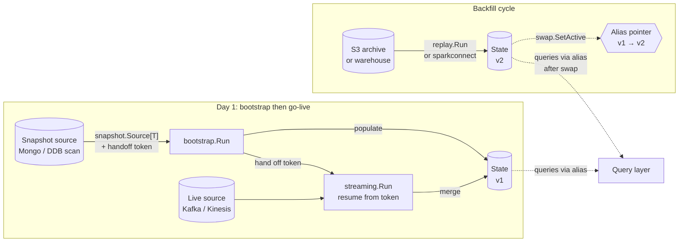

# Murmur: Design and Implementation

> Status: design document &middot; Audience: engineers integrating, extending, or operating Murmur &middot; Updated: 2026-05

## How to read this document

`doc/architecture.md` is the pitch — why Murmur exists, what it isn't, the
shape of the original plan. This document is the deep treatment: the
abstractions that hold the system up, the implementation choices behind
them, and an honest accounting of the rough edges. Where the architecture
doc says "monoids are structural", this doc says how the dispatch table is
built, where it can fail, and what would have to change to add a new
backend. Where the architecture doc says "Bootstrap → Live → Replay are one
DSL", this doc walks the actual handoff token, the resume protocol per
source, and the failure modes when a worker dies mid-cutover.

Read `doc/architecture.md` first if you haven't. Read
`doc/search-integration.md` after, if your problem touches search.

`STABILITY.md` is the running inventory of what's experimental and what's
sharp. The two should agree; if they don't, `STABILITY.md` wins because it
moves more often.

## Table of contents

1. [Problem statement](#1-problem-statement)
2. [The keystone abstraction: structural monoids](#2-the-keystone-abstraction-structural-monoids)
3. [The Summingbird lineage](#3-the-summingbird-lineage)
4. [Pipeline DSL](#4-pipeline-dsl)
5. [Execution model](#5-execution-model)
6. [Lambda runtimes](#6-lambda-runtimes)
7. [State stores](#7-state-stores)
8. [Query layer](#8-query-layer)
9. [Observability](#9-observability)
10. [Bootstrap to live handoff](#10-bootstrap-to-live-handoff)
11. [Backfill via Spark Connect](#11-backfill-via-spark-connect)
12. [Wire contracts](#12-wire-contracts)
13. [Operational shape](#13-operational-shape)
14. [Failure model](#14-failure-model)
15. [Performance characteristics](#15-performance-characteristics)
16. [Testing philosophy](#16-testing-philosophy)
17. [Frontiers](#17-frontiers)

## 1. Problem statement

### 1.1 What Murmur is for

Murmur is a Go framework for **streaming aggregations with structural
monoids**. The narrow problem it solves: given a high-rate event stream
(Kinesis, Kafka, DDB Streams, SQS, or any combination), maintain
per-entity counters / cardinality estimates / top-K sketches that:

- merge correctly under at-least-once delivery (because every distributed
  source is at-least-once in practice),
- expose a generic gRPC query layer with point reads, batch reads,
  sliding-window reads, and absolute-range reads,
- can be backfilled from a snapshot or replayed from an archive without
  duplicating pipeline logic,
- and run on AWS-native primitives (Lambda, ECS Fargate, DynamoDB, S3,
  Kinesis, SQS, DDB Streams) with bounded operational footprint.

The narrow problem is exactly the shape Twitter solved with Summingbird in
2013, restated for Go-shop AWS deployments in 2026. The same underlying
insight — *if your aggregation is a monoid, you can reuse the same
combine logic across batch, streaming, snapshot, and replay* — turns out
to be the only insight you actually need to make the rest of the
framework fall into place. Sections 2 and 3 walk that out.

### 1.2 What Murmur is deliberately not

Murmur is not a streaming engine. It does not own a scheduler, a watermark
machine, a checkpoint protocol, or a window-trigger model. The phrase that
keeps appearing in the source comments is "we are not building Flink in
Go." Streaming engines own the shape of computation; Murmur owns the
shape of *aggregation* and lets the underlying source — franz-go,
aws-sdk-go-v2, the Lambda runtime — own the shape of computation.

Concretely, Murmur explicitly does not:

- **Provide event-time watermarks or out-of-order processing semantics.**
  Bucket assignment is based on a single timestamp per record (event-time
  if available, processing-time otherwise). Late-arriving events fall into
  the bucket whose ID matches their timestamp; whether that bucket is
  still being aggregated, has been queried, or is being TTL'd is between
  the user, the storage layer, and the laws of physics.
- **Provide stream-stream joins, stream-table joins, or any join.**
  Joining is a different problem and the abstractions that support it
  (versioned state, watermarks, holistic operators) are exactly the ones
  Murmur is choosing not to ship. Use Flink (or Managed Service for
  Apache Flink) when you need joins.
- **Provide exactly-once stream processing.** The Phase 1 default is
  at-least-once with optional per-record dedup
  (`pkg/state/dynamodb.NewDeduper` + `streaming.WithDedup`). Exactly-once
  via DDB transactions is queued behind one or two real users who can't
  tolerate the dedup window's edge cases.
- **Provide a unified deployment story for non-AWS clouds.** The Terraform
  modules under `deploy/terraform/modules/` target AWS. The Go code is
  cloud-agnostic insofar as the source / state / cache interfaces are,
  but the operational story (Lambda runtimes, ECS Fargate, DDB Streams)
  is AWS-shaped and intentionally so.
- **Provide a vector store, a feature store, an OLAP cube, or a
  time-series database.** The integration patterns for those — search
  indices in `doc/search-integration.md`, OLAP engines in the same doc's
  "adjacent solutions" section — are spelled out elsewhere.

### 1.3 Who Murmur is for

Two audiences, both real:

**The Go shop on AWS that wants a counter framework, not a platform.**
Most product teams have one or two pipelines they care about — daily
unique users, top posts in last 24h, like counts, view counts, follower
counts. They have Kinesis or Kafka in the data path already; they have
DynamoDB; they don't want to stand up an EMR cluster, learn Flink, or
run a JVM in production for what amounts to "sum the events, group by
key, expose a Get RPC." Murmur is meant to disappear into that team's
stack: import a package, configure a pipeline, deploy via the supplied
Terraform module, point the query service at it. Two days of
engineering, not two quarters.

**The platform team that needs many pipelines from one substrate.**
Murmur's keystone — structural monoids dispatched to backend-native
operations — was chosen specifically to make this audience feasible. A
single Murmur deployment can run dozens of pipelines, each with its own
key shape and monoid kind, sharing the streaming runtime, the state
table, the query service, and the deployment harness. The platform team
exposes a self-service surface ("declare a monoid, point at a source");
Murmur owns the rest.

### 1.4 What this document covers

The rest of this document is the deep design treatment. It assumes you
have the architecture doc fresh in your head and want answers to
specific implementation questions. Where the architecture doc is
prescriptive, this one is descriptive — it documents what's actually in
the source tree, why the choices were made, and where the seams are.

If you're skimming for a specific concern:

- *I want to add a new monoid.* Section 2.
- *I want to add a new source.* Sections 4.4 and 5.5.
- *I want to add a new state backend.* Section 7.
- *I want to write a new query shape.* Section 8.
- *I want to operate this in production.* Sections 13 and 14.
- *I want to know what's broken.* Section 17 plus `STABILITY.md`.

## 2. The keystone abstraction: structural monoids

Every other abstraction in Murmur is downstream of this one. Get this
section wrong and nothing else matters; get it right and the rest of the
framework is mostly mechanical.

### 2.1 What a structural monoid is

A monoid in Murmur is the trio defined in `pkg/monoid/monoid.go:36`:

```go
type Monoid[V any] interface {
    Identity() V
    Combine(a, b V) V
    Kind() Kind
}
```

`Identity()` returns the algebraic identity of `Combine` — the value
that, combined with anything, returns that thing. `Combine(a, b)` is the
associative binary operation; the laws are documented on the interface
and enforced via `pkg/monoid/monoidlaws` in CI for every built-in
monoid.

`Kind()` is what makes the monoid *structural*. It returns one of
roughly a dozen string-typed constants (`pkg/monoid/monoid.go:21-37`):
`KindSum`, `KindCount`, `KindMin`, `KindMax`, `KindFirst`, `KindLast`,
`KindSet`, `KindHLL`, `KindTopK`, `KindBloom`, `KindMap`, `KindTuple`,
`KindCustom`. A backend implementation reads `Kind()`, dispatches on the
constant, and emits the runtime-native operation. This is the single
piece of design that lets one monoid run as a DDB atomic ADD, a Spark
SUM aggregation, a Valkey INCRBY, and a Go closure all at once — not as
four separate implementations sharing a name, but as one Go-typed value
that backends interpret structurally.

The `KindCustom` escape hatch lets users plug in opaque Go closures.
Custom monoids work on Go execution backends (streaming, bootstrap,
replay, the Fargate executor) and *only* there — they're explicitly
opted out of Spark codegen, DDB atomic-ADD specialization, and Valkey
sketch acceleration. This is honest about the tradeoff: users get the
full expressive power of Go for the 5% of pipelines that need it,
without paying for it on the 95% that don't.

### 2.2 Why associativity is load-bearing

Murmur takes associativity seriously to the point of fuzzing it in CI.
The reason: every other property of the framework depends on it.

**At-least-once delivery is safe iff Combine is associative and commutative
on the redelivered subset.** When a Kafka or Kinesis source replays a
record after a worker crash, the framework either dedups it (via
`state.Deduper`) or applies it again. For idempotent monoids (Set, Min,
Max, Bloom) the second case is a no-op; for non-idempotent ones (Sum,
HLL, TopK), the framework must dedup. In either case the *underlying
guarantee* is associative-merge. If `Combine` were not associative —
e.g. `f(a, b) = (a + 2b)` — every redelivery would shift the answer by
unpredictable amounts and dedup would be the only option, with no
recourse for non-idempotent operations.

**Bucket-merge math at query time is safe because Combine is associative.**
A `GetWindow(last_30_days)` on a daily-bucketed pipeline reads 30
buckets and folds them via the monoid's Combine. If Combine weren't
associative, the order of fold would change the answer, and concurrent
readers might see different orderings of the same buckets. Associativity
makes the order irrelevant — every reader gets the same value because
every fold of the same set produces the same result.

**Cross-backend correctness depends on associativity.** When a Spark job
backfills 90 days of data into the shadow table and the streaming
runtime keeps writing into the live table, the swap protocol works
because both backends are computing the same monoid. The Spark backend
emits `SUM(...) AS v` and gets the right answer; the streaming backend
emits an atomic `ADD :delta` and gets the right answer; the two answers
agree because addition is associative and commutative. If Combine were
backend-specific, the swap would be a recipe for silent data loss.

**Window batching is safe because Combine is associative.** Murmur's
`streaming.WithBatchWindow` (`pkg/exec/streaming/runtime.go:78`)
accumulates per-key deltas in memory for a configurable window, then
flushes a single MergeUpdate per key per window. The deltas are
combined locally before the flush; the local fold + the remote fold
must produce the same result as folding all deltas remotely one at a
time. Associativity is exactly the property that makes that true.

The architecture doc says "associativity is load-bearing" in passing.
This document makes it explicit: associativity is the *invariant the
framework depends on for every nontrivial property*. The
`monoidlaws.TestMonoid` harness in `pkg/monoid/monoidlaws/laws.go` is
not a test of test infrastructure — it's a test of the framework's
core contract.

### 2.3 Identity is harder than it looks

The interface is symmetric — `Combine(Identity, x) == x` AND
`Combine(x, Identity) == x` — but the implementation is where bugs hide.

The cautionary tale lives in PR-3 (referenced in `STABILITY.md:46-51`):
the original `Min` and `Max` monoids used `V`'s zero value as Identity.
For `int64`, that's `0`. So `Min(0, 5) == 0`, which is correct only if
`0` is a real observation; if no value has been seen yet, we want
`Min(unset, 5) == 5`, not `0`. The fix was to lift the value type:
`pkg/monoid/core.Bounded[V]` carries a `Set bool` flag, so
`Bounded[V]{Set: false}` is a genuine identity wrapper. Users construct
real values via `core.NewBounded(v)`; the lifted `Min`/`Max` monoids
then operate on `Bounded[V]` rather than `V` directly.

The same shape recurs for `Decayed`. The exponential-decay monoid
(`pkg/monoid/compose/decayed.go`) is `(value, timestamp)` pairs, and the
"no value yet" state has to be distinguishable from a legitimate
`(0.0, time.Unix(0, 0))` observation. The fix is the same: an explicit
`Set bool` field on the `Decayed` struct. The monoid's `Identity()`
returns `Decayed{Set: false}`, and `Combine` treats unset operands as
the identity element.

The lesson generalizes: any monoid whose value space includes a "natural"
zero needs to be careful about whether that zero is the identity or a
real observation. The `monoidlaws` harness catches this — it specifically
checks `Combine(Identity, x) == x` for many sample `x` values, which
means it'll fail if Identity is misclassified — but only if the test is
wired up. **Custom monoid authors must wire up the laws test.**

### 2.4 Backend dispatch in practice

A backend reads `Kind()` and decides how to translate Combine into a
native operation. The exhaustive dispatch table today, by backend:

| Kind | DDB | Valkey | Spark | Go |
|---|---|---|---|---|
| `KindSum` (int64) | atomic `ADD` (`Int64SumStore`) | atomic `INCRBY` (`Int64Cache`) | `SUM(...)` (sparkconnect SQL) | `+` |
| `KindCount` | atomic `ADD` | atomic `INCRBY` | `COUNT(*)` or `SUM(1)` | `+` |
| `KindMin`/`KindMax` | CAS read-modify-write (`BytesStore`) | not yet | `MIN`/`MAX` aggregation | `Bounded` lift |
| `KindFirst`/`KindLast` | CAS RMW | not yet | argmin/argmax with timestamp | timestamp compare |
| `KindSet` | CAS RMW | not yet | `collect_set` | map union |
| `KindHLL` | CAS RMW | RMW with caller-supplied byte-monoid (`BytesCache`) | HLL UDAF (codegen, Phase 2) | axiomhq merge |
| `KindTopK` | CAS RMW | RMW via `BytesCache` | TopK UDAF (codegen, Phase 2) | Misra-Gries merge |
| `KindBloom` | CAS RMW | RMW via `BytesCache` | Bloom UDAF (codegen, Phase 2) | xor-merge |
| `KindMap`/`KindTuple` | CAS RMW | RMW via `BytesCache` | per-component | recursive |
| `KindCustom` | CAS RMW | RMW via `BytesCache` | unsupported | user closure |

The two interesting cells are the diagonal extremes:

- **`KindSum` on DDB** is the framework's fastest path. Atomic
  `UpdateItem ADD` requires no read, no CAS, no application-side race
  resolution. `pkg/state/dynamodb.Int64SumStore.MergeUpdate` issues
  `ADD :delta` and returns; with no read in the path, the only contention
  is at the DDB partition level (which DDB handles via adaptive capacity).
  This single specialization is what makes Murmur viable for high-rate
  counter pipelines without a Valkey accelerator in front.
- **`KindCustom` everywhere** is the slow but expressive path. CAS RMW
  on DDB is order-of-magnitude slower than atomic ADD because each
  MergeUpdate is 1 GetItem + 1 conditional PutItem + retry-on-conflict.
  For pipelines with mostly-cold keys this is fine; for pipelines with
  hot custom-monoid keys, configure a Valkey cache (see Section 7) to
  absorb the RMW storm.

The dispatch is *static* at pipeline construction time — the Store
implementation is chosen by the user (`Int64SumStore` for KindSum,
`BytesStore[V]` with the right monoid for the rest). It's not a runtime
switch. This was a deliberate design choice: Go's type system can't
express the relationship cleanly enough for compile-time dispatch, so
the user picks the right concrete store and the framework trusts them.
The cost of getting it wrong is loud — using `BytesStore` for a Sum
monoid is correct but ~50× slower than `Int64SumStore`, and the
performance characteristic is observable from any latency histogram.

### 2.5 Sketch monoids and bit compatibility

Three sketch monoids ship today: HyperLogLog
(`pkg/monoid/sketch/hll/hll.go`), Top-K via Misra-Gries
(`pkg/monoid/sketch/topk/topk.go`), and Bloom filter
(`pkg/monoid/sketch/bloom/bloom.go`). All three are `Monoid[[]byte]`
because their state is best stored as opaque bytes — the encoded form
of the sketch — and merged via decode-merge-encode.

The HLL monoid uses [axiomhq/hyperloglog](https://github.com/axiomhq/hyperloglog)
under the hood. The marshaled form is the axiomhq encoding, which is
bit-stable across versions of that library but **NOT compatible** with
Valkey's PFADD/PFCOUNT/PFMERGE encoding. This is the open question the
architecture doc flags: cross-runtime sketch portability.

The current resolution is honest: when a pipeline configures a Valkey
cache for an HLL pipeline, it uses `BytesCache` with the HLL monoid as
the byte-merger (so Valkey holds axiomhq-encoded sketches and the
client-side code merges them on read). PFADD/PFCOUNT acceleration is
not used. That gives correctness across all backends at the cost of
the Valkey-native sketch speedup. Phase 2 work is the conversion path:
either a portable encoding (HLL++ canonical) for state stored in DDB,
or a bidirectional translator at the Valkey boundary. Both are
non-trivial because the dense and sparse representations differ
between encodings.

The lesson here for monoid authors: **if your monoid is byte-encoded,
the encoding is part of the contract**. Two backends "implementing the
same HLL" agree only if they produce the same bytes for the same set of
inputs. The framework doesn't enforce this; it can't, because byte
stability is a property of an external library. Instead, it's tested
via cross-backend round-trips in `test/e2e/` and tracked via
`STABILITY.md`'s "cross-runtime encoding portability not yet proven"
note for sketches.

### 2.6 Composition: Map, Tuple, and Decayed

Three composition monoids let users build aggregations without writing
custom code (`pkg/monoid/compose/`):

- **`MapMerge[K, V]`** is the per-key Combine of an inner monoid V over
  a map. Identity is the empty map. Combine merges keys; values for
  duplicated keys are combined via the inner monoid. Used for
  per-cohort counters where the cohort space is small enough to fit in
  memory (think "per-country counts of a specific event" with ~200
  countries).
- **`Tuple2[A, B]`** is the componentwise Combine of two inner monoids.
  Identity is `(IdentityA, IdentityB)`. The associativity of Tuple2 is
  immediate from the associativity of its components. Useful for
  pipelines that maintain two parallel aggregations on the same key
  (count + sum, for example).
- **`Decayed`** is the (value, timestamp) exponential-decay monoid
  documented in 2.3. It's the only built-in non-trivial composition
  with a quirk: in IEEE-754 floats, associativity holds within a few
  ULPs but is not bitwise. The `monoidlaws.WithEqual` option lets the
  test harness use approximate equality for this monoid. This is
  honest: the monoid laws hold in real arithmetic, and the float
  implementation is the closest approximation we get.

These compose with each other. `MapMerge[string, Tuple2[Sum, HLL]]` is
a valid monoid: per-cohort, maintain both the event count and the
unique-user HLL. The structural Kind for compositions is `KindMap` or
`KindTuple`; backends that recognize them recurse into the inner
monoids' kinds. Backends that don't fall back to the byte-encoded
generic path.

## 3. The Summingbird lineage

Murmur is "spiritual successor to Summingbird" in the README, and the
phrase is not marketing. The design choices below trace directly to
Summingbird's [original
paper](https://dl.acm.org/doi/10.14778/2733004.2733010) and the
production lessons Twitter shared in the years that followed. This
section is a short, opinionated walk through which ideas were borrowed,
which were rejected, and where Murmur diverges.

### 3.1 What Summingbird did right

Summingbird's central claim — *write the aggregation logic once as a
monoid and we'll generate batch (Hadoop) and streaming (Storm)
executors that produce the same result* — is the load-bearing idea
Murmur reuses verbatim. The two contributions that turned out to be
durable:

1. **Monoids as the unit of cross-runtime correctness.** Without a
   shared algebraic abstraction, "batch and streaming compute the same
   thing" is a manual claim that has to be re-verified for every
   pipeline. With monoids, "batch and streaming compute the same
   thing" reduces to "Combine is associative and the backends both
   implement Combine," which is checkable in CI and uniform across
   pipelines.
2. **Lambda-architecture-as-deployment-mode.** Summingbird treated
   "batch view + realtime delta" not as a different programming model
   but as a *deployment posture* of the same monoidal pipeline.
   Murmur's `pkg/query.LambdaQuery[V]` is the same idea in 50 lines of
   Go: two stores, one monoid, query-time merge.

### 3.2 What Summingbird got wrong (in retrospect)

Three choices Summingbird made that Murmur deliberately doesn't:

1. **Compiling to Storm.** Storm was the streaming engine of 2013;
   it's a relic in 2026. Summingbird's Storm runner was tied to
   Storm's tuple model, its at-least-once-with-acks semantics, and its
   topology-launch protocol. Murmur deliberately does not compile to
   any streaming engine. The streaming runtime is a single-goroutine
   loop in `pkg/exec/streaming/runtime.go`, the Lambda runtimes are
   AWS-supplied, and the Spark Connect path uses Spark Connect's
   normal Go API. There's no codegen-to-stream-engine because there's
   no stream engine in the way.
2. **A separate "Producer" abstraction for streaming sources.**
   Summingbird abstracted source semantics through its `Producer`
   type, which subsumed both batch and streaming. The cost was that
   batch and streaming "looked the same" syntactically but had
   subtly different runtime semantics — backpressure, watermarks,
   commit boundaries. Murmur instead has one explicit `source.Source[T]`
   interface (`pkg/source/source.go`) for streaming, one explicit
   `snapshot.Source[T]` interface (`pkg/source/snapshot/snapshot.go`)
   for bootstrap, and one explicit `replay.Driver` for archive
   replay. They share a record shape but the abstractions are
   separate, because the runtime semantics are separate.
3. **Compiling user-supplied Scala UDFs.** Summingbird supported
   arbitrary Scala closures inside aggregations; the cost was
   classpath-management hell across the Storm and Hadoop runtimes.
   Murmur's `KindCustom` is the analogous concept but is restricted
   to Go execution backends *by design*. Spark codegen sees only
   structural monoids; if the user's monoid is custom, they don't get
   Spark dispatch. This trades expressiveness for operational sanity.

### 3.3 What Murmur adds that Summingbird didn't have

Three first-class concerns that didn't exist in Summingbird's world:

1. **Windowed monoids.** Summingbird had time-bucketing as a manual
   pattern users built on top. Murmur ships it as a first-class
   wrapper (`pkg/monoid/windowed.Config`). The bucket math, TTL
   integration with DDB, and sliding-window query merge are all in
   the framework.
2. **AWS-native Lambda runtimes.** Summingbird had Storm and Hadoop;
   Murmur has Lambda triggers for Kinesis, DDB Streams, and SQS
   (`pkg/exec/lambda/{kinesis,dynamodbstreams,sqs}`). The same
   pipeline definition runs as a long-lived ECS Fargate worker or as
   a Lambda handler with no code changes — the runtime adapts.
3. **A generic query layer.** Summingbird had user-built query
   services. Murmur's `pkg/query` and `pkg/query/grpc` are a generic
   read layer with point reads, batch reads, sliding-window reads,
   absolute-range reads, and singleflight coalescing built in. This
   was on Summingbird's "future work" list and never landed; it's
   what `doc/architecture.md` calls "the layer nobody else has built."

### 3.4 What's still on the cutting room floor

A few Summingbird ideas that didn't make Murmur and probably won't:

- **Implicit batch-streaming reconciliation.** Summingbird ran the same
  job in both modes simultaneously and reconciled at query time.
  Murmur's lambda mode (`pkg/query.LambdaQuery`) does the read-side
  merge but doesn't auto-deploy the batch-and-streaming pair; that's a
  user-space orchestration concern.
- **Cross-monoid query rewrites.** Summingbird's planner could
  decompose a Top-K query into a sketched Top-K + an exact tail.
  Murmur doesn't do query rewrites; the monoid you pick is the
  monoid you get.
- **A unified DSL for batch SQL and streaming aggregation.** Summingbird
  had a single Scala DSL. Murmur splits the responsibility:
  `pkg/pipeline` is the streaming DSL and the sparkconnect executor
  takes user-supplied SQL (`pkg/exec/batch/sparkconnect.RunInt64Sum`).
  The Phase 2 plan (in the architecture doc) is to codegen Spark SQL
  from structural monoids; that would close the gap, at the cost of a
  templating engine the framework would have to maintain.

The summary is unsentimental: Murmur takes the two ideas from
Summingbird that turned out to matter (monoids as cross-runtime
correctness, lambda-as-deployment-mode), drops the parts that were
specific to 2013 infrastructure (Storm codegen, Scala UDFs, batch-DSL
unification), and adds the parts that 2026-era cloud-native counter
pipelines actually need (windowed monoids, Lambda runtimes, generic
query layer).

## 4. Pipeline DSL

The DSL is the user's first contact with Murmur, and the choices it
encodes shape what the rest of the framework can do. This section walks
the surface, the generics tradeoffs, and the multi-layer split between
the verbose `pkg/pipeline` builder and the `pkg/murmur` preset facade.

### 4.1 The two layers

Murmur ships two DSL layers because the same shape isn't right for
every user.

**Layer 1: `pkg/pipeline.Pipeline[T, V]`** is the verbose, fully
explicit builder. Every dimension of the pipeline — record type `T`,
value type `V`, monoid, source, store, cache, windowing — is set via
named methods on a single `*Pipeline[T, V]` value, then `Build()`
validates and returns the pipeline. This is the layer custom monoids
flow through and the layer the runtimes consume internally.

**Layer 2: `pkg/murmur.Counter[T] / UniqueCount[T] / TopN[T]`** is a
preset facade for the three most common shapes (Sum-counter, HLL
unique-count, Misra-Gries top-N). The preset infers the monoid and
value type from the shape; users only configure the dimensions that
vary across pipelines (name, source, key extractor, store, optional
window). Internally the preset delegates to `pkg/pipeline`; the result
is a fully equivalent `pipeline.Pipeline[T, V]`.

Why two layers? Because the 90% case is a Counter pipeline and the
verbose builder forces that 90% case to spell out parameters that are
fixed by the preset. The `Counter[T]` facade reduces a 6-line pipeline
construction to 3, and reduces the cognitive load of "what's the right
monoid for this counter" to zero. The verbose builder remains for the
10% of pipelines that need a custom monoid, a Tuple2, a hierarchical
fan-out, or anything else the presets don't cover.

The architecture doc speculated about typed-per-stage builders ("a
tower of stage-typed builders"). The current implementation deferred
that intentionally — Go's generics can express it but the syntax cost
is high, and real users haven't hit a case where the tower would catch
something the current builder doesn't. If that case appears, the layer-1
DSL is where it'd land.

### 4.2 Generics: explicit at construction, inferred everywhere else

Murmur is a generics-heavy codebase. Type parameters appear on
`Pipeline[T, V]`, `Source[T]`, `Store[V]`, `Cache[V]`, `Monoid[V]`,
`Encoder[V]`, and a long tail of helpers. The choice point is whether
to put the parameters at the *construction* site (`NewPipeline[T, V]`)
or at every *operation* site, and the convention is firmly "at
construction":

```go
pipe := pipeline.NewPipeline[Event, int64]("page_views").
    From(src).
    Key(func(e Event) string { return e.PageID }).
    Aggregate(core.Sum[int64]()).
    StoreIn(store).
    Build()
```

vs. the alternative where every method takes its own parameters:

```go
// not how it works
pipe := pipeline.NewPipeline("page_views").
    From[Event](src).
    Key[Event](func(e Event) string { return e.PageID }).
    Aggregate[Event, int64](core.Sum[int64]()).
    ...
```

The first form is what shipped. The cost: users have to declare `T`
and `V` upfront when they probably know `T` from `src` and `V` from the
monoid. The benefit: the type parameters propagate through the chain,
so Go's inference handles every method parameter without explicit
typing. In practice this is a clear win for the 90% case where users
follow the canonical chain order.

The presets in `pkg/murmur` go further: `Counter[T]` *only* takes the
record type, because `V = int64` is fixed by the preset. This makes
the canonical Counter pipeline syntactically minimal:

```go
pipe := murmur.Counter[Event]("page_views").
    From(src).
    KeyBy(func(e Event) string { return e.PageID }).
    StoreIn(store).
    Build()
```

The trade is real: type-parameter-at-construction means `Build()` is
where validation errors appear, not at the call sites. A wrong-type
`StoreIn` is a compile error rather than a runtime error, but the
compiler points at `Build()` (the last line), not at the offending
`.StoreIn` call. This is acceptable in practice because the error
messages still name the conflicting types; no one's in doubt about
which line is wrong.

### 4.3 KeyBy and KeyByMany: the multi-key extension

Most aggregations are "for each event, contribute to one key." A
notable minority — hierarchical rollups — are "for each event,
contribute to N keys at once." Both shapes share the rest of the
pipeline (source, value extractor, monoid, store, cache); only the
key-extraction step differs.

The DSL exposes this as two mutually-exclusive methods:

- **`KeyBy(fn func(T) string)`** sets a single-key extractor. The
  event contributes its value to exactly one entity in the state
  store.
- **`KeyByMany(fn func(T) []string)`** sets a multi-key extractor.
  The event contributes its value to every key in the returned slice.

When both are set, `KeyByMany` wins (documented at
`pkg/pipeline/pipeline.go:73`). The runtime side is in
`pkg/exec/processor.MergeMany` (`pkg/exec/processor/processor.go:178`):
one call iterates the keys, doing one MergeUpdate per key. For
hierarchical pipelines, this is the natural shape — the rollup
expansion is a property of the pipeline, not of the runtime.

The hot use case lives in `doc/search-integration.md`'s "Composing
patterns" section: emit per-post, per-(post, country), per-country, and
global rollups from one event. Each rollup level becomes a key in the
emitted slice; the DDB Streams projector receives one stream record
per emitted key and dispatches each to its own OpenSearch field.

The cost of `KeyByMany` is linear in the number of emitted keys, and
the per-event work is N MergeUpdates rather than 1. For tightly-bounded
rollup hierarchies (post → cohort → global, ~3-5 keys) this is fine.
For very wide fan-outs (per-(user, post) rollups across millions of
users), the cost shape becomes wrong and the pipeline should be
restructured — typically to use a different aggregation primitive
(collaborative filtering, matrix factorization) rather than a counter
fan-out.

### 4.4 The four required dimensions, plus the optional ones

Every pipeline declares four required dimensions:

1. **A name** (passed to `NewPipeline` or the preset constructor). The
   name is used as the basis for state-table prefixes, metrics labels,
   and the generated gRPC service name. It must be stable across
   deployments — renaming a pipeline is equivalent to forking it.
2. **A source** (`From`). Sources implement `pkg/source.Source[T]` and
   produce `source.Record[T]` with an EventID, a value, and an Ack
   callback. Section 5.5 walks the source contract in depth.
3. **A key extractor** (`Key` / `KeyBy` for single-key, `KeyByMany`
   for multi-key). Keys are always strings; users encode composite
   keys (`pageID + "|" + region`) themselves. The string-key choice
   matches DDB's partition-key shape and avoids an awkward
   marshaling layer.
4. **A primary store** (`StoreIn`). Stores implement
   `pkg/state.Store[V]`. The store is where MergeUpdate writes land
   and where the query layer reads from. Section 7 covers the
   contract.

Optional dimensions:

- **A value extractor** (`Value`, on the verbose builder). For
  Counter pipelines the value is implicit (every event contributes
  `1` of `int64`); for HLL the value is a singleton sketch; for
  custom monoids the user must supply a `func(T) V`.
- **A monoid** (`Aggregate`, verbose builder; implicit in presets).
  The monoid determines the value type, the dispatch shape, and the
  algebraic semantics.
- **A windowing config** (`WindowDaily(retention)`,
  `WindowHourly(retention)`, `WindowMinute(retention)`, or
  `Window(custom)`). Adds the bucket-ID dimension to state keys;
  enables `GetWindow` and `GetRange` queries. Section 4.6 covers the
  bucket math.
- **A read cache** (`Cache`). Optional Valkey-backed accelerator for
  hot reads / RMW absorption. Section 7 covers the cache contract.
- **A query config** (`ServeOn`). Configures the auto-served gRPC
  endpoint. Optional in the sense that the user can serve the query
  layer themselves via `pkg/query/grpc.NewServer` — the pipeline-side
  setting is convenience.

The required-vs-optional split is enforced at `Build()`. Missing a
required dimension fails immediately with a named error. Setting
optional dimensions you don't need is a no-op.

### 4.5 The preset layer: what `pkg/murmur` does

The presets do three things beyond delegating to `pkg/pipeline`:

1. **Fix the value type** so the user doesn't declare it.
   `Counter[T]` is `Pipeline[T, int64]` under the hood;
   `UniqueCount[T]` is `Pipeline[T, []byte]` with the HLL monoid;
   `TopN[T]` is `Pipeline[T, []byte]` with the Misra-Gries monoid.
2. **Supply the value extractor** for the canonical case. `Counter`'s
   value extractor is `func(T) int64 { return 1 }`. `UniqueCount`
   takes a `func(T) string` element extractor, lifts it to a
   singleton HLL on each event. `TopN` takes a `func(T) string`
   element extractor and lifts it to a `(element, 1)` Misra-Gries
   update.
3. **Smooth the windowing API** so users don't have to import the
   `pkg/monoid/windowed` package. `b.Daily(retention)` is the
   chained version of setting a `windowed.Daily(retention)` config
   on the underlying pipeline.

The presets are intentionally conservative: they cover the cases real
users hit, and that's it. The escape hatch is "use `pkg/pipeline`
directly" — the preset is not a wall, just a fast path. Users who need
a Min-counter or a Tuple2 pipeline drop to layer 1 without ceremony.

A small pattern that comes up in the worked examples: the
`page-view-counters` example uses `Counter[T]`; the
`mongo-cdc-orderstats` example uses the verbose builder because it
needs a Sum over a typed `OrderTotal` field, which the preset's
"every event contributes 1" shape doesn't fit. Both compile, both
deploy via the same Terraform module, both serve the same query
layer. The DSL split is invisible at the boundary.

### 4.6 Windowing: bucket math and TTL integration

`pkg/monoid/windowed.Config` is two fields and a granularity:

```go
type Config struct {
    Granularity    time.Duration
    Retention      time.Duration
    EventTimeField string
}
```

`Granularity` is the bucket size — 24h for daily, 1h for hourly, 1m for
per-minute. `Retention` is how long buckets persist before DDB TTL
evicts them. `EventTimeField`, when set, names a struct field on the
record from which the runtime extracts a timestamp; when empty,
processing-time is used.

Bucket assignment is `BucketID(t) = t.UnixNano() / Granularity.Nanoseconds()`
(`pkg/monoid/windowed/windowed.go:54-60`). Buckets are tumbling and
aligned to the Unix epoch. The implication: bucket 0 is "the first
bucket since 1970" for any granularity, not "the bucket containing
midnight today." This matters for queries — `GetWindow(now,
24*time.Hour)` is "the most recent 24h-worth of buckets at the
configured granularity," which spans bucket boundaries cleanly because
all bucket IDs are deterministic functions of timestamps.

The retention is enforced at write time: when MergeUpdate writes to
bucket B at time T, the underlying DDB row's TTL is set to
`T + Retention` (`pkg/state/dynamodb/store.go`). DDB's native TTL feature
deletes rows whose TTL has elapsed; the deletion is asynchronous (DDB
documents up to 48h delay) but free. Murmur exploits this for free
bucket eviction past the retention horizon, with no application-side
sweep job.

The query layer side is in `pkg/query.GetWindow` and `GetRange`
(`pkg/query/window.go`). Both compute a bucket-ID range, BatchGetItem
all the buckets, and fold via the monoid Combine. The fold is in stable
order (bucket IDs ascending) which doesn't matter for the result
(Combine is associative) but does matter for reproducibility when
debugging.

The cost note in the source is honest: "for fine-grained windows the
bucket count can be large (e.g., a 'last 30 days' query on hourly
buckets reads 720 items)." For sketches, that's 720 sketch merges per
query, which is non-trivial CPU. The architecture doc flags pre-rolled
"last-7-days" / "last-30-days" buckets and Valkey-cached pre-merged
windows as Phase 2 mitigations. Today, the singleflight coalescing
layer in `pkg/query/grpc.Server` makes concurrent identical queries
share one underlying fold, which absorbs the worst case for hot
windowed reads.

The minute-granularity case is honestly uncomfortable: a "last 7 days"
query at minute resolution reads 10080 buckets. That's three round-trips
of `BatchGetItem` and 10080 sketch merges. `STABILITY.md:16` calls this
out: "minute-granularity has high read-amplification on long ranges."
The recommendation is to use minute granularity only for short-window
aggregations (last 5 min, last hour), and roll up to hourly or daily
for long-window queries. Hierarchical roll-up generation
(`Windowed[Sum]` at minute, `Windowed[Sum]` at hour, both fed by the
same source) is the cleanest answer when both fine and coarse queries
matter.

### 4.7 Validation and Build()

`Pipeline.Build()` is the validation point. Today it checks for missing
required dimensions and returns a descriptive error
(`pkg/pipeline/pipeline.go`). The Phase 2 plan calls for renaming this
to `Validate()` and adding deeper checks: that the monoid kind matches
the store implementation (no `KindSum` on `BytesStore`), that the
windowing config and the store agree on TTL semantics, that
`KeyByMany` is paired with a Store that supports per-key fan-out.
Today these are caught by integration tests; tomorrow they should be
caught by the type system or `Validate()`.

### 4.8 What the DSL doesn't try to express

A few things that would seem to fit a streaming DSL but deliberately
don't:

- **Filtering.** "Only events with `e.Tier == "premium"`" is naturally
  a stage-typed combinator (`.Filter(predicate)`), and Summingbird had
  one. Murmur doesn't, because the user can express the same thing in
  the value extractor: return `0` (the Sum identity) for events that
  shouldn't contribute. The cost is one synthetic write per filtered
  event; the benefit is a smaller DSL surface. For pipelines where the
  filter rate is a real problem, the user's source-side decoder
  pre-filters cheaper than the framework ever could.
- **Mapping.** "Project the record before aggregating" is the value
  extractor's job; it's not a separate stage. This is the same
  argument as filtering, and the same conclusion.
- **Joining.** Out of scope by design. Joins live in stream-processing
  engines, not aggregation frameworks.
- **Stateful per-event computation.** "If this is the user's first
  event ever, do X" is a different problem (online learning, fraud
  detection) and the abstractions that support it (windowed state
  keyed by something other than the aggregation key, branching
  output) are not Murmur's job.

The DSL is small on purpose. The abstractions it exposes — source, key,
value, monoid, window, store, cache — are exactly the ones that
generalize across all four execution modes (live, bootstrap, replay,
batch backfill). Anything that doesn't generalize is left out.

## 5. Execution model

A pipeline is a value. Running a pipeline is what the runtime does. The
key design decision is that the *same* pipeline value runs in four
different runtimes — streaming, bootstrap, replay, and the various
Lambda triggers — without the pipeline knowing which one it's in. The
runtimes share a single per-record processor
(`pkg/exec/processor.MergeMany`) that owns the at-least-once contract,
the retry / backoff loop, the dedup integration, and the metrics
surface.

This section walks the model.

### 5.1 The four runtimes

Five runtime entry points exist today:

| Runtime | Purpose | File |
|---|---|---|
| `streaming.Run` | Long-lived consumer reading from a `Source[T]` (Kafka, Kinesis) | `pkg/exec/streaming/runtime.go` |
| `bootstrap.Run` | One-shot driver scanning a `snapshot.Source[T]` (Mongo, JDBC, S3-dump) | `pkg/exec/bootstrap/runtime.go` |
| `replay.Run` | Archive replay through a `replay.Driver` (S3 JSON Lines, Kafka offset range) | `pkg/exec/replay/runtime.go` |
| `lambda/kinesis.NewHandler` | AWS Lambda handler for Kinesis triggers | `pkg/exec/lambda/kinesis/kinesis.go` |
| `lambda/dynamodbstreams.NewHandler` | AWS Lambda handler for DDB Streams | `pkg/exec/lambda/dynamodbstreams/dynamodbstreams.go` |
| `lambda/sqs.NewHandler` | AWS Lambda handler for SQS triggers | `pkg/exec/lambda/sqs/sqs.go` |

(Six entry points. The "Lambda runtime" is conceptually one mode with
three concrete event-source variants.)

All five take a `pipeline.Pipeline[T, V]` and produce a callable shape.
For the Run-style runtimes, the shape is a function that loops until
ctx is canceled. For the Lambda-style runtimes, the shape is the AWS
Lambda Go SDK handler signature for that trigger type.

**The pipeline itself is unaware of which runtime is hosting it.** The
runtime sees the pipeline's monoid, key extractor, value extractor,
store, and cache; the runtime does *not* see the source (because the
streaming runtime drives the source while the Lambda runtimes are
driven *by* an event-source mapping the framework doesn't own). The
pipeline's `From(src)` is consumed by `streaming.Run` and ignored by
the Lambda runtimes — they receive their records from Lambda's event
shape directly.

### 5.2 The single-goroutine processor and why it's that way

`pkg/exec/streaming/runtime.go`'s main loop is a sequential reader-fold
over the source channel: pull a record, decode, run the processor,
Ack, repeat. There's no per-partition goroutine pool, no fan-out
worker, no asynchronous flush thread (with one exception covered in
5.4). Single-goroutine.

The architecture doc and `STABILITY.md` are upfront about this:
"Phase-1 streaming processes records sequentially per worker.
Throughput ceiling is roughly 5–10 k events/s/worker against DDB-local
depending on item size. Scale horizontally with Kafka partitions until
per-partition parallelism lands."

Why single-goroutine? Three reasons, in priority order:

1. **Correctness under at-least-once.** A multi-goroutine processor
   has to coordinate its dedup, its commit boundaries, and its flush
   ordering. The single-goroutine version doesn't — every record is
   processed in source order, every Ack is in source order, and the
   batch-window flush (when enabled) collapses identical-key writes
   in arrival order. None of these properties are subtle when the
   processor is sequential. All of them get subtle the moment you
   parallelize.
2. **Bottleneck is rarely the processor.** In a counter pipeline,
   the time per record is dominated by the DDB MergeUpdate (1-5ms
   for atomic ADD, 5-20ms for CAS) and franz-go's Fetch batching
   (sub-millisecond per batched record). The processor itself —
   running the value extractor, calling the monoid — is sub-microsecond.
   Parallelizing the cheap part doesn't help when the expensive part is
   network-bound.
3. **Horizontal scaling is the real lever.** Kafka partitions are a
   first-class scaling primitive: more partitions = more workers =
   more throughput, and the per-partition single-goroutine model
   keeps each worker honest. Kinesis shards work the same way (with
   the caveat that Phase 1's Kinesis source is single-instance; KCL
   v3 is the Phase 2 fix). Scale-out beats parallelize-in for this
   workload class.

The decision is reversible. If real users hit the per-worker ceiling
and horizontal scaling is undesirable for some reason — typically cost
or partition count limits — per-partition parallelism inside a worker
is the obvious next step. The processor's interface
(`MergeMany(ctx, cfg, ...)` is already concurrent-safe at the
processor level; the source-side ordering is what would need
restructuring.

### 5.3 The shared processor: `pkg/exec/processor`

Every runtime delegates the per-record contract to one place:
`pkg/exec/processor.MergeMany` and its single-key shorthand
`MergeOne` (`pkg/exec/processor/processor.go:80, 178`). This is the
keystone of the runtime layer.

The processor's job, in order:

1. **Dedup short-circuit.** If a `state.Deduper` is configured, claim
   the EventID via `MarkSeen`. If it was already claimed
   (`firstSeen=false`), record `<pipeline>:dedup_skip` and return nil.
   The record is *not* applied to the monoid, but the source-side Ack
   still fires (the caller does that on a nil return).
2. **Bucket assignment.** If the pipeline is windowed, compute the
   bucket ID from the event timestamp. The store's `Key.Bucket` field
   carries this; bucket 0 means "no window."
3. **MergeUpdate, with retry.** Apply the value extractor, run the
   monoid Combine via the store, repeat on error up to MaxAttempts.
   Backoff is exponential with full jitter (50ms base, 5s cap by
   default).
4. **Cache write-through.** If a `state.Cache` is configured, mirror
   the MergeUpdate to the cache. Cache failures are non-fatal — they
   record an error metric and continue. The cache is never
   ground-truth; if it's wrong, DDB is right and the cache will
   eventually agree (or be repopulated).
5. **Metrics.** Record the success / error / retry / dedup-skip event
   under the pipeline's name. The runtime supplies a
   `metrics.Recorder`; the default `metrics.Noop{}` discards
   everything.

The contract on return:

- **nil**: record processed (or duplicate-skipped). Caller Acks.
- **non-nil**: every retry exhausted. Caller decides — Lambda runtimes
  add to `BatchItemFailures`, the streaming runtime dead-letters and
  Acks past.

This is the single contract every runtime obeys. The streaming
runtime's loop is roughly 200 lines — most of that is option plumbing
and metrics — because the per-record work delegates to the processor.

The decision to expose `processor.MergeOne` and `MergeMany` as a
public package was deliberate. Out-of-tree drivers (a custom event
source, an SNS-fronted EventBridge handler, a NATS Jetstream consumer)
can sit on the same retry / dedup / metrics contract without forking
the logic. The processor is small, stable, and meant to be the
extension point for "I want to host a pipeline behind a runtime that
isn't in the box."

### 5.4 Write aggregation: `WithBatchWindow`

The single optional concession to a non-trivial runtime is
`streaming.WithBatchWindow(window, maxBatch)`
(`pkg/exec/streaming/runtime.go:78`). It enables a per-(entity, bucket)
delta accumulator: instead of issuing one MergeUpdate per record, the
runtime accumulates deltas in memory for `window` time, then flushes a
single MergeUpdate per key.

The motivation is hot-key throughput. A celebrity post receiving
50,000 like-events/sec lands as 50,000 MergeUpdates/sec to the same
DDB row, which DDB's adaptive capacity will eventually rate-limit.
With `WithBatchWindow(1*time.Second, 1024)`, the same 50,000 events
land as one MergeUpdate per second (carrying delta=50000), well within
DDB's per-partition limits.

The trade is real:

- **Latency.** A record's contribution to the visible state lags by up
  to `window`. For sub-second windows this is invisible; for 5s
  windows it's perceivable in "I just liked this; why doesn't the
  count reflect it?" UX. Pair with `fresh_read = true` on the query
  side for the read-your-writes case.
- **Crash durability.** Records are Ack'd to the source AFTER the
  batch flushes. A worker crash loses up to `window`-worth of in-flight
  records, which the source replays on restart. Dedup catches the
  redelivery.
- **Memory.** At most `maxBatch` records per (entity, bucket) before
  a forced flush, but the *number of concurrent keys* is unbounded.
  For high-cardinality pipelines (per-user keys, with long-tail
  behavior), keep `window` short so each batch stays small.

The flush goroutine is the sole concession to multi-goroutine logic in
the streaming runtime. The data structures it touches are mutex-guarded;
the flush ordering is FIFO within a key but unordered across keys.
Because Combine is associative and commutative for every monoid this
matters for, the unordered flush is correct.

When `WithBatchWindow` is unset, the runtime is fully sequential — the
processor handles every record inline. The default is unset for safety
(no surprising latency), and users opt in for hot-key pipelines where
the throughput cost matters more than the latency cost.

### 5.5 Sources and the record contract

Every source implements `pkg/source.Source[T]`:

```go
type Source[T any] interface {
    Read(ctx context.Context, out chan<- Record[T]) error
    Name() string
    Close() error
}
```

The source's job is to push `Record[T]` values onto `out` until ctx is
canceled or the source is exhausted. A `Record[T]` carries:

- `EventID string` — globally unique, used for dedup. Per-source
  formats: Kafka uses `<topic>:<partition>:<offset>`; Kinesis uses
  `<stream>/<shard>/<sequenceNumber>`; SQS uses `<arn>/<MessageID>` or
  a user-supplied override (FIFO content-dedup, upstream-key dedup).
- `Value T` — the decoded record body.
- `EventTime time.Time` — used for windowed bucket assignment.
  Sources fill this from their native timestamp (Kafka record
  timestamp, Kinesis ApproximateArrivalTimestamp, SQS SentTimestamp);
  the user's value extractor can override via the `EventTimeField`
  windowing config.
- `Ack func() error` — called when the record has been successfully
  processed (or duplicate-skipped). For Kafka, this marks the offset
  for commit; for Kinesis, this advances the per-shard checkpoint;
  for SQS, this implicitly happens via Lambda's batch protocol.

The contract is at-least-once. A source MAY redeliver a record if the
worker crashes before Ack; sources SHOULD NOT redeliver after Ack
unless the upstream is broken. EventID uniqueness across redeliveries
is the source's responsibility.

Sources today:

- **Kafka** (`pkg/source/kafka`): franz-go-backed consumer-group
  client. Single-goroutine consumer, AutoCommitMarks for offset
  management. Poison-pill records (decode errors) are silently
  dropped today; DLQ hook is a Phase 2 task per `STABILITY.md:20`.
- **Kinesis** (`pkg/source/kinesis`): aws-sdk-go-v2-backed shard
  fan-out. Single-instance, no checkpointing — a hard limit
  documented prominently. KCL v3 upgrade is Phase 2.
- **Snapshot sources** (`pkg/source/snapshot/{mongo,...}`): for
  bootstrap mode. Section 10 walks the handoff token shape.
- **Replay drivers** (`pkg/replay/{s3,...}`): for archive replay.

The Lambda runtimes don't use `Source[T]`. Instead they have a
`Decoder[T]` that converts the AWS event shape (Kinesis record, DDB
Streams change record, SQS message) to `T`. The decoder is the
runtime's escape hatch for source-specific record interpretation:
the DDB Streams decoder gets the whole change record so it can branch
on `EventName` and inspect `OldImage`; the SQS decoder gets the
message body and attributes so it can extract upstream IDs for
dedup.

### 5.6 Bootstrap mode

Bootstrap is a one-shot driver that reads from a snapshot source,
applies the same monoid Combine to the same store, and records a
*handoff token* the live runtime starts from after bootstrap completes
(`pkg/exec/bootstrap/runtime.go`). The pattern is Debezium's "snapshot
then stream" almost verbatim, walked in Section 10.

The runtime side is short: `bootstrap.Run(ctx, pipe, snapshotSource,
opts...)`. Internally it:

1. Calls `snapshotSource.CaptureHandoff(ctx)` to get the resume token
   the live source will start from.
2. Iterates `snapshotSource.Scan(ctx, out)`, feeding each record through
   the same `processor.MergeMany` the streaming runtime uses.
3. Returns the captured handoff token to the caller.

Re-running bootstrap is idempotent when a `Deduper` is configured:
each scan emits records with `EventID = doc._id`, dedup catches
re-emissions. Without dedup, bootstrap re-runs *will* double-count for
non-idempotent monoids — same caveat as the streaming runtime.

### 5.7 Replay mode

Replay is bootstrap's slightly different cousin: instead of a
snapshot source, it's an archive replay driver
(`pkg/replay/s3` for S3 JSON Lines today, with Kafka offset-range
replay deferred). The runtime is `pkg/exec/replay.Run(ctx, pipe,
driver, opts...)` and does the same processor.MergeMany dance per
record, with no handoff-token concept (replay is for backfilling into
a *fresh* state table, not for picking up after).

The fresh-table pattern is the reason replay exists separate from
bootstrap. Replay's typical use is "I have 90 days of S3-archived
events; build me a state table over those events; atomically swap
when complete." The bootstrap pattern is "my Mongo is the source of
truth; pre-populate live state from it." Both feed the same processor;
the difference is the source shape and the operational lifecycle.

Replay's metrics integration is incomplete (`STABILITY.md:28`); the
processor's metrics fire correctly but the per-driver progress
metrics aren't wired. This is a gap but not a blocker — the e2e
tests verify correctness directly.

### 5.8 Mode-switching at deploy time

A pipeline has no notion of "I'm in streaming mode." The deployment
chooses. A typical deployment shape:

1. **Day 1**: Run `bootstrap.Run` to populate state from the
   snapshot source. Capture the handoff token; persist it for the
   live runtime.
2. **Day 1, after bootstrap**: Start `streaming.Run` with the live
   source configured to begin from the handoff token. The pipeline
   is now in steady state.
3. **Backfill triggers**: Run `sparkconnect.RunInt64Sum` (or
   `replay.Run`) into a fresh shadow table. When complete, call
   `swap.Manager.SetActive` to advance the alias pointer.
4. **Production reads**: query against the alias, which always
   points to the current state table. Atomic swaps are invisible
   to readers.

This shape composes cleanly because every step uses the same
pipeline definition. The mode is the operational concern; the logic
is invariant.



The diagram is the model the runtimes implement. Section 10 walks
the bootstrap handoff in detail; Section 11 walks the Spark Connect
backfill; Section 13 walks the operational shape.

<!-- next-section -->
