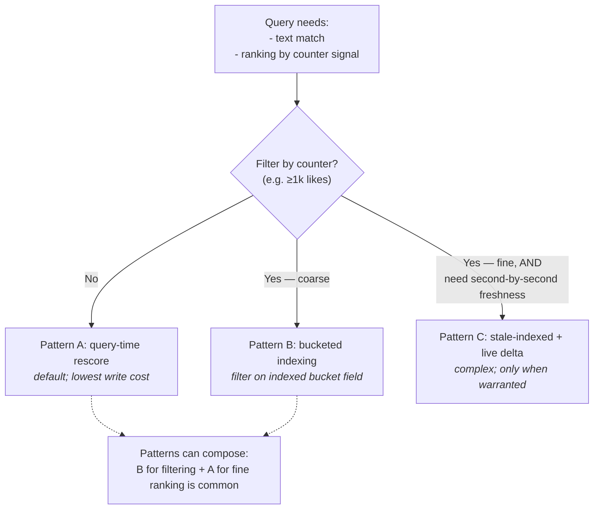
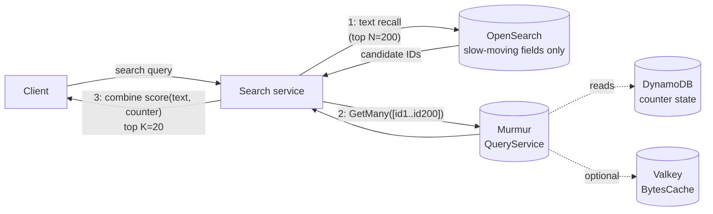
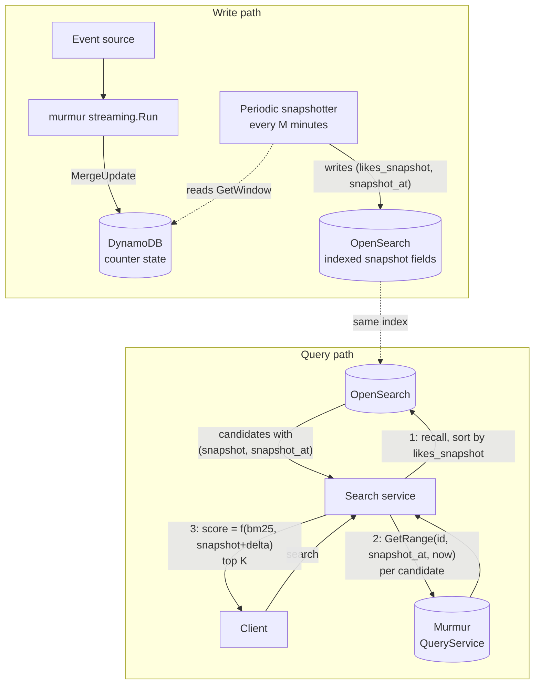
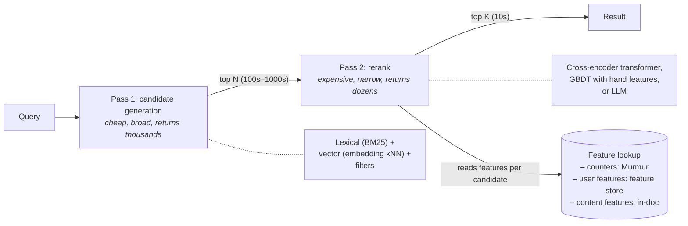
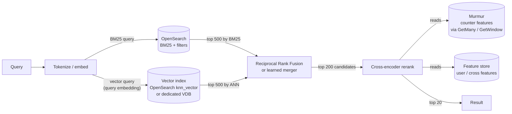

# Search integration: combining text relevance with counter-based ranking

> Status: design document &middot; Audience: engineers integrating Murmur with OpenSearch / Elasticsearch &middot; Updated: 2026-05

## Problem

A common requirement: rank search results by **text relevance combined with a popularity signal**. Concretely:

> "Show me posts matching `kubernetes operator`, sorted by a function of relevance and (likes in the last 24h)."
>
> "Show me users matching `data engineer`, ranked by relevance × follower-count, filtered to those with ≥1k followers."

The data has two regimes that pull in opposite directions:

| Field | Update rate | Cardinality of changes | Example |
|---|---|---|---|
| Slow-moving document fields | Hours to weeks | Low | username, bio, tags, taxonomy |
| Counter signals | Continuous | Very high (every event) | likes, views, follows, replies |

Search engines — Lucene, OpenSearch, Elasticsearch — are not built for high-cardinality update workloads. Their data structures are immutable segments that reach steady-state cost only when writes are amortized over reads. Pushing every counter event through the indexer is wrong by construction; the question is what to push instead.

This document is the canonical answer for Murmur users. It covers three patterns, when each fits, and how each composes with Murmur's existing primitives.

## Worked example

Used throughout this document for concreteness:

```go
type Post struct {
    ID       string
    Title    string
    Body     string
    AuthorID string
    Tags     []string
    // Slow-moving — change on edit, maybe daily
    UpdatedAt time.Time
    // Fast-moving — change on every interaction; live in Murmur
    // Likes (all-time)        → murmur counter `post_likes_total`
    // Likes (last 24h)        → murmur counter `post_likes_daily` windowed daily
    // Views (last 24h)        → murmur counter `post_views_daily` windowed daily
    // Unique viewers (24h)    → murmur HLL `post_unique_viewers_daily` windowed
}
```

The desired query: full-text on `Title + Body`, filtered by tag, sorted by a score function that mixes BM25 with the live counters.

## Why naive approaches fail

### "Just index the count"

Document the count as a numeric field, reindex on every counter update.

For a moderately popular post receiving 1k like-events/day, this is **1k OpenSearch updates/day per post**. At 100k popular posts in your corpus, that's 100M updates/day — sustainable only on infrastructure most teams won't fund.

The deeper problem is segment churn. Lucene-family engines write each update as a **delete-then-add** at the segment level. Updates trigger background segment merges; merge cost scales with total writes, not net changes. A workload that updates the same document 1000 times costs 1000× a workload that updates it once, even though the final state is identical.

Operationally: refresh latency degrades, query p99 climbs, and the cluster spends more cycles merging than serving.

### "Push every event from Murmur to OpenSearch"

Same as above with a fancier wrapper. The bottleneck isn't transport, it's segment write amplification.

### "Refresh every minute, accept the staleness"

Bounds the indexer write rate but doesn't address segment churn — popular posts still get N updates per minute. Improves the cluster's ability to absorb load by 60×, doesn't change the asymptotic cost of indexing every event.

The pattern *can* work if combined with a coalescing layer that drops intermediate states (only the latest count per document per minute hits the indexer). This is essentially what the user's debounce does — see below.

## The two heuristics in the wild

The pattern the question describes:

> (a) Use a count over "previous H hours, not including the current hour" so the value is stable. Emit fake events at the top of the hour to roll the window forward.
>
> (b) Debounce reindexing on the search side using a trailing 2-minute interval.

These are **legitimate workarounds**, not nonsense. They solve real problems:

- (a) gives you a count that's **stable for an hour** so a per-document update is bounded to once per hour. The synthetic top-of-hour event is the trigger for the next index update.
- (b) caps the per-document update rate further, absorbing bursts of slow-moving field changes that arrive close together.

But they have well-defined limits:

| Heuristic | Limit | Cost |
|---|---|---|
| Hour-stable lookback | The displayed count is up to 1 hour stale. At T+59min, popular content still shows its T+0 count. | User-visible freshness gap; complaints about "why hasn't my new post moved up?" |
| Top-of-hour fan-out | All popular documents reindex within seconds of `:00`. | Reindex storm: thundering herd against the indexer, every hour, with no smoothing. |
| Trailing debounce | All updates delayed by debounce-window. | Compounding latency on top of (a); makes the freshness gap worse for any change, not just counter changes. |

The fundamental issue both heuristics dance around: **counters and search documents have incompatible update frequencies**. Pinning a counter to the index forces you to reconcile that incompatibility somewhere, and (a) and (b) move it to the time domain. The patterns below move it to the data-flow domain instead, which is the right place.

## Three correct patterns, picked by query shape



**Pattern A** keeps counters out of the index entirely. The index serves text relevance and slow-moving fields; counters are fetched from Murmur at query time and applied as a rescore.

**Pattern B** indexes a coarse, slow-moving projection of the counter (e.g., a logarithmic bucket) so the index can filter and roughly sort on it. Bucket transitions, not every event, drive reindex.

**Pattern C** indexes a snapshot of the count plus its as-of timestamp. At query time, fetch the **delta** since the snapshot from Murmur and add it. Used historically by Twitter / pre-Manhattan systems for high-cardinality ranking with second-level freshness; complex and rarely the right starting point.

These compose. A production deployment routinely uses **B for filtering** ("only show posts with ≥1k likes") **and A for ranking** ("among those, order by exact-current-likes × BM25"). A recommendation surface might use B-then-C for hot pages and A-only elsewhere.

## Pattern A: query-time rescore



The pipeline:

1. **Recall** — OpenSearch returns top N candidates by text relevance, optionally filtered by tags / categories / slow-moving predicates.
2. **Fetch** — search service issues `QueryService.GetMany({entities: [id1, …, idN]})` to Murmur for the counter values.
3. **Rerank** — search service computes the final score `f(bm25, counter) -> score`, sorts, returns top K to the client.

This is the canonical two-stage retrieval pattern from production search systems (Elasticsearch's [`rescore_query`](https://www.elastic.co/guide/en/elasticsearch/reference/current/filter-search-results.html#rescore) is built for it; both Bing and Google use larger versions of the same shape, with the second stage being a learned model rather than a counter join).

### Why this works

- **Zero indexer write amplification from counters.** OpenSearch only sees writes when slow-moving fields change.
- **Counters are always fresh.** Reads hit Murmur directly; with `WithBatchWindow` write aggregation, Murmur's view lags the actual event stream by at most one batch window (configurable, typically sub-second).
- **Read amplification is bounded by N**, the recall set size. For N=200, two `BatchGetItem`s against DDB cost ~10ms p99. With the singleflight coalescing layer (`pkg/query/grpc.Server`), concurrent identical queries collapse to one underlying read.

### Latency budget

A representative breakdown for a feed-render query against this pattern:

| Stage | p50 | p99 | Notes |
|---|---|---|---|
| OpenSearch recall (N=200) | 8 ms | 30 ms | Text-only; no expensive function_score |
| Murmur `GetMany` (200 keys, 2× `BatchGetItem`) | 6 ms | 20 ms | Singleflight collapses concurrent identical queries |
| Score-and-sort in service | 0.1 ms | 1 ms | Plain Go; ~200 floats |
| **Total** | **~15 ms** | **~50 ms** | Inside the typical feed-render budget |

Compare to the naive "function_score with script" pattern, which inflates OpenSearch query CPU by 5–10× and ties freshness to refresh-interval rather than to Murmur's actual ingest lag.

### When Pattern A doesn't fit

- **Filter cardinality.** If most queries need `WHERE likes ≥ 1000` and "≥1000 likes" is true for >50% of the corpus, the recall set returned by OpenSearch is dominated by candidates that won't survive the rescore. Wasted recall capacity. Shift to **Pattern B for the filter**, A for ranking.
- **Top-K with no recall constraint.** "Show me the top 50 posts globally by likes-in-last-24h" has no text predicate to constrain recall. OpenSearch can't recall meaningfully. Use Murmur's `TopK` sketch directly via `QueryService.GetWindow`; OpenSearch isn't in the path.
- **Personalization at scale.** "Top 20 posts for me" requires a per-user score that doesn't factor through a global counter. Pattern A still fits — the counter join becomes a per-user feature lookup — but the recall set design is different (collaborative filtering / vector recall, not text).

### API map

Concrete calls into Murmur from the search service:

```go
import (
    "connectrpc.com/connect"
    pb "github.com/gallowaysoftware/murmur/proto/gen/murmur/v1"
)

// Recall returns N candidate IDs from OpenSearch with their text-relevance score.
candidates, err := osClient.Recall(ctx, query)        // []Candidate{ID, BM25}

// Batch counter fetch — one round trip for up to 100 entities; coalesced
// against concurrent identical queries server-side.
ids := make([]string, len(candidates))
for i, c := range candidates {
    ids[i] = c.ID
}
resp, err := murmurClient.GetMany(ctx, connect.NewRequest(&pb.GetManyRequest{
    Entities: ids,
    // FreshRead: true,                  // see "Read-your-writes" below
}))

// Decode wire bytes per the pipeline's monoid kind. For Sum (int64), the
// wire format is 8-byte little-endian; mgrpc.Int64LE encoder is used
// server-side, mirror it client-side.
likeByID := make(map[string]int64, len(ids))
for i, v := range resp.Msg.Values {
    if v.Present {
        likeByID[ids[i]] = decodeInt64LE(v.Data)
    }
}

// Score and sort.
ranked := rankAndSort(candidates, likeByID, scoreFn)
```

For windowed counters (likes-in-last-24h), use `GetWindow` instead of `GetMany`. The wire shape is identical — same `Value{present, data}` payload — but the server merges the bucket range via the pipeline's monoid before returning.

> **Read-your-writes.** Set `fresh_read = true` on the request when the user just performed an action whose effect must appear in the response (the user just liked the post they're about to see in their own profile). This bypasses the singleflight coalescing layer; everything else stays cached. Use sparingly — every `fresh_read` is a guaranteed DDB round-trip.

### Failure modes

1. **Murmur unavailable.** Search returns degraded results (recall-only, ranked by text relevance). Implement at the service layer with a circuit breaker; failure of the counter side should never block the recall side.
2. **Partial counter fetch.** `GetMany` returns `present=false` for entities Murmur has never seen. Treat as a count of zero in the score function. Do not return an error to the user.
3. **Window-boundary skew.** A `GetWindow(last_24h)` call straddling a bucket boundary may return slightly different values across two queries 100ms apart. This is correct behavior — the bucket math is honest about wall clock — but downstream caches that key on the *response* should TTL appropriately (not exceeding the bucket granularity).

## Pattern B: bucketed indexing via DDB Streams projector

When a query needs to **filter by the counter** (not just rank by it), Pattern A's recall stage can't help. The answer is to index a coarse, slow-moving projection of the counter and let OpenSearch filter on that.

**The bucket function maps the counter to a small integer that changes rarely.** Logarithmic bucketing — `bucket(v) = floor(log10(v))` for v ≥ 1, 0 otherwise — is the standard:

| Bucket | Range | Bucket function output |
|---|---|---|
| 0 | 0–9 likes | `floor(log10(<10)) = 0` |
| 1 | 10–99 | 1 |
| 2 | 100–999 | 2 |
| 3 | 1k–9.9k | 3 |
| 4 | 10k–99.9k | 4 |
| 5 | 100k–999.9k | 5 |
| 6 | 1M–9.9M | 6 |
| 7 | ≥10M | 7 |

A post going from 0 to 1M likes triggers exactly **6 reindex events** (boundary crossings at 10, 100, 1k, 10k, 100k, 1M), regardless of how many likes were involved. Compare to the naive approach's 1M index updates: a 6-orders-of-magnitude reduction in index write rate, and the structure of the savings is monotonic — bucket-stable runs get longer as the count climbs, which matches how popularity actually distributes.

The architecture:

```mermaid
flowchart LR
    Source[Event source<br/>Kafka / Kinesis] -->|like events| Streaming[murmur streaming.Run<br/>WithBatchWindow]
    Streaming -->|MergeUpdate| DDB[(DynamoDB<br/>counter state)]
    DDB -->|stream events<br/>OldImage + NewImage| Streams[DDB Streams]
    Streams -->|Lambda trigger| Projector[Bucket-transition<br/>projector]
    Projector -->|"index doc<br/><i>only on bucket change</i>"| OS[(OpenSearch)]
    Projector -.-|"drop<br/><i>no bucket change</i>"| Bin[/dev/null]
```

The projector logic:

1. DDB Streams emits a record for every UpdateItem against the counter table, carrying both `OldImage` (state before the write) and `NewImage` (state after).
2. The Lambda projector decodes both images to int64.
3. It applies the bucket function to each: `bucketFn(old)` and `bucketFn(new)`.
4. If the buckets differ, emit an OpenSearch `update` request: `{ "doc": { "popularity_bucket": <new>, "popularity_indexed_at": <now> } }`.
5. Otherwise, drop the record.

The Lambda is `pkg/exec/lambda/dynamodbstreams.NewHandler` running with a custom `Decoder[Transition]` and a tiny pipeline whose `Store` is an OpenSearch-backed shim. (Or — if you don't want the pipeline shape at all — the Lambda runtime is also fine to use directly with `lambda.Start`; the existing handler is one option, not the only one.)

### Why this works

| Property | Value |
|---|---|
| Index update rate per document | `O(log_b max_count)` total transitions over the document's lifetime; **≈6** for typical popularity, regardless of event rate |
| Index update timing | Driven by actual data, not a clock — no thundering-herd reindex storm |
| Filter precision | Coarse but useful — `popularity_bucket >= 3` is "1k+ likes" with at most 10× error |
| Sort precision | Order-preserving across buckets; ties within a bucket need a tiebreaker (BM25, recency, or fall through to Pattern A) |
| Bucket granularity | Tunable. Logarithmic for popularity (most queries care about order-of-magnitude); linear for things like reputation or score where small differences matter |

### Compared to the user's hour-stable lookback

| Aspect | Hour-stable lookback | Bucketed indexing |
|---|---|---|
| Trigger | Wall clock | Data crossings |
| Per-doc update rate | 1/hour for any doc that ever changes | ~6 lifetime for a doc going 0→1M |
| Update timing | Synchronized to `:00`, thundering herd | Smoothed by data |
| Freshness inside a step | Hour-stale | Bucket-stale (typically minutes for hot content, days for warm) |
| Filter usefulness | Only on hour-old data | Yes |

The bucket-indexing approach **strictly dominates** the hour-stable approach on every operational axis. The freshness comparison is more nuanced — bucket-stale can be worse than hour-stale for cold content, where a doc may sit at "bucket 1" (10–99 likes) for weeks. But for cold content, freshness doesn't matter; for hot content, bucket transitions happen on a timescale (minutes for fast climbers) that's competitive with the hour-stable approach without the synchronized reindex storm.

### Compared to the user's debounce

The 2-minute debounce protects OpenSearch from a write storm by coalescing same-doc updates. Bucketed indexing protects OpenSearch from the *same* write storm by **eliminating the updates that don't need to happen** (everything inside a bucket). The debounce is doing real work; in the bucketed pattern, nearly all of that work is unnecessary because most events don't cross a bucket boundary.

If both are deployed together, the debounce becomes redundant for counter-driven updates and can be reserved for the slow-moving-field-update case where it's actually useful (e.g., the user edits their bio four times in a minute).

### Bucket function design

Logarithmic bucketing is the workhorse but not the only option:

```go
// Logarithmic — popularity, view counts, follower counts.
// Returns 0 for v < 1; floor(log10(v)) otherwise. Matches the table above.
func LogBucket(v int64) int {
    if v < 1 {
        return 0
    }
    return int(math.Floor(math.Log10(float64(v))))
}

// Linear bands — reputation scores, ratings.
func LinearBucket(v int64, bandSize int64) int {
    return int(v / bandSize)
}

// Manual breakpoints — when business rules dictate "verified at 10k followers,
// influencer at 100k, celebrity at 1M".
var followerBreaks = []int64{10_000, 100_000, 1_000_000}

func ManualBucket(v int64) int {
    return sort.Search(len(followerBreaks), func(i int) bool {
        return followerBreaks[i] > v
    })
}
```

Pick based on **query distribution**, not based on counter shape:

- If most queries are "≥1k", "≥10k", "≥100k" — logarithmic.
- If queries are "score ≥ 4.5/5" — linear with fine bands.
- If queries are "verified accounts only" — manual with the verified breakpoint.

The bucket function is an OpenSearch-side concern, but it must be applied **identically** by the projector (which decides when to reindex) and by the query layer (which constructs filters). Codify it once and import from both.

### Reindex semantics: full or partial?

OpenSearch's [`update` API](https://www.elastic.co/guide/en/elasticsearch/reference/current/docs-update.html) supports partial updates. The projector should issue `partial-update { popularity_bucket: <new>, popularity_indexed_at: <now> }`, NOT a full reindex of the document. Two reasons:

1. The projector doesn't have the slow-moving fields. It can read the counter state, but the canonical doc body lives elsewhere — typically the same OLTP database that emitted the original event. Forcing the projector to round-trip there for every update breaks layering.
2. Partial updates are cheaper at the segment level. Even when partial-update is internally a delete-then-add, OpenSearch can avoid replaying analyzers on unchanged text fields.

Independently, a separate **doc-body projector** handles slow-moving-field changes (user edits bio → reindex `bio` field). The two projectors can run in the same Lambda or split; they're orthogonal.

### Failure modes

1. **DDB Streams lag.** Streams typically deliver within seconds but can lag minutes during DDB throttling or cross-region replication issues. The bucket update arrives late; the indexed `popularity_bucket` is stale by that lag. Acceptable for popularity (the user won't notice 30s of staleness on a bucket boundary) but worth alerting on if lag >5min sustained.
2. **OpenSearch unavailable.** The Lambda's retry budget exhausts; records flow to BatchItemFailures. Lambda redelivers with the existing semantics (see `pkg/exec/lambda/dynamodbstreams` package docs). Worst case the bucket transitions miss; subsequent writes will retrigger when they cross another boundary.
3. **Bucket function change.** Changing `LogBucket` to `LinearBucket` mid-flight requires reindexing every document. Plan for this with a versioned bucket field (`popularity_bucket_v2`) and a one-time backfill job — Murmur's bootstrap mode is built for this.
4. **Hierarchical rollups + bucketing.** A pipeline using `KeyByMany` (hierarchical rollups, see `pkg/pipeline.Pipeline.KeyByMany`) writes the same delta to N keys; the projector receives N stream records. Each maps to its own indexable document (or a different field on the same document). Design the OpenSearch schema to match the rollup shape, not invert it.

## Pattern C: indexed snapshot + live delta correction

The Twitter pre-Manhattan pattern. Use it when both:

- A query genuinely needs **second-level freshness** on the counter (Pattern B's bucket-staleness isn't acceptable), AND
- The counter must be **filterable in OpenSearch** (Pattern A's recall-then-rescore isn't enough — the recall set is too noisy without the filter).

For a few real workloads — global trending feeds, in-game leaderboards integrated with text search — both conditions hold. For most product-search workloads, neither does, and Pattern A is fine. Reach for Pattern C only when the cost of complexity is paid back by a measurable user-facing improvement.

### Architecture



The pipeline:

1. A periodic **snapshotter** writes `(likes_snapshot, snapshot_at)` to OpenSearch every M minutes (typical: 5–15min).
2. The OpenSearch index has the snapshot as an indexed numeric field; OpenSearch can sort and filter on it directly.
3. At query time, OpenSearch returns a candidate set sorted/filtered by the snapshot.
4. The search service issues **`GetRange(entity, snapshot_at, now)`** to Murmur for each candidate — the count *delta* since the snapshot.
5. Final score uses `snapshot + delta`, accurate to within Murmur's own ingest lag (typically <1s).

### Why this works

- The indexed snapshot is what makes filter/sort cheap inside OpenSearch.
- The delta correction is what makes the displayed value live.
- The snapshot update rate is `1/M` per document — ten minutes apart is 144 updates/doc/day, which is fine even for a million-document corpus (144M total updates/day, well within a tuned cluster's capacity).

### Why it's not the default

- **More moving parts.** A snapshotter, a different index schema, a query-time delta join. Each is a failure mode and a deployment surface.
- **The delta call is on the query critical path.** Pattern A also has this property (the GetMany call), but Pattern C does it for *every* result, not just for ranking. Worse latency budget under unknown failure conditions.
- **Bucket staleness in Pattern B is usually fine.** Asking real users to A/B between "popularity bucket updates within 30 seconds" and "exact like count updates within 1 second" rarely shows a measurable preference signal.

Use Pattern C only when you've measured that the bucket-stale value (Pattern B) is materially worse than the live value, and the workload is large enough that the engineering investment pays for itself.

### When Murmur fits well here

- `query.GetRange(ctx, store, monoid, window, entity, start, end)` returns the merged value for an absolute time range. Pass `start = snapshot_at`, `end = now` directly — no glue logic needed.
- The windowing is per-second-resolution (windowed config supports it), so the delta join can be as fresh as the bucket granularity allows.
- Murmur's `BytesCache` over Valkey accelerates the per-query delta lookup; with N=200 candidates and Valkey-cached deltas, the GetRange round trip is <5ms at p99.

## Pattern comparison

| Property | A: query-time rescore | B: bucketed indexing | C: snapshot + delta |
|---|---|---|---|
| Index write rate (per doc) | 0 (counter never indexed) | ~log₁₀(N) lifetime | 1 per snapshot interval |
| Sort/filter inside OpenSearch | No (counters not indexed) | Yes, coarse | Yes, snapshot-precision |
| Query-time freshness | Murmur ingest lag (~1s) | Bucket-stale (minutes–days) | Murmur ingest lag (~1s) |
| Query-time cost | 1 GetMany | 0 (filter inside OS) | 1 GetRange per candidate |
| Filter precision | N/A | Order-of-magnitude | Snapshot-precision |
| Failure isolation | Counters can fail; recall still works | OpenSearch can lose updates; query still works | Either side failing degrades quality |
| Operational complexity | Lowest | Medium (DDB Streams + projector) | Highest (snapshotter + per-query delta) |
| Default? | **Yes** | When filter cardinality demands | Only when measured benefit justifies |

In a real product, you'll probably end up with **A as the foundation, B layered for filter-heavy queries, C reserved for one or two critical surfaces**. Don't pick one and force everything through it.

## Pagination

Pagination is the place Pattern A first hits a real wall, and any honest document has to address it.

### Why it's hard

When sort is determined inside the search engine — counters indexed alongside text — pagination is straightforward. OpenSearch knows the global order; `from + size` works, and `search_after` cursors continue stably from the last sort value of the previous page.

When sort is determined **outside** the search engine — the rescore happens in your service against a candidate set OpenSearch returned — this property breaks. Page 1 is "recall N candidates → rescore N → return top size." For page 2, the obvious question doesn't have an obvious answer: which candidates does OpenSearch return, and how do you guarantee that the rescored items 21–40 are actually globally rank 21–40?

Two failure modes if you do nothing:

1. **Skipped or duplicated items.** If page 2 recalls a different chunk of OpenSearch results (using `from = 200`), the rescore order may have an item from chunk 2 that should have ranked above some item in chunk 1's rescored top 20. The user sees an item on page 2 that "should have been on page 1," or doesn't see it at all.
2. **Drift across pages.** Counter values change between page-1 and page-2 requests. Even with identical recall sets, the rescored order shifts. The user pages through a feed where items reorder beneath them.

These failure modes are well-understood. What's less well-known is that **all production search systems with external rescore have made a choice from a small set of established workarounds**, and the right choice depends on the page-depth distribution of your traffic.

### Approach 1: deep recall, stateless

Recall N where N is much larger than `page_size × max_supported_page`. Rescore all N. Slice the rescored list to the requested page.

```go
// Page p of size 20 with depth limit 10:
// Recall 2000 candidates, rescore all 2000, return rescored[20*p : 20*(p+1)].
```

**Cost:** linear in `N × cost_per_rescore`. For N=2000 and counter-rescore-from-Murmur (cheap, ~10ms for 2000 items via several batched `GetMany` calls) this is fine. For N=2000 and a 100ms-per-doc transformer rerank, this is fatal.

**Coherence:** within a single request, perfect. Across requests, none — every page request re-runs the rescore so counter changes between pages do shift order.

**Best for:** shallow pagination (page 1–10), simple rescore (counter join), e-commerce-style search where most users don't go past page 3.

### Approach 2: search-session cache

First page request: recall N=large, rescore all N, **cache the rescored list** keyed by query under a session ID. Return page 1 plus the session ID.

Subsequent page requests: look up the session, slice the cached list, return the requested page.

```go
// Page 1: recall + rescore + cache + return rescored[0:20], session_id=X
// Page 2: lookup session X, return cached_rescored[20:40]
// Page N: lookup session X, return cached_rescored[20*(N-1) : 20*N]
// Cache eviction: TTL (5–15 min typical) or LRU
```

**Cost:** O(N × rescore) on first page, O(1) per subsequent page. Memory cost = `concurrent_sessions × N × per-doc-state`.

**Coherence:** stable within the session window; counter changes during the session don't reorder pages. The user sees a consistent view, which is usually what they want.

**Tradeoffs:** session storage (Redis/Valkey is the right shape — small payloads, TTL native), session affinity (any node can serve any session if cache is shared), session expiration UX (page request after TTL elapsed must recompute, possibly returning slightly different results — usually acceptable).

This is the workhorse pattern for product search and social feeds. Twitter, Reddit, Bing all do variants of this. It's the right default when rescore cost is non-trivial.

### Approach 3: search_after with a hybrid sort key (Pattern A + Pattern B)

When you've already deployed Pattern B (bucketed indexing), you can paginate cursor-style on the indexed bucket and rescore only within each page.

The OpenSearch sort key is composite: `(popularity_bucket DESC, _score DESC, doc_id ASC)`. OpenSearch knows the global order under that key. `search_after` cursors are stable across requests. The rescore happens *per page* on a small candidate set (the page itself, not the corpus).

```text
Page 1: search_after(null), sort=(bucket, _score, id)
        → 20 candidates, all in bucket 6 + top BM25
        → rescore those 20 with live counter, return.
Page 2: search_after(last item's sort tuple from page 1)
        → next 20 in bucket+BM25 order
        → rescore + return.
```

**Cost:** per-page rescore over `page_size` items only. O(20) per page, regardless of page depth.

**Coherence:** within-bucket ordering is BM25 (stable across requests). Cross-bucket ordering is the indexed bucket (stable until the projector updates the bucket field). The live-counter rescore happens *only within the page* — so the relative ranking of the 20 items on a given page reflects current counter values, but the cross-page boundary is stable.

This is the answer for **infinite-feed UIs** where the user scrolls indefinitely and you want low constant per-page cost. Most modern social feeds use this shape.

The tradeoff: items in different buckets are sorted by bucket first, BM25 second, regardless of how the live-counter rescore would have ordered them. If your rescore is supposed to pull a 90-likes-but-perfect-match item up past a 1k-likes-mediocre-match item, this approach won't do it. The two items are in different buckets and bucket order wins. Bucket granularity is a tunable — finer buckets (e.g., quartile within a log decade) make this less of a problem at the cost of more reindex transitions.

### Approach 4: re-rescore each page

The naive page 2 — recall the next chunk and rescore. **Don't do this.** You will see items shift between pages, items appear twice or not at all, and users will report the bug. Every search system that started here moved off it.

### Decision matrix

| Approach | First page | Page N (N=10) | Memory | Cross-page coherence | Right when |
|---|---|---|---|---|---|
| Deep recall, stateless | 1× | 1× | none | Within-request only | Shallow pages, cheap rescore |
| Search-session cache | 1× | ~constant | session × N × payload | Strong, within TTL | Product search, social feed, ML rerank |
| `search_after` + hybrid bucket | 1× | 1× (page-size only) | none | Strong, indexed | Infinite feeds, low-cost requirement |
| Re-rescore each page | 1× | 1× | none | None — bug | Never |

In practice, a real product picks one default and keeps an escape hatch. A search backend that supports both "session cache for page 1–20" and "deep recall stateless for page > 20" gives you the right cost profile across the depth distribution.

### What Murmur provides

The pagination problem isn't solved by Murmur — it's a search-service architecture concern. But Murmur's APIs make each approach cheap to implement:

- Deep recall: `GetMany` batches up to 100 per `BatchGetItem` call; N=2000 is 20 round trips, ~20ms p99 with the singleflight coalescing layer absorbing concurrent identical queries.
- Session cache: cache the rescored list, not the Murmur values themselves. The values are already cached server-side via `BytesCache` / `Int64Cache`; the session cache stores the *rescored, sorted candidate list*.
- Hybrid bucket: requires Pattern B's projector. The bucket field is OpenSearch's; Murmur owns the source counter only.
- The `fresh_read` flag is rarely useful for pagination — page consistency is achieved by caching, not by per-call freshness. Reserve `fresh_read` for the read-your-writes flow.

## Composing patterns: hierarchical rollups + bucketing

`pipeline.KeyByMany` (see `pkg/pipeline/pipeline.go`) lets one event contribute to multiple aggregation keys. Combined with bucketed indexing, this gives clean per-cohort filters in OpenSearch:

```go
murmur.Counter[Like]("likes").
    KeyByMany(func(e Like) []string {
        return []string{
            "post:" + e.PostID,                              // post total
            "post:" + e.PostID + "|country:" + e.Country,    // post per country
            "country:" + e.Country,                          // country total
            "global",                                        // global total
        }
    }).
    Aggregate(core.Sum[int64]()).
    StoreIn(ddb).
    From(kafkaSrc)
```

The DDB Streams projector receives a stream record for each emitted key. Map each rollup level to a different OpenSearch field:

| Murmur key shape | OpenSearch field | Query example |
|---|---|---|
| `post:<id>` | `popularity_bucket` | `popularity_bucket:[3 TO *]` (≥1k likes) |
| `post:<id>\|country:<c>` | `popularity_bucket_<c>` | `popularity_bucket_US:[3 TO *]` |
| `country:<c>` | (separate `country_aggregates` index) | aggregate dashboards |
| `global` | (single doc, separate index) | platform-wide trending |

The projector decodes each stream record's `pk` to discover which rollup level this delta belongs to, applies the bucket function, and routes to the right index/field. This is plain dispatch — straightforward to write but needs to be designed alongside the query patterns.

## Two-pass ML ranking: where Murmur fits in the modern stack

The question this section answers: is the "OpenSearch for candidate generation, ML model for ranking" pattern outdated in a transformer / embedding world?

**No — the two-pass shape is more relevant than ever.** What's changed is the cost profile of each pass and the role of vector retrieval. Pattern A from this document is the simplest possible instance of two-pass ranking; everything else this section covers is the same shape with a more expensive second pass and a richer first pass.

### The pattern, restated



| Era | Pass 1 | Pass 2 | What changed |
|---|---|---|---|
| Pre-2015 | BM25 | Hand-tuned linear / boosted trees | — |
| 2015–2020 | BM25 + filters | LambdaMART / XGBoost on pointwise features | Better feature engineering |
| 2020–2024 | BM25 + dense embedding kNN (hybrid retrieval) | Transformer cross-encoder | Vector recall in pass 1, cross-encoder in pass 2 |
| 2024–present | Hybrid retrieval + learned sparse (SPLADE etc.) | Transformer + sometimes a 3rd LLM pass | LLM-as-final-reranker for top 20–50 |

The **structure** has been stable for a decade. What people argue about is which model goes in which pass, not whether two passes are the right shape.

### Why two passes survive transformers

It's tempting to ask: "why not just run a transformer over the whole corpus?" Two reasons, both fundamental:

1. **Latency.** A modern cross-encoder is roughly 10–100ms per query-doc pair on a serving GPU and 10–50× slower on CPU. Serving search at 30ms p99 over 100M documents means scoring at most a few hundred docs per query on GPU and many fewer on CPU. The candidate set has to be narrowed by *something* before the transformer sees it.

2. **Cost.** A transformer rerank costs roughly $0.0001–$0.001 per (query, doc) pair on managed inference. At 1k QPS × 200 candidates that's $20–$200/sec on rerank alone. The first pass keeps that cost bounded by limiting what reaches the model.

Vector retrieval (kNN over dense embeddings) gave people the option to *replace* BM25 in pass 1 rather than augment it. Most production systems augment — hybrid retrieval (BM25 + vector) returns a richer candidate set than either alone. ColBERT and similar "late interaction" models try to bridge passes 1 and 2 but in practice still need a cheap recall stage in front.

### Where Murmur fits

The pass-2 model takes a candidate (query, doc) and produces a score. The score is a function of:

- **Query features** — query length, query type, language. (Free; computed inline.)
- **Document features** — text similarity, document age, content embedding. (In the doc / index / pre-computed.)
- **Counter features** — likes, follower count, view count, recency-weighted activity. (**This is what Murmur is for.**)
- **User features** — personalization signals, click history. (In a feature store, e.g. Feast / Tecton / internal-build.)
- **Cross features** — (user, doc) interactions, collaborative-filtering scores. (In a feature store or computed from embeddings.)

Murmur's role is **the counter feature lookup**. The structure is identical to Pattern A's rescore — `GetMany` for the candidate set, batched and coalesced — except the consumer is a model rather than a hand-tuned scoring function.

```go
// Pattern A with hand-tuned scoring:
score := bm25 * math.Log10(float64(likes+1))

// Pattern A with ML rerank:
features := buildFeatures(candidate, query, likes, views, freshness, ...)
score := mlModel.Predict(features)
```

Same shape, same Murmur calls, same caching behavior. The only difference is what consumes the counter values.

### Counter freshness as a feature-staleness problem

Feature staleness is well-studied in ML. The recommender-systems community calls the property "**training-serving skew**" when the features at training time don't match features at serving time, and the related property "**point-in-time correctness**" when historical features must reflect what was *actually known at the historical moment*.

For Murmur-as-feature-source, this maps cleanly:

- **Serving freshness** — the value of `likes` at rerank time. Pattern A returns Murmur's current state, which is the merged window value as of the call. Bounded by Murmur's ingest lag (sub-second with `WithBatchWindow` at typical settings).
- **Point-in-time training data** — historical (query, doc, score) triples used to train the rerank model. Requires the *historical* counter values, not current. This is what `query.GetRange(start, end)` is for: replay log → join Murmur state at the log timestamp via GetRange ending at that timestamp. The bootstrap-mode replay (`pkg/exec/bootstrap`) over an archived event log is the right shape for generating training features over historical data.

Feature stores (Feast, Tecton) usually offer this as "online + offline parity." Murmur isn't a feature store, but it has the right shape to **back** a feature store's "stream-aggregated counter features" path, which is where a meaningful fraction of online features live.

### Where Murmur isn't the answer

- **Per-(user, item) features.** "How many times has *this user* clicked on *this item*" — that's `O(users × items)` keys. Murmur's `KeyByMany` could express it, but the cardinality cost is wrong; you'd produce hundreds of state writes per click. The right tool is collaborative filtering (matrix factorization, two-tower embeddings), not an aggregation framework.
- **Embedding storage / nearest-neighbor recall.** Murmur is not a vector database. Use OpenSearch's `knn_vector`, Pinecone, Weaviate, or pgvector.
- **Online learning / model updating.** Murmur aggregates events; it doesn't train models. The model side wants a feature store or an ML platform.

### Concrete shape: hybrid retrieval + cross-encoder rerank with Murmur features

A modern stack looks roughly like:



The integration with Murmur from the rerank service is unchanged from Pattern A:

```go
import (
    pb "github.com/gallowaysoftware/murmur/proto/gen/murmur/v1"
)

// candidates from hybrid retrieval (BM25 + vector merger).
candidates := merge(bm25Top500, vectorTop500)[:200] // top 200 after fusion
ids := candidateIDs(candidates)

// Batch counter feature lookups against Murmur — the counters become
// model features. Same singleflight-coalesced, BatchGetItem-backed
// path as Pattern A's rescore.
likeResp, _ := murmurLikes.GetMany(ctx, connect.NewRequest(&pb.GetManyRequest{
    Entities: ids,
}))

// For windowed features, fan out per-entity (windowed reads aren't
// batched yet — this is a known gap; see "Open questions"). The
// singleflight layer collapses concurrent identical queries from
// adjacent rerank batches.
viewsByID := fanoutGetWindow(ctx, murmurViews, ids, 24*time.Hour)

// Build feature vectors and call the cross-encoder.
features := assembleFeatures(query, candidates, likeResp, viewsByID, userFeatures)
scores := crossEncoder.Predict(ctx, features) // typically batched on GPU
ranked := topKByScore(candidates, scores, 20)
```

The Murmur side is unchanged from Pattern A. The model side is where transformer-era complexity lives — embedding pipelines, ANN indexing, batched GPU inference, point-in-time training data. **Murmur is one feature source among many; its job is to serve counter values cheaply, accurately, and with bounded freshness.** That job hasn't changed since BM25.

### LLM as a third stage

Some recent systems add a third pass: an LLM that takes the top 20 candidates and the query, and produces either a final ranking or a synthesized answer (RAG-style). The third pass costs $0.001–$0.01 per query at typical model sizes — affordable when you've narrowed to 20 candidates, prohibitive earlier.

This doesn't change Murmur's role. The LLM consumes the same features the cross-encoder did; one of those features is Murmur's counter values; the lookup shape is identical. Whether the score function is `score = ml(features)` or `score = llm(prompt(features))`, the data flow is unchanged.

### Honest assessment of "is this outdated?"

The two-pass shape isn't going anywhere because the underlying constraint isn't going anywhere: **scoring billions of documents in a query budget costs too much, no matter how good the model is**. Faster models lower the constant factor; they don't change the shape.

What *will* keep changing:

- The first pass will keep getting smarter — learned sparse retrieval (SPLADE, uniCOIL), generative retrieval (DSI, NCI), hybrid query understanding. Murmur is invariant under these changes; it just provides counter features.
- The second pass will keep getting more expensive but better — bigger transformers, more features, multi-task learning. Murmur is invariant.
- The third pass (LLM) will become more common where latency budgets allow it. Murmur is invariant.
- Feature stores will mature. Murmur's relationship to feature stores is "good streaming-aggregation backend for the counter-features subset" — it doesn't replace feature stores, it complements them.

If transformers replace search altogether — every query is "ask the LLM, no retrieval, no ranking" — then Murmur's relevance to search drops to zero. That world doesn't exist yet (cost, hallucination, freshness) and the architectures that move toward it (RAG) still have a retrieval pass. The two-pass pattern is robust.

### Pagination, revisited under ML rerank

ML rerank changes one thing about pagination: **rescore cost goes way up**. The deep-recall-stateless approach from the previous section (recall N=2000, rescore all of them, slice to page) becomes unaffordable when each rescore is a 50ms GPU call.

Practical implication: **search-session caches become non-optional** for ML-reranked search at any meaningful page depth. The first page request pays for the rerank of N=200; cached pages are free. The TTL trade-off shifts toward longer TTLs (15–30 min) because the cost of cache miss is so much higher.

The hybrid `search_after` approach (Pattern B's bucket as a cursor + per-page rescore) also becomes more attractive: rescoring 20 items per page is cheap even at GPU cost; rescoring 2000 items is not.

## What Murmur provides today

| Capability | API | Status |
|---|---|---|
| Single-entity counter read | `query.Get` / `QueryService.Get` | Shipped |
| Batch counter read (rescore) | `query.GetMany` / `QueryService.GetMany` | Shipped, with `BatchGetItem` retry |
| Sliding-window read | `query.GetWindow` / `QueryService.GetWindow` | Shipped |
| Absolute-range read (delta) | `query.GetRange` / `QueryService.GetRange` | Shipped |
| Concurrent-read coalescing | `singleflight.Group` in `pkg/query/grpc.Server` | Shipped |
| Read-your-writes | `fresh_read` field on every read RPC | Shipped |
| Hierarchical fan-out | `pipeline.KeyByMany` + `processor.MergeMany` | Shipped |
| Write aggregation (hot keys) | `streaming.WithBatchWindow` | Shipped |
| Per-record dedup | `streaming.WithDedup` + DDB-backed deduper | Shipped |
| Sketch-state cache | `state.valkey.BytesCache` | Shipped |
| DDB Streams Lambda runtime | `pkg/exec/lambda/dynamodbstreams.NewHandler` | Shipped (the Pattern B projector primitive) |
| OpenSearch sink | — | **Not shipped**; sketched below |
| Bucket function library | — | **Not shipped**; sketched below |
| Snapshotter for Pattern C | — | **Not shipped**; reuses `query.GetRange` |

The Pattern A and Pattern C glue is small enough that the application owns it — Murmur provides the read APIs; the search service applies them. Pattern B's projector is the larger missing piece. Sketches below.

## Reference implementation: Pattern B projector

A concrete sketch of the bucket-transition projector. Self-contained Go; intended to live in `examples/search-projector/` in a future commit.

```go
// Package main is a Lambda DynamoDB Streams handler that projects Murmur
// counter state changes into OpenSearch as bucket transitions.
//
// Wire-up:
//   1. Enable DDB Streams on the Murmur counter table with
//      StreamViewType = NEW_AND_OLD_IMAGES (both images required).
//   2. Create an event-source mapping from the stream to this Lambda with
//      FunctionResponseTypes = [ReportBatchItemFailures].
//   3. Set OPENSEARCH_INDEX in the Lambda environment.
package main

import (
    "context"
    "errors"
    "fmt"
    "log"
    "math"
    "os"
    "strconv"
    "strings"

    "github.com/aws/aws-lambda-go/events"
    "github.com/aws/aws-lambda-go/lambda"
    opensearchapi "github.com/opensearch-project/opensearch-go/v3/opensearchapi"
)

// LogBucket maps a counter value to its log10 bucket. The same
// implementation MUST be used by the search service when constructing
// filters — extract to a shared package and import from both.
func LogBucket(v int64) int {
    if v < 1 {
        return 0
    }
    return int(math.Floor(math.Log10(float64(v))))
}

// Transition is the projector's per-record decision shape.
type Transition struct {
    EntityID  string
    OldBucket int
    NewBucket int
    Changed   bool
}

// decode pulls (entity, old, new) from a DDB Stream record. The Murmur
// Int64SumStore writes attribute "v" as a NUMBER; see
// pkg/state/dynamodb/store.go for the schema.
func decode(rec *events.DynamoDBEventRecord) (Transition, error) {
    pk, ok := rec.Change.Keys["pk"]
    if !ok {
        return Transition{}, errors.New("missing pk")
    }
    entity := pk.String()

    var oldV, newV int64
    if v, ok := rec.Change.OldImage["v"]; ok {
        n, err := strconv.ParseInt(v.Number(), 10, 64)
        if err != nil {
            return Transition{}, fmt.Errorf("decode old: %w", err)
        }
        oldV = n
    }
    if v, ok := rec.Change.NewImage["v"]; ok {
        n, err := strconv.ParseInt(v.Number(), 10, 64)
        if err != nil {
            return Transition{}, fmt.Errorf("decode new: %w", err)
        }
        newV = n
    }
    oldB, newB := LogBucket(oldV), LogBucket(newV)
    return Transition{
        EntityID:  entity,
        OldBucket: oldB,
        NewBucket: newB,
        Changed:   oldB != newB,
    }, nil
}

func main() {
    osClient, err := opensearchapi.NewDefaultClient()
    if err != nil {
        log.Fatalf("opensearch: %v", err)
    }
    indexName := os.Getenv("OPENSEARCH_INDEX")
    if indexName == "" {
        log.Fatal("OPENSEARCH_INDEX not set")
    }

    handler := func(ctx context.Context, evt events.DynamoDBEvent) (events.DynamoDBEventResponse, error) {
        var resp events.DynamoDBEventResponse
        for i := range evt.Records {
            rec := &evt.Records[i]
            tr, err := decode(rec)
            if err != nil {
                // Decode failure = poison pill; don't redeliver.
                log.Printf("decode failure: %v (eventID=%s)", err, rec.EventID)
                continue
            }
            if !tr.Changed {
                // Same bucket → no reindex. This filter is the whole point
                // of the projector.
                continue
            }
            // Partial update — only the bucket-driven field. The rest of
            // the document body is owned by a separate slow-moving-field
            // projector fed from the OLTP side.
            body := fmt.Sprintf(`{"doc":{"popularity_bucket":%d}}`, tr.NewBucket)
            updateReq := opensearchapi.UpdateReq{
                Index:      indexName,
                DocumentID: tr.EntityID,
                Body:       strings.NewReader(body),
            }
            if _, err := osClient.Update(ctx, updateReq); err != nil {
                resp.BatchItemFailures = append(resp.BatchItemFailures, events.DynamoDBBatchItemFailure{
                    ItemIdentifier: rec.EventID,
                })
            }
        }
        return resp, nil
    }
    lambda.Start(handler)
}
```

What this is **not**:

- This is not a Murmur pipeline (no `KeyBy` / `Aggregate` / `StoreIn`). It's a Lambda consumer of Murmur's output. The DDB Streams Lambda runtime in `pkg/exec/lambda/dynamodbstreams` could host this with a Decoder that returns the `Transition` shape and a Store-shim that issues OpenSearch writes — but the simpler shape above is the one you'd actually deploy.
- It does not handle hierarchical rollups; for those, dispatch on `pk` shape (`post:`, `post:|country:`, etc.) and route to different OpenSearch fields/indices.
- It does not handle windowed counters. For windowed pipelines the `pk + sk` combine to identify both the entity and the bucket; the projector decides which buckets are search-relevant (typically only the current and most-recent N). Most "trending" use cases want to project only the current windowed value, not the historical buckets.

## Reference implementation: Pattern C snapshotter

The snapshotter is a Murmur-side periodic job (Step Functions / EventBridge schedule / cron):

```go
// Every snapshot interval, for every active entity:
//   - read GetWindow(now - retention, now) from Murmur
//   - update OpenSearch doc with (likes_snapshot, snapshot_at)
//
// The "active entities" set is the join key with the search index and
// must be enumerable. For posts/users this is typically a separate scan
// of the OLTP table or a Murmur-state pagination via a key-prefix scan
// (DDB Query on pk).
```

This isn't fundamentally different from the projector above. The difference is the trigger: scheduled (snapshotter) vs. event-driven (projector). The snapshotter trades latency for predictability — every doc gets touched on a fixed cadence regardless of whether it changed.

For most workloads, the projector is strictly better. The snapshotter exists for the Pattern C case where the indexed snapshot is a **basis for the live delta**, so it must update on a known cadence so the delta math stays bounded.

## Open questions and Phase 3+ work

Issues honestly noted, not solved by this document:

1. **Hot-document tail in Pattern B.** A document whose count is "around" a bucket boundary (e.g., oscillating between 999 and 1000 likes) will trigger reindex on every transition. Real-world distributions don't do this often, but the worst case is unbounded. A rate limiter (max 1 reindex per doc per 30s, dropping intermediate transitions) is a tactical fix; a hysteresis band ("only transition up after exceeding the boundary by 10%") is the principled fix and not yet codified.

2. **Bucket-function backfill semantics.** Pattern B requires the same bucket function on the projector AND on every query. Versioning is straightforward (new field name) but the migration window is fraught — for a brief period queries against the old field name return stale results. The bootstrap mode in Murmur (`pkg/exec/bootstrap`) is the right tool for the backfill side; the swap protocol from `pkg/swap` covers the atomic cutover. Document a worked example.

3. **Hierarchical rollups + filter-AND-sort.** Pattern B with hierarchical rollups gives you `popularity_bucket_US >= 3` for filtering, but sorting cleanly requires the rollup to be in the document itself. With many cohorts (country × device × age band), the document field count explodes. Consider per-cohort indices instead — operationally heavier but cleaner schema.

4. **Pattern A latency under cold cache.** When the BytesCache is cold (after Valkey restart), the rescore stage's `GetMany` falls through to DDB. p99 doubles temporarily. The Repopulate machinery (`state.valkey.BytesCache.Repopulate`) is the recovery path; a warmup hook on cluster start is missing today.

5. **Multi-region.** Murmur is single-region today (see [STABILITY.md](../STABILITY.md)). Pattern A's rescore call against a remote-region Murmur is a non-starter for query latency. Pattern B with cross-region DDB Global Tables works but introduces conflict resolution corner cases on the projector side. Multi-region is Phase 3.

6. **Vector recall.** Modern relevance is increasingly vector-based (embedding similarity). All three patterns above generalize — the recall stage is whatever produces a candidate set; the rescore / bucket / delta steps don't care. But the actual integration with vector indices (OpenSearch's `knn_vector`, dedicated vector DBs) deserves its own treatment.

7. **Batched windowed reads.** `QueryService.GetMany` batches single-bucket lookups well. `GetWindow` is per-entity; fetching windowed values for N candidates requires N concurrent calls. The singleflight layer collapses identical concurrent calls, but each *distinct* entity still fans out. A `GetWindowMany` shape that batches multiple entities into one DDB-side merge is the obvious fix and not yet shipped — for ML rerank with windowed counter features over N=200 candidates, this is the bottleneck.

8. **Search-session cache as a first-class Murmur primitive.** The session cache pattern from the pagination section is reimplemented at every search service. A library that handles session creation, TTL, eviction, and the "rerank then cache" shape would save real work. Not a Murmur concern *strictly speaking* — it's downstream of the query API — but a worked example pairing Murmur with a Valkey-backed session cache would strengthen the integration story.

## Adjacent solutions that aren't in scope

A complete answer should name what this design *isn't* and why:

- **OLAP engines (Apache Pinot, Apache Druid).** These solve "high update rate + analytical query" natively — Pinot in particular handles 100k+ writes/sec/segment with second-level query latency. They are not a fit when the query has a free-text relevance component, because they don't ship a Lucene-class text-search engine. Use them for "trending dashboards", not for "search results sorted by relevance × popularity". For the dashboard side of a real product, Pinot or Druid alongside Murmur is reasonable; they consume the same event stream.

- **Elasticsearch ExternalFileField / sidecar scoring.** Elasticsearch historically supported plugins (e.g. [`external-file-field`](https://github.com/sirensolutions/siren-join), various third-party variants) that read score values from a file outside the index, updated independently. Conceptually similar to Pattern A but inside the search engine's score pipeline. **Not portable to Amazon OpenSearch Service** — managed offerings disallow custom plugins. If you self-host Elasticsearch and need every query to factor live counts into BM25 directly (rather than as a post-rerank), this path exists; for managed-OpenSearch shops it doesn't.

- **Streaming search engines (Quickwit, Tantivy + custom backend).** These prioritize low write latency over query features. Worth evaluating if your problem is "high write + simple search", but the point of using OpenSearch is to get full Lucene query power, which these don't match yet.

## Questions that come up in review

**"Why not just use Elasticsearch's `function_score` with a script?"**
You can. For low-QPS surfaces it's fine. The downside compounds at high QPS: every query runs the script over the full result set inside the search node, eating CPU that should be serving recall. Pattern A moves that compute outside the search cluster, where it's bounded by candidate count (N=200, not corpus size) and where you can horizontally scale the search service independently of OpenSearch. At QPS levels where OpenSearch becomes the bottleneck, function_score is the first thing you take out.

**"How do I keep OpenSearch and Murmur consistent?"**
For Pattern A, you don't — they're independent: OpenSearch holds slow-moving data; Murmur holds counters. There is no consistency invariant to violate. For Pattern B, Murmur is upstream of OpenSearch (via DDB Streams); the projector enforces eventual consistency with the lag bound discussed in the failure-modes section. For Pattern C, the snapshotter writes both halves; consistency is bounded by snapshotter cadence.

**"What about cross-pipeline consistency — likes-total and likes-this-week disagree at the boundary?"**
They will, briefly. A like that lands at 23:59:59 might be in `likes_total` but not yet in the bucket for "today" until the streaming runtime's batch window flushes (configured via `WithBatchWindow`). For most product surfaces, this is invisible — both counts are eventually-consistent within the same monoid, and the visible value is the merged window result, not the raw bucket. If you need strict cross-pipeline atomicity, you're outside the streaming-aggregation domain and want a transactional event store instead.

**"What's the catch with `fresh_read = true`?"**
Each `fresh_read` is a guaranteed DDB GetItem (it bypasses singleflight + any future query-side cache). 100% `fresh_read` traffic costs ~100× more on the read side than the cached path. Use it for the "user just acted, must see their action" case; route the rest through the default path. The batched `GetMany` shape doesn't have a `fresh_read` flag because the rescore use case is canonically the cached one — if you find yourself wanting `fresh_read` on `GetMany`, you're probably solving the wrong problem (likely you want Pattern C, not freshness on Pattern A).

**"Can the projector run inline in the streaming worker instead of as a separate Lambda?"**
Yes — write a `Cache` that issues OpenSearch updates and configure it as the pipeline's secondary store. But it's a worse design: streaming worker capacity scales with event ingest rate; projector capacity scales with bucket-transition rate (orders of magnitude lower). Coupling them forces them to scale together. The DDB Streams Lambda decouples the two scaling axes — that's the entire point.

**"Why not Kafka Connect / Debezium for the projector instead of DDB Streams + Lambda?"**
Same shape, different transport. If your operational gravity is around Kafka, write the projector as a Kafka Streams app or franz-go consumer of the change topic. The patterns above don't depend on AWS-specific transports. The DDB-Streams sketch is provided because Murmur's reference deployment is AWS-native; substitute as appropriate.

## TL;DR

Pick the right tool for the query shape:

- **Default:** Pattern A — query-time rescore. Counters never go in the index. Murmur's read APIs handle the join.
- **Filter cardinality demands it:** Pattern B — bucket the counter, project bucket transitions via a DDB Streams Lambda. Index update rate is logarithmic in counter magnitude, not linear in event rate.
- **Second-level freshness with filter:** Pattern C — indexed snapshot + live delta. Complex; only when measured.

The two heuristics in the original question (hour-stable lookback, 2-minute debounce) are working solutions to write amplification. Pattern B addresses the same problem with a strictly better operational profile — fewer index writes, no synchronized fan-out, no artificial freshness gaps. Pattern A removes the problem from the index entirely for queries that don't need the counter for filtering.

**Pagination** with external rescore is the immediate practical complication. Three viable approaches: deep recall stateless (cheap rescore, shallow pages), search-session cache (the workhorse for product search and social feeds), and `search_after` over a hybrid bucket+BM25 sort key (the shape for infinite feeds). Pick by page-depth distribution, not by aesthetics.

**ML rerank** is Pattern A with a more expensive scoring function. Two-pass retrieval is not outdated — transformers make it more important, not less, because cross-encoder cost forces narrowing earlier. Murmur's role under ML rerank is the **counter feature lookup**, identical in shape to the hand-tuned-rescore case. Search-session caches become non-optional when each rerank costs 50ms+ on GPU.

For most search surfaces in most products, the right architecture is **A everywhere, with B layered onto the few queries that genuinely need filter-by-counter, and a search-session cache for pagination**. Reach for C with eyes open. Hybrid retrieval and cross-encoder rerank are orthogonal model choices; Murmur is invariant under them.
